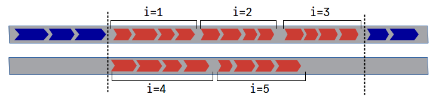
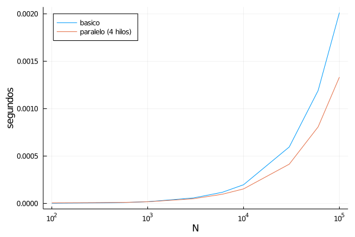
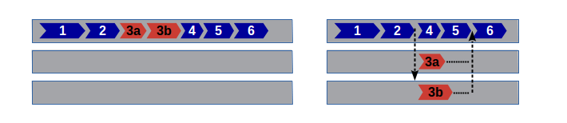

# Capítulo 11. Computación paralela

```@setup c11
include("../../scripts/collatz.jl")
```

En este último capítulo vamos a ver unos principios de cómo emplear técnicas de computación paralela con Julia, para tratar de conseguir aún mayor velocidad en los cálculos.

Antes que nada, conviene advertir que la computación paralela es un tema bastante complicado, del que es difícil sacar provecho con solo una introducción superficial. Pero un texto que pretende hablar de las "claves de Julia" estaría incompleto sin siquiera una mención al tema, pues una de las características de este lenguaje de programación es que ha sido diseñado desde el principio para obtener el máximo rendimiento de ordenadores con múltiples procesadores y en redes distribuidas —aunque se pueden hacer muchísimas cosas sin adentrarse en ese terreno—.

!!! note "Compatibilidad con versiones de Julia"

    Las utilidades de computación paralela en Julia se han ido mejorando y estabilizando progresivamente desde el lanzamiento de la versión 1.0 de Julia. Algunas de las características mencionadas en este capítulo no están disponibles en versiones inferiores a la 1.5.

## *Multi-threading*

El *multi-threading* es una forma de computación paralela basada en en el uso de múltiples "hilos" de operaciones (*threads* en inglés), controlados por una o más CPUs. Los distintos hilos disponibles se usan para ejecutar a la vez fragmentos independientes de código. Por ejemplo, un programa con un bucle de cinco iteraciones podría ejecutarse en dos hilos como se representa en la figura 1.



En este esquema cada operación está representada por un bloque azul o rojo; los bloques rojos son las operaciones que se realizan dentro de un bucle con cinco iteraciones. Las iteraciones 1, 2 y 3 se ejecutan en el mismo hilo que las operaciones anteriores; pero las iteraciones 4 y 5 se ejecutan en paralelo a las primeras, y cuando ha terminado la última de todas las iteraciones (en este caso la tercera), se reaunda el resto del programa.

El número de hilos disponibles para ejecutar un programa de Julia se determina al inicial la sesión, según el valor de la variable de entorno `JULIA_NUM_THREADS`. A partir de la versión 1.4 de Julia, el número de hilos también puede especificarse en el parámetro `--threads` o `-t` en el comando de inicio. Por ejemplo, para lanzar una sesión de Julia con 4 hilos se puede ejecutar:

```shell
julia -t 4
```

Una vez iniciada la sesión, puede consultarse el número de hilos disponibles con la función `Threads.nthreads()`. Por otro lado, el hilo en el que se esté ejecutando una tarea cualquiera se puede consultar con la función `Threads.threadid()`. Desde la versión 1.7 de Julia en adelante, el hilo en el que se ejecuta una tarea —y por lo tanto el valor de `Threads.threadid()`— puede ir cambiando de forma dinámica para optimizar el funcionamiento.

Si no se especifica nada, Julia se inicia por defecto con un solo hilo, pero habitualmente se puede conseguir un mayor rendimiento lanzando dos o más hilos por cada CPU que tenga el ordenador. No hay ninguna regla fija para determinar el número óptimo de hilos. Las CPUs modernas suelen funcionar de manera eficiente con más de un hilo, especialmente si se reparten adecuadamente tareas que consuman distintos recursos (acceso a ficheros, gestión de memoria, cálculos...), pero lanzar un número excesivo de hilos por procesador acaba ralentizando los procesos.

Lo que se recomienda normalmente es ir probando con números proporcionales a la cantidad de núcleos de CPU disponibles, hasta encontrar la configuración más adecuada, aunque el resultado cambia de aplicación a aplicación.

## Bucles `for` en paralelo (`@threads`)

Lanzar un bucle `for` con iteraciones en paralelo es tan sencillo como utilizar la macro `@threads` del módulo estándar `Threads`, del siguiente modo:

```julia
Threads.@threads for ... end
```

Esto hace que las distintas iteraciones del bucle se distribuyan entre los distintos hilos disponibles, como se ha comentado antes. Naturalmente, para que esto funcion adecuadamente es imprescindible que el orden en el que se ejecutan las iteraciones no afecte al resultado.

Como ejemplo y contraejemplo podemos poner el cálculo de pasos en las secuencias de Collatz expuesto en el [capítulo 9](9-benchmark.md). Las funciones empleadas en ese capítulo y en el presente están disponibles y documentadas, para facilitar su uso, en el repositorio de esta guía, en [https://github.com/heliosdrm/guia-julialang/blob/master/scripts/collatz.jl](https://github.com/heliosdrm/guia-julialang/blob/master/scripts/collatz.jl).

Respecto al tema que nos concierne aquí, la función `serie_pasoscollatz`, que calcula los pasos para las secuencias que comienzan con valores de 1 a `n`, tiene el siguiente código.

```julia
function serie_pasoscollatz(n::T) where T<:Integer
    pasos_total = zeros(Int, n)
    for i=range(T(2), stop=n)
        (pasos, inferior) = pasoscollatz(i, i)
        pasos_total[i] = pasos + pasos_total[inferior]
    end
    return pasos_total
end
```

Esa función contiene esencialmente un bucle que calcula el número total de pasos para cada secuencia de Collatz (`pasos_total[i]`). En la primera instrucción del bucle se usa la función `pasoscollatz` para contar los pasos de la secuencia que comienza en `i` hasta alcanzar un valor inferior al inicial; en la segunda se toma esa cuenta y se le suma el número de pasos totales de la secuencia inferior. Para que esto funcione correctamente, las secuencias inferiores tienen que haberse calculado *antes* que las superiores, por lo que ese bucle no es apto para lanzar en múltiples hilos en paralelo.

Por otro lado, entre las funciones contenidas en el repositorio hay una alternativa (`serie_pasoscollatz_threads`) con un bucle en el que el orden de las iteraciones es irrelevante. En lugar de la función `pasoscollatz`, que cuenta los pasos de una secuencia hasta llegar a un valor *anterior al inicial*, en el bucle se usa `pasoscollatz!`, que hace la cuenta para cada valor inicial hasta llegar al final o a un número *para el que ya se tenga un resultado*, sea tanto inferior como superior al inicial. El código de esta función está paralelizado tal como se ha comentado antes:

```julia
function serie_pasoscollatz_threads(n::T) where T<:Integer
    pasos_total = zeros(Int, n)
    Threads.@threads for i=range(T(2), stop=n)
        pasoscollatz!(pasos_total, i)
    end
    return pasos_total
end
```

Podemos comprobar que las dos formas de calcular los pasos de las secuencias de Collatz son equivalentes:

```@example c11
serie_pasoscollatz(100) == serie_pasoscollatz_threads(100)
```

Por otro lado, la versión paralelizada resulta sensiblemente más rápida para números altos. La siguiente gráfica muestra cuánto cuesta ejecutar las dos versiones de la función para calcular las series de pasos, en una sesión con cuatro hilos.[^1] Se puede observar que para números muy bajos el tiempo consumidos por ambas versiones es del mismo orden de magnitud (de hecho la versión básica es ligeramente más rápida); pero a partir de ``N=1000``, la ventaja del procesado en paralelo es cada vez más notable.



[^1]: Los datos de la figura 2 se han obtenido con Julia 1.6 en un Intel i3 de 4 núcleos a 2.5GHz, con Ubuntu 16.04.

Esto ocurre a pesar de que el el número de iteraciones que se hacen en el fondo es mucho mayor en la versión paralelizada. Manipulando las funciones para hacer la cuenta, se puede observar que con `n=100_000`, al ejecutar `serie_pasoscollatz(n)` la función `pasoscollatz` ejecuta cerca de medio millón de iteraciones de su bucle `while`. Por otro lado, al ejecutar `serie_pasoscollatz_threads(n)`, la función `pasoscollatz!` ejecuta más de un millón y medio de iteraciones.

## Lanzar tareas en paralelo (`@spawn`)

Para un uso más flexible de los hilos disponibles se puede usar la macro `@spawn` del módulo `Threads`, normalmente acompañada de otras macros para controlar la conclusión de las tareas lanzadas. Esta macro delega la ejecución de una tarea (una operación o un conjunto de operaciones recogidas en un bloque) a cualquier hilo que haya disponible, y continúa con el resto de las operaciones programadas hasta que se requiera el resultado de la tarea delegada.

La siguiente figura muestra este procedimiento de forma gráfica. (Por simplificar se representa como si cada tarea se ejecutase de principio a fin en el mismo hilo, aunque esto puede no ocurrir así.) En la parte izquierda se representa una secuencia de operaciones numeradas del 1 al 6, pero la operación número 3 (señalada en rojo) es una tarea larga, cuyo resultado en realidad no se requiere hasta la última operación. Marcando esa tarea con `Threads.@spawn`, el procesador buscaría un hilo disponible para ejecutarla al mismo tiempo que se ejecutan las operaciones 4 y 5 en el hilo principal, esperando al resultado de la número 3 antes de proceder con la sexta.


Hay distintas formas de indicar cuándo el hilo principal tiene que detenerse, a la espera de que finalicen las tareas delegadas a otros hilos. Veamos un primer ejemplo, con una función diseñada para comprobar si otras dos funciones son equivalentes. Esto podría hacerse con el siguiente código:

```julia
function compararfunciones(f1, f2, args...; kwargs...)
    resultado1 = f1(args...; kwargs...)
    resultado2 = f2(args...; kwargs...)
    resultado1 == resultado2
end
```

Si `f1` y `f2` son "funciones puras", que no modifican sus argumentos, esta sería una situación perfecta para hacerlas correr en paralelo. La última línea de `compararfunciones`, por otro lado, debería esperar a que tanto `f1` como `f2` hayan terminado su trabajo. Esto se puede hacer del siguiente modo: 

```@example c11
function compararfunciones((f1, f2), args...; kwargs...)
    t = Threads.@spawn f1(args...; kwargs...)
    resultado2 = f2(args...; kwargs...)
    resultado1 = fetch(t)
    resultado1 == resultado2
end
nothing #hide
```

En este ejemplo, la macro `Threads.@spawn` hace que la expresión que le sigue se ejecute en un hilo independiente, y devuelve inmediatamente un objeto de tipo `Task` con la tarea generada, que asignamos a la variable `t`, y que nos servirá para controlar lo que pasa con esa tarea que hemos delegado a otro hilo.

A continuación se procede sin interrupciones a ejecutar las siguienes líneas, hasta llegar a `fetch(t)`. Esto hace que se detenga el hilo de operaciones presente, hasta que la tarea `t` haya concluido, y devuelve el resultado de la misma, para que se pueda seguir trabajando con él.

Gracias a esto, `compararfunciones` consume poco tiempo más que la más costosa de las dos funciones:

```julia-repl
julia> using BenchmarkTools

julia> @btime serie_pasoscollatz(100_000);
  2.138 ms (2 allocations: 781.33 KiB)

julia> @btime serie_pasoscollatz_threads(100_000);
  1.296 ms (23 allocations: 783.19 KiB)

julia> @btime compararfunciones((serie_pasoscollatz_threads, serie_pasoscollatz), 100_000)
  2.372 ms (11 allocations: 1.53 MiB)
true
```

Cuando no es necesario recuperar el valor devuelto por la tarea delegada, en lugar de `fetch(t)` se puede usar sencillamente `wait(t)`, que también detiene la ejecución del hilo presente hasta que termina la tarea `t`, pero no devuelve ningún resultado.

Alternativamente, cuando se quiere esperar a la finalización de múltiples tareas se puede usar la macro `@sync`. Por ejemplo, consideremos la siguiente variación del esquema mostrado antes, en el que la tarea paralelizable se descompone en otras dos subtareas (3a y 3b), que también pueden ejecutarse en paralelo. Por otro lado, la operación número 6 sigue teniendo que esperar a que finalicen ambas subtareas —aunque en este caso tardan más en ejecutarse las operaciones 4 y 5 que le preceden—.



Si no es necesario asignar el resultado de 3a o 3b a ninguna variable, esto se podría hacer con un código como el que sigue:

```julia
tarea1()
tarea2()
@sync begin
    Threads.@spawn tarea3a()
    Threads.@spawn tarea3b() 
    tarea4()
    tarea5()
end
tarea6()
```

Aquí, la macro `@sync` empaqueta en una misma tarea las subtareas 3a y 3b (que se lanzan en paralelo a otros hilos con `Threads.@spawn`), junto con las tareas 4 y 5, y ejecuta ese bloque de manera "síncrona", es decir bloqueando la ejecución de tareas subsiguientes hasta que esta haya terminado.

## Carreras de datos y *locks*

Antes se ha comentado que un factor a tener en cuenta antes de paralelizar un programa es que las tareas lanzadas en paralelo (por ejemplo las iteraciones de un bucle) han de poderse ejecutar en cualquier orden. Pero incluso cuando el orden no importa, podemos tener problemas si distintas tareas acceden a los mismos datos, y en particular cuando al menos una de ellas hace alguna operación "de escritura" en los datos comunes (reasignar valores a variables o mutarlas).

Se conoce como "carrera de datos" la situación en la que dos o más hilos tratan de hacer alguna operación sobre un mismo dato a la vez. Esto puede hacer que una de las operaciones quede sin efecto, o que las variables sufran modificaciones que no tengan nada que ver con lo que se pretendía.

En el caso de los bucles, el hecho de que Julia cree un nuevo contexto de variables para cada iteración reduce los riesgos de este problema, porque los iteradores y las variables creadas localmente dentro del bucle no se comparten entre iteraciones. Pero las varibles globales o las locales creadas fuera del bucle siguen estando compartidas, por lo que es necesario tener cuidado con ellas.

Veamos, por ejemplo, la siguiente función que genera números enteros al azar y devuelve un vector con la cantidad de elementos pares y la cantidad de impares, respectivamente:

```julia
function paresonones(n)
    resultado = [0,0]
    Threads.@threads for _ in 1:n
        if iseven(rand(Int))
            resultado[1] += 1
        else
            resultado[2] += 1
        end
    end
    return resultado
end
```

Al ejecutar esta función, nos encontramos con que la cuenta siempre sale menor de lo que debería:

```julia-repl
julia> paresonones(1000)
2-element Vector{Int64}:
 295
 297
```

El problema está claramente en la paralelización de las operaciones, porque si se elimina la macro `@threads` dejan de "perderse" números. Sin embargo, por la naturelza de la función es obvio que el error no se debe al orden de las iteraciones. Lo que ocurre en realidad es que al hacer simultáneamente varias reasignaciones a los elementos del vector `resultado` en función de sus valores anteriores, muchas de esas asignaciones quedan anuladas.

Hay varias formas de resolver este problema. Por un lado existen algunas [operaciones atómicas](https://docs.julialang.org/en/v1/base/multi-threading/#Atomic-operations), que a bajo nivel se reducen a una sola operación de la CPU, y por lo tanto no pueden verse interrumpidas o alteradas por las carreras de datos. Pero solo hay un conjunto limitado de esas operaciones, y únicamente se pueden aplicar a ciertos de tipos de variables muy específicas, por lo que no vamos a detenernos en ellas.

El recurso que vamos a ver, más genérico y adaptable a múltiples situaciones, son los "cerrojos" (*locks* en inglés), que también podríamos comparar con "permisos" o "semáforos". Hay diferentes tipos de cerrojos, que operan de forma distinta, pero nos vamos a centrar en los "cerrojos con reentrada", que se crean con el constructor `ReentrantLock`:

```julia
c = ReentrantLock()
```

Los cerrojos se activan y se desactivan para proteger fragmentos de código con las funciones `lock` y `unlock`, respectivamente, del siguiente modo:

```julia
# código desprotegido ...
lock(c)
# código protegido ...
unlock(c)
# código nuevamente desprotegido ...
```

En un fragmento de código como el anterior, la instrucción `lock(c)` comprueba primero que el cerrojo `c` no esté ya bloqueado por algún otro proceso, y si lo está, se queda en espera hasta que se haya liberado. En cuanto consigue acceso, lo bloquea para que otros procesos no puedan usarlo, y se procede a hacer las siguientes operaciones. Por otro lado, `unlock(c)` libera el cerrojo, dando paso a otros procesos que estén programados para usarlo.

!!! note

    Los cerrojos de tipo `ReentrantLock` concretamente solo bloquean procesos de *otros hilos*. En el mismo hilo se puede cerrar un cerrojo múltiples veces (aunque para desactivarlo también habrá que usar `unlock` varias veces). Esto los hace especialmente prácticos para programas que incluyan operaciones recursivas, donde otros tipos de cerrojos se podrían quedar en un estado de bloqueo permanente.

Un riesgo de usar estos cerrojos es que algún fallo impida desactivarlos, por lo que se recomienda usar el siguiente patrón:

```julia
lock(c)
try
    # operaciones protegidas
finally
    unlock(c)
end
```

O bien introducir el código protegido en una función anónima del siguiente modo:

```julia
lock(c) do
    # operaciones protegidas
end
```

En ambos casos, se asegura que la operación `unlock` se llevará a cabo pase lo que pase con el código que se intenta ejecutar antes. Aunque también hay que tener en cuenta que ambas soluciones introducen un nuevo contexto de variables locales, que solo serán visibles dentro del bloque `try` o en la función anónima escrita entre `do` y `end`.

Así, nuestra función `paresonones` podría quedar como sigue:

```julia
function paresonones_locked(n)
    c = ReentrantLock()
    resultado = [0,0]
    Threads.@threads for _ in 1:n
        if iseven(rand(Int))
            lock(c) do
                resultado[1] += 1
            end
        else
            lock(c) do
                resultado[2] += 1
            end
        end
    end
    return resultado
end
```

Los cerrojos son recursos que permiten detener un hilo cuando están siendo usados por otro, anulando en parte la paralelización de los procesos. Debido a esto, los cerrojos suponen una penalización importante a la eficiencia del código paralelizado. En el caso particular de este ejemplo, la función `paresonones` sería de hecho más rápida si se escribiera con un bucle `for` convencional, sin paralelización de ningún tipo.

## Tareas asíncronas (`@async`)

!!! warning "Característica obsoleta"

    Esta explicación sobre la macro `@async` es anterior a Julia 1.7, cuando se introdujeron mejoras que hicieron que las tareas lanzadas con `@spawn` aprovechen mucho mejor los recursos, independientemente del número de hilos disponibles. Actualmente no se recomienda el uso de `@async`, que tiene inconvenientes importantes sobre todo para tareas complejas, y se recomienda usar `@spawn` siempre en su lugar.

La ejecución asíncrona es una forma de "procesado multihilo virtual", en la que se aprovechan puntos de interrupción entre ciertas operaciones para dar paso a otras tareas si procede. De ese modo, en la práctica se pueden estar procesando varias tareas al mismo tiempo, aunque todo ocurra de forma intermitente en el mismo hilo.

Para crear y ejecutar una tarea de forma asíncrona se puede utilizar la macro `@async`, como en el siguiente ejemplo en el que hacemos correr dos bucles a la vez:

```@example c11
let #hide
@async for i = 1:3
    println("tic ", i)
    sleep(1)
end
for i = 1:3
    sleep(0.9)
    println("tac ", i)
end
end #hide
```

A primera vista esto se parece mucho al uso de `Threads.@spawn`. De hecho las funciones `fetch`, `wait` y la macro `@sync` también se pueden emplear para hacer que otras tareas esperen a la finalización de una lanzada con `@async`, igual que se hacía con las paralelizadas mediante `Threads.@spawn`. Pero hay algunas de diferencias fundamentales:

* `@async` no delega la tarea a otro hilo, sino que la pone "en cola", a la espera de que se dé alguna interrupción adecuada en el resto del programa para ponerse en marcha. (En el ejemplo de arriba, ese punto es el primer `sleep` del segundo bucle.)
* El comportamiento de `@async` es independiente del número de hilos disponibles, porque la tarea programada se ejecuta enteramente en el mismo hilo.
* Por esa misma razón, las tareas lanzadas con `@async` son menos susceptibles de provocar problemas por carreras de datos.
* Por otro lado, las tareas que dependen de una lanzada con `@async` se ven obligadas a ejecutarse también en el mismo hilo, lo que puede empeorar la eficiencia en lugar de mejorarla.
* Además, lanzar una tarea con `@async` solo resulta práctico si las tareas que le siguen presentan puntos de interrupción que le dejen paso.

Esta última condición solo la cumplen un conjunto limitado de funciones, entre las que como se ha visto se encuentra `sleep`. Así, en el ejemplo anterior, el primer bucle se pone a la cola de tareas, y su primera iteración se inicia cuando el primer `sleep` del segundo bucle le da paso. En ese momento la instrucción que iba a continuación --`println("tac ", i)`-- se pone en espera, y así los dos bucles se van dando paso alternativamente. Pero si no estuvieran las líneas con `sleep` u otras funciones que lo permitan, el primer bucle no podría iniciarse hasta que acabase el resto del programa.

La macro `@async` se usa a menudo con tareas que se llevan a cabo mientras se ejecutan funciones de lectura y escritura de archivos (p.ej. `read` o `write`), interacciones con bases de datos, o transferencias de datos por Internet. Todas esas operaciones suelen estar programadas en funciones que también dejan paso a tareas asíncronas, igual que `sleep`, ya que gran parte del tiempo consumido por ellas se invierte en el acceso a los discos, que requiere muy poca CPU, por lo que esas funciones están diseñadas para permitir que otras tareas aprovechen esa capacidad de procesado.

Si se desea es posible añadir puntos de interrupción al código de forma manual, con la función `yield`. Por ejemplo, podríamos sustituir las llamadas a `sleep` del ejemplo anterior por `yield`, lo que daría el mismo resultado, pero sin tiempos de espera:

```julia
@async for i = 1:3
    println("tic ", i)
    yield()
end
for i = 1:3
    yield()
    println("tac ", i)
end
```

Puedes experimentar poniendo y quitando la instrucción `yield()` en distintos puntos de este fragmento de código, para comprobar cómo afecta a la ejecución asíncrona de los bucles.

## Coda

Las herramientas que se han presentado en este capítulo son, como se decía al principio, solo la punta del iceberg en el terreno de la computación paralela. De hecho, ni siquiera hemos abordado el tema aún más complejo de la [computación distribuida](https://es.wikipedia.org/wiki/Computación_distribuida), en la que las tareas se reparten entre distintos ordenadores de una red. (Julia tiene también herramientas para eso en el módulo `Distributed`).

Para poder usar de forma productiva esas herramientas es necesario profundizar en detalles que están mucho más allá del alcance de esta guía, que no pretende ser más que una introducción a los aspectos más destacables de Julia como lenguaje de programación. La computación paralela es uno de sus puntos fuertes, pero no el más importante, y en lo que a la optimización de código se refiere, es un recurso que conviene reservar para cuando no se puede sacar mucho más de otras estrategias más sencillas.

El procesado en paralelo, sea en hilos reales o virtuales, puede hacer más difícil entender lo que ocurre antes o después, y aumenta el riesgo de encontrarse con resultados no esperados, sobre todo si entran en juego las carreras de datos. Por otro lado, la gestión de los hilos y las salvaguardas que hay que introducir para que las tareas paralelas funcionen correctamente tienen también un coste. Además, para el compilador suele ser más fácil optimizar el código a bajo nivel cuando las operaciones ocurren de forma lineal. Por eso no es raro encontrarse con que un programa o una función fácil de paralelizar (por ejemplo añadiendo la macro `Threads.@threads` en un bucle) funcione más rápido sin hacerle nada.
