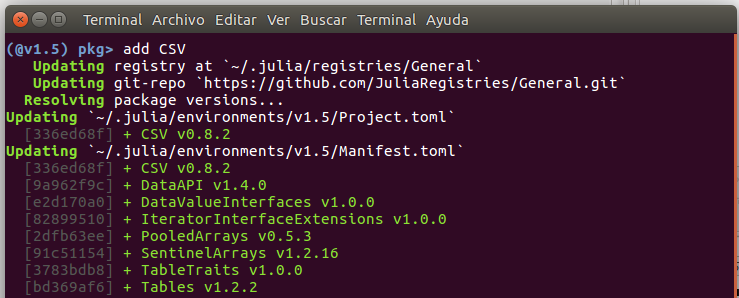

# Capítulo 2. Proyectos

```@setup c2
using Fracciones
```

La organización del trabajo con entornos separados por proyectos es una de las "buenas prácticas" de programación más sencillas de seguir en Julia; posiblemente la que más beneficio proporciona en relación con el esfuerzo que requiere. Por eso es oportuno dar algunas indicaciones dal respecto, como una de las claves para programar con Julia. Aprovecharemos además para introducir algunas ideas que se desarrollan con mayor detalle en capítulos posteriores.

## Ejemplo: el paquete "Fracciones"

Varios de los temas que trataremos en este y los siguientes capítulos se verán sobre el código del repositorio "Fracciones", que se puede encontrar en [https://github.com/heliosdrm/Fracciones.jl](https://github.com/heliosdrm/Fracciones.jl). Se trata un proyecto en forma de paquete que proporciona un tipo de variable para representar y hacer operaciones sencillas con fracciones de números enteros, con propósitos puramente didácticos. (Julia ya tiene su propio tipo de números racionales, mucho más versátil, práctico y eficaz; de hecho el paquete Fracciones se inspira en el código original de Julia, simplificado y adaptado para el propósito de esta guía.)

En la página web se puede navegar por el conjunto de archivos, pero para mayor comodidad se puede hacer una copia local del repositorio completo en cualquier directorio del ordenador. Para quienes no sean usuarios de Git, lo más sencillo es seleccionar la opción de "descargar como ZIP" (ver en la figura siguiente, aunque la interfaz de GitHub a la que accedas pueda ser distinta de la que se muestra). Una vez descargado, se puede descomprimir el archivo en el sitio que se escoja (puede ser cualquier carpeta).



El árbol de archivos es muy pequeño --menos de 50 Kb en su conjunto--, y su estructura es la siguiente:

```
├── src/
|   ├── Fracciones.jl
|   └── fraccion.jl
├── test/
|   ├── Project.toml
|   ├── Manifest.toml
|   └── runtests.toml
├── LICENSE
├── Project.toml
├── Manifest.toml
└── README.md
```

Centrándonos por ahora en los archivos que hay en el directorio raíz, para nuestros propósitos podemos ignorar los llamados `LICENSE` y `README.md`, que son simples textos informativos. Esto nos deja los archivos `Project.toml` y `Manifest.toml`, que son los que definen el entorno del proyecto. Concretamente, el archivo `Project.toml` contiene la lista de los paquetes de los que depende directamente el proyecto, y `Manifest.toml` contiene los detalles de *todas* las dependencias, directas e indirectas, que hacen falta en el proyecto. Lo mismo ocurre con la carpeta `test`, que es un "subproyecto" particular dentro de `Fracciones`, aunque por ahora no vamos a entrar en detalles sobre eso. 

## Los archivos `Project.toml` y `Manifest.toml`

Estos dos archivos se generan automáticamente cuando se opera con el gestor de paquetes de Julia. Vamos a verlo con la creación de un proyecto nuevo. Supongamos que estamos en una sesión de Julia, y ejecutamos los siguientes comandos (el primero en el modo de REPL "normal", y los siguientes en el modo "pkg"):  

```julia
julia> mkdir("proyecto_prueba")
"proyecto_prueba"

(@v1.6) pkg> activate proyecto_prueba
 Activating new environment at `~/proyecto_prueba/Project.toml`

(proyecto_prueba) pkg> status
Status `~/proyecto_prueba/Project.toml` (empty project)
```

En la primera línea hemos utilizado la función `mkdir` para crear un nuevo directorio llamado `proyecto_prueba`. En la segunda línea hemos cambiado del modo REPL normal al modo "pkg" escribiendo `]`, lo que se muestra con el cambio de la etiqueta `julia>` que se ve habitualmente a `pkg>`, precedida del nombre del entorno. En este caso hemos comenzado con el entorno por defecto de la versión de Julia 1.6 (en tu ordenador puede ser otro, dependiendo de la versión de Julia y más cosas).

Al escribir `]activate proyecto_prueba`, el entorno de Julia cambia al definido en ese directorio (lo que sigue a `]activate` puede ser una ruta absoluta o relativa cualquiera, o simplemente `.` para activar el entorno definido en el directorio actual). El mensaje que nos devuelve Julia señala que se ha activado un entorno *nuevo*, porque en ese directorio aún no existe realmente ningún archivo `Project.toml`. Esto lo vemos al ejecutar `]status` en la siguiente línea: normalmente el resultado de ese comando es un listado de los paquetes que se han añadido anteriormente, pero ahora vemos que nos encontramos en un "proyecto vacío" (*empty project*), como si fuera la primera vez que usamos Julia después de su instalación.

!!!note "Comandos de Pkg"

    Al describir los comandos de Julia, cuando van precedidos de `]` como `]activate` o `]status` en este ejemplo, se da a entender que son comandos ejecutados en el "modo pkg", que en el REPL se muestran con la etiqueta `pkg>` al principio de la línea, en lugar de la etiqueta `julia>` que se observa habitualmente. Todos los comandos el el "modo pkg" se corresponden con una función del módulo estándar `Pkg`, por lo que si conviene, en lugar de `]activate X` se puede utilizar la función `Pkg.activate("X")` en el modo normal del REPL. (Antes hay que ejecutar `using Pkg`, y nótese que los argumentos van entrecomillados.)
    
A este proyecto vacío le podemos añadir paquetes mediante con los comandos de gestión de paquetes habituales. Añadamos, por ejemplo, el paquete `MacroTools` que también se utiliza en el proyecto de Fracciones.jl:

```julia
(proyecto_prueba) pkg> add MacroTools
   Updating registry at `~/.julia/registries/General`
   Updating git-repo `https://github.com/JuliaRegistries/General.git`
  Resolving package versions...
Updating `~/proyecto_prueba/Project.toml`
  [1914dd2f] + MacroTools v0.5.6
Updating `~/proyecto_prueba/Manifest.toml`
  [1914dd2f] + MacroTools v0.5.6
  [2a0f44e3] + Base64
  [d6f4376e] + Markdown
  [9a3f8284] + Random
  [9e88b42a] + Serialization

(proyecto_prueba) pkg> status
Status `~/proyecto_prueba/Project.toml`
  [1914dd2f] MacroTools v0.5.6
```

Cuando volvemos a ejecutar `]status` vemos que el nuevo paquete ya está disponible para ser usado en este entorno. El mensaje devuelto por `add` indica que se han actualizado (de hecho se han creado) los archivos `Project.toml` y `Manifest.toml` que definen el proyecto. El contenido de `Project.toml` se reduce a las dos siguientes líneas, que nos dicen los nombres de los paquetes introducidos como dependencias del proyecto --en este caso solo uno--, y su identificador único, que es una propiedad del paquete en cuestión:

```toml
[deps]
MacroTools = "1914dd2f-81c6-5fcd-8719-6d5c9610ff09"
```

El archivo `Manifest.toml` es más complicado, aunque en este ejemplo particular no demasiado:

```toml
# This file is machine-generated - editing it directly is not advised

[[Base64]]
uuid = "2a0f44e3-6c83-55bd-87e4-b1978d98bd5f"

[[MacroTools]]
deps = ["Markdown", "Random"]
git-tree-sha1 = "6a8a2a625ab0dea913aba95c21370589e0239ff0"
uuid = "1914dd2f-81c6-5fcd-8719-6d5c9610ff09"
version = "0.5.6"

[[Markdown]]
deps = ["Base64"]
uuid = "d6f4376e-aef5-505a-96c2-9c027394607a"

[[Random]]
deps = ["Serialization"]
uuid = "9a3f8284-a2c9-5f02-9a11-845980a1fd5c"

[[Serialization]]
uuid = "9e88b42a-f829-5b0c-bbe9-9e923198166b"
```

En este archivo vemos los detalles de todas las dependencias, directas e indirectas, que necesita Julia para el proyecto. Por supuesto está `MacroTools`, del que se señala que se usa la versión 0.5.6, y que depende de `Markdown` y `Random`. A su vez, `Markdown` depende de `Base64` y `Random` de `Serialization`, y los cuatro módulos en cuestión aparecen identificados también con sus propias entradas (en este caso sin número de versión, porque los cuatro son módulos estándar). Es habitual que el árbol de dependencias sea mucho más amplio, y contenga decenas de módulos y otros paquetes externos, de los que también se especifica la versión usada en el entorno.

Si exploras los archivos de Fracciones.jl, podrás comprobar que el archivo `Manifest.toml` es igual o muy parecido (puede cambiar por las versiones del paquete). `Project.toml` tiene unas pocas líneas más al principio, por razones que se comentan más adelante.

En general, los paquetes que se pueden usar directamente en el proyecto son los señalados en `Project.toml`, que son los reportados por `]status`. Así pues, en este caso podemos ejecutar `using MacroTools` --y naturalmente, también se pueden usar todos los módulos estándar de Julia, estén o no en el `Manifest.toml`--. Pero no se podra aplicar `using` ni `import` con ningún otro paquete externo que no se haya añadido explícitamente, aunque esté en `Manifest.toml` como dependencia indirecta.

## Reutilizar proyectos

Por supuesto, si en sesiones anteriores de Julia habías instalado otros paquetes, que no se encuentren en nuevo entorno no quiere decir que se hayan borrado ni perdido; siguen instalados en el ordenador, en el mismo sitio que antes, y volverán a estar disponibles cuando el entorno correspondiente esté activado (si es el entorno por defecto, se puede reactivar con `]activate`, sin especificar ninguna ruta). Asimismo, que haya un paquete añadido en distintos entornos no implica que se instale varias veces: la instalación de los paquetes en el sistema es única, y si por ejemplo `MacroTools` ya estaba instalado, al ejecutar `]add MacroTools` simplemente se creará una referencia al mismo. 

Emplear un entorno específico para cada proyecto, con solo el conjunto mínimo de paquetes necesarios para que funcione, tiene varias ventajas: se reduce el riesgo de problemas por incompatibilidades entre paquetes, que pueden aparecer cuando se combinan muchos de ellos (que puede no ser necesario emplear a la vez); se pueden usar versiones distintas de los mismos paquetes en entornos distintos; y si se conserva la información específica del entorno de un proyecto, este podrá reproducirse perfectamente en otro ordenador.

Así, supongamos que tenemos el repositorio de ejemplo descargado en una ruta como `proyectos_julia/Fracciones`. Para poder trabajar con él bastaría con ejecutar los siguientes comandos:

```julia
(@v1.6) pkg> activate proyectos_julia/Fracciones
 Activating environment at `~/proyectos_julia/Fracciones/Project.toml`

(Fracciones) pkg> instantiate
```

El comando `]instantiate` sirve para instalar en el sistema los paquetes recogidos en `Manifest.toml` (si es que no estaban ya instalados, o no se tenían las versiones adecuadas). Una vez hecho esto, ya podemos utilizar sin problemas el código del repositorio. Por ejemplo, podemos ejecutar el contenido de `src/fraccion.jl`:

```julia
julia> include("proyectos_julia/Fracciones/src/fraccion.jl");
```

Ese código, que empieza con la línea `using MacroTools` y utiliza algunas de sus utilidades, no podría haberse ejecutado si no estuviéramos en el entorno presente, que tiene ese paquete entre sus dependencias. Al ejecutarlo, hemos definido el tipo `Fraccion` y diversas operaciones algebraicas para los mismos, además de algunas funciones específicas. Así pues, por ejemplo podemos sumar las fracciones de 2 partido por 3 y 1 partido por 5, y luego obtener su recíproco:

```@repl c2
x = Fraccion(2,3) + Fraccion(1,5)
reciproco(x)
```

## Proyectos en forma de "paquete"

El código de un proyecto puede contener instrucciones para realizar un análisis de datos, ejecutar una aplicación, o muchas otras cosas. En el ejemplo que estamos viendo el código no "hace" gran cosa; solo define un tipo de variables y unas funciones que pueden ser de utilidad en otros proyectos. Es por eso que el repositorio está estructurado en forma de "paquete", con un árbol de directorios que tiene una estructura particular, y un archivo `Project.toml` que incluye cierta información extra, como hemos visto antes. Veremos los detalles de esa estructura en los capítulos 4 y 6, que están dedicados especialmente a este tema.

Por ahora basta con comentar que, gracias a que el proyecto está organizado de esa forma, puede incluirse como dependencia en otro proyecto donde nos interese usar las herramientas definidas ahí. Supongamos que ese nuevo proyecto va a estar ubicado en la carpeta `proyectos_julia/proyecto1`:

```julia
(@v1.6) pkg> activate proyectos_julia/proyecto1
 Activating new environment at `~/proyecto_prueba/proyecto1/Project.toml`

(proyecto1) pkg> add proyectos_julia/Fracciones
    Cloning git-repo `/home/heliosdrm/proyectos_julia/Fracciones`
   Updating git-repo `/home/heliosdrm/proyectos_julia/Fracciones`
   Updating registry at `~/.julia/registries/General`
   Updating git-repo `https://github.com/JuliaRegistries/General.git`
  Resolving package versions...
Updating `~/proyecto_prueba/proyecto1/Project.toml`
  [81451a68] + Fracciones v0.1.0 `../Fracciones#master`
Updating `~/proyecto_prueba/proyecto1/Manifest.toml`
  [81451a68] + Fracciones v0.1.0 `../Fracciones#master`
  [1914dd2f] + MacroTools v0.5.6
  [2a0f44e3] + Base64
  [d6f4376e] + Markdown
  [9a3f8284] + Random
  [9e88b42a] + Serialization
```

Los mensajes que aparecen después de `]add proyectos_julia/Fracciones` indican que nuestro nuevo proyecto ahora incorpora el de `Fracciones` como dependencia directa (en `Project.toml`), e incluye como dependencias indirectas todas las que también encontrábamos en el `Manifest.toml` de `Fracciones`. Ahora podemos trabajar con las fracciones igual que en el ejemplo del apartado anterior, pero sin tener que ejecutar explicitamente el código del otro proyecto:

```julia
julia> using Fracciones
[ Info: Precompiling Fracciones [81451a68-6ad1-41c9-8c04-09494141aeca]

julia> x = Fraccion(2,3) + Fraccion(1,5)
Fraccion(13, 15)
```

De hecho, cuando ejecutamos `using Fracciones` como se ha hecho en este ejemplo, ni siquiera se utilizan ya los archivos del repositorio original que habíamos descargado, sino el código precompilado que se ha instalado en el sistema de paquetes centralizado. Es más, ni siquiera hacía falta que hubiéramos descargado el paquete "Fracciones" para instalarlo. Julia es capaz leer la estructura de archivos directamente desde la web de GitHub en la que se aloja el repositorio, así que el paquete se podía añadir dándole la URL correspondiente:[^1]

[^1]: Esto se puede hacer con cualquier servidor que aloje repositorios de git, además de GitHub.

```julia
(proyecto1) pkg> add https://github.com/heliosdrm/Fracciones.jl
    Cloning git-repo `https://github.com/heliosdrm/Fracciones.jl`
   Updating git-repo `https://github.com/heliosdrm/Fracciones.jl`
   [...]
```

## Recomendaciones para el uso de proyectos

Como se ha comentado antes, es muy recomendable crear un entorno propio para cada proyecto, por sencillo que sea. Hacerlo implica tomarse la molestia de activar el entorno antes de empezar a trabajar en el proyecto, pero las ventajas ya mencionadas lo compensan con creces: menor riesgo de incompatibilidades, mayor flexibilidad en las versiones de los paquetes, reproducibilidad...

Ahora bien, si cada proyecto tiene un entorno específico, ¿qué utilidad se le da al entorno por defecto (en los ejemplos mostrados anteriormente, el que aparecía señalado como `@v1.6`)? No hay realmente una respuesta concreta para eso. Se podría considerar al entorno por defecto como un cajón de sastre, o un terreno de pruebas para explorar paquetes e ideas sin ningún proyecto particular. Naturalmente, si en el entorno por defecto se instalan y manipulan conjuntos arbitrarios de paquetes, existe el riesgo de que ocurra lo que precisamente se quiere evitar con la organización por proyectos: que se creen conflictos entre algunos de los paquetes o sus versiones, y uno o varios de ellos queden inutilizables, que surjan incompatibilidades y errores difíciles de desenmarañar, etc. Pero si un entorno realmente no se utiliza para más que para hacer pruebas, ese tipo de problemas se resuelve con la sencilla y drástica solución de borrar los archivos `Project.toml` y `Manifest.toml` correspondiente, con lo que se vuelve a empezar de cero.

El directorio asociado a los entornos por defecto suele estar en la carpeta `.julia/registries/vX.Y`, donde `X.Y` representa el número de versión de Julia correspondiente (en los ejemplos se utiliza la versión 1.6, pero pueden existir entornos para versiones distintas si en el mismo ordenador se han instalado varias versiones de Julia). La carpeta `.julia` es lo que se conoce como el "depósito" o "almacén" de Julia (en inglés el *depot*), y según el origen de la instalación de Julia, puede estar en la carpeta principal del usuario o en otro sitio; su ubicación exacta se puede consultar como el primer elemento de la variable global `DEPOT_PATH`.

Cambiar los archivos `Project.toml` y `Manifest.toml` no altera en absoluto los paquetes instalados en Julia; solo afecta al uso que se puede hacer de ellos desde el entorno en cuestión. Así que borrarlos en una carpeta que se utilice solo para pruebas es una operación razonablemente segura. En cualquier caso, quien prefiera no tocar mucho esos directorios siempre puede hacer las pruebas en otro entorno especial para ese propósito, y dejar "limpio" el entorno por defecto.

Asimismo, si después de hacer pruebas con unos paquetes se tiene la seguridad de que no se quiere volver a emplearlos, por la misma razón comentada antes no basta con eliminarlos mediante el comando `]rm` o `]remove`, ni siquiera borrando los archivos `Project.toml` y `Manifest.toml` de los entornos donde se han empleado alguna vez. Aunque se haga eso seguirán estando instalados en el sistema. La forma de liberar espacio de paquetes descartados es mediante el comando `]gc` (de *garbage collector* , "recolector de basura"), que revisará los entornos de proyectos existentes, y desinstalará los paquetes que no sean necesarios para ninguno de ellos (es decir, que alguna vez se hubieran instalado pero se haya podido comprobar que realmente ya no están en uso).

Un detalle final a tener en cuenta es que, aunque el comando `]activate` se puede emplear en cualquier momento para cambiar de entorno, una vez se ha cargado un paquete (con `using` o `import`) desde un entorno, ese paquete se mantendrá cargado --con la misma versión-- durante toda la sesión de trabajo, aunque se cambie a otro entorno donde no se reconozca el paquete o que tenga especificada una versión diferente. Debido a esto, cambiar de entorno en medio de una sesión de trabajo puede hacer que surjan conflictos, por lo que para trabajar en varios proyectos es mejor salir de la sesión de Julia y volver a entrar entre uno y otro. 


