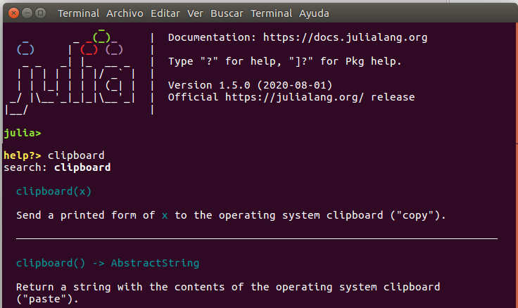

# Capítulo 6. Desarrollo de paquetes

```@setup c6
using Fracciones
```

Al final del capítulo 4 se hizo una breve introducción sobre cómo transformar un módulo de Julia en un paquete, para facilitar su reutilización en otros proyectos, tomando el paquete [Fracciones](https://github.com/heliosdrm/Fracciones.jl) como ejemplo. En el presente capítulo vamos a desarrollar este tema en mayor profundidad, con más consejos e instrucciones para mejorar la calidad, robustez y usabilidad de los paquetes en Julia.

## Compatibilidad de las dependencias

Un proyecto de Julia convencional es reproducible gracias a que su archivo `Manifest.toml` incluye información detallada sobre todas sus dependencias directas e indirectas. Pero esto no sirve para los paquetes, porque al añadir un paquete a un proyecto con `]add` o `]dev`, el `Manifest.toml` del paquete no se tiene en cuenta. El motivo es que el proyecto podría tener otros paquetes con dependencias comunes, pero con versiones de esas dependencias distintas declaradas en su `Manifest`; así que si tuvieran que considerarse los contenidos de esos archivos --que recordemos, especifican las versiones exactas de las dependencias a instalar--, el conflicto estaría servido.

En lugar de eso, los paquetes declaran las versiones admisibles de sus dependencias en la sección `[compat]` del archivo `Project.toml`. En el paquete Fracciones, esa sección es:

```toml
[compat]
julia = "1"
MacroTools = "0.5"
```

Esto significa que el paquete requiere el uso de una versión de Julia compatible con la número 1, y de una versión de `MacroTools` compatible con la número 0.5. Esta definición de compatibilidad está basada en la numeración de [SemVer](https://semver.org/lang/es/), que identifica las versiones como una secuencia de tres números ("versión mayor", "versión menor" y "parche"). Concretamente, el criterio que se sigue es el siguiente:

* Puede omitirse el número de parche (como en `MacroTools = "0.5"`), y también el número de versión menor (dejando solo el número de versión mayor, como en `julia = "1"`). Los números que se omiten se asumen que son `0`. Así, el ejemplo es equivalente a indicar `julia = "1.0.0"` y `MacroTools = "0.5.0"`.
* Se consideran compatibles todas las versiones iguales o mayores que el número especificado, siempre que se mantenga fijo el número de mayor nivel distinto de cero.

Así, en el caso de nuestro paquete de ejemplo, las versiones compatibles de `MacroTools` son `0.5.0`, `0.5,1`... y todas las que comiencen por `0.5`; y las versiones de Julia admitidas son todas las que comienzan por `1`.

Esto implica que al ejecutar `]add Fracciones` en un proyecto, se comprobará que la versión de Julia es `1.x.y`, el gestor de paquetes buscará versiones de `MacroTools` que comiencen por `0.5`, e instalará la mayor de ellas que también sea compatible con otros paquetes que hubiera ya instalados en ese proyecto. El paquete escogido se utilizará para actualizar el `Manifest.toml` del proyecto en el que estamos.

La especificación de compatibilidad puede ser más compleja si hace falta. Por ejemplo, si se da una secuencia de versiones separadas por comas (p.ej. `"0.5, 0.6"`), se considerará la unión de todos esos rangos. También se pueden indicar rangos más amplios (`"0.5 - 1.3"` para todas las versiones entre esos dos límites), rangos abiertos (p.ej. `">= 1.3"` para cualquier versión igual o mayor que 1.3, incluidos cambios en versiones mayores), y otras condiciones. Se puede consultar el manual oficial de Julia para las [reglas completas sobre compatibilidad](https://pkgdocs.julialang.org/v1/compatibility/).

## Numeración y control de versiones

Al igual que podemos usar los números de versión de nuestras dependencias para gestionar adecuadamente las compatibilidades, también es conveniente que en nuestro paquete actualicemos el número de versión señalado en `Project.toml` cuando se haga algún cambio en el código --y si vamos a compartir el paquete o a utilizarlo en proyectos distintos, es una práctica imprescindible para asegurar la reproducibilidad--.

Para facilitar que el gestor de paquetes escoja las versiones adecuadas, es muy recomendable seguir el criterio SemVer de numeración de versiones. Según este criterio la versión de un software viene indicada por tres números que separamos por un punto:

* La primera versión "estable" del software recibe el número de versión 1.0.0.
* Si se hace algún arreglo para solucionar *bugs*, sin alterar en ningún otro aspecto la funcionalidad del software, se incrementa el tercer número, dejando los demás iguales. P.ej. de la versión 1.0.0 se pasaría a la 1.0.1.
* Si se añade alguna mejora o se hace algún cambio más allá de esos "parches", pero el cambio no es disruptivo, se incrementa el segundo número (el de "versión menor") y se reinicia el tercero. P.ej. de la versión 1.0.5 se pasaría a la 1.1.0. Se entiende que un cambio no es disruptivo si se mantiene la compatibilidad con versiones anteriores: es decir, que los programas que funcionaban con las versiones anteriores siguen funcionando igualmente con la nueva.
* Si se hace algún cambio disruptivo, que no asegura la compatibilidad con versiones anteriores, se incrementa el primer número (el de "versión mayor") y se reinician los otros dos. Por ejemplo, de la versión 1.4.3 se pasaría a la 2.0.0.
* Lo normal es que cuando se hace un cambio menor o mayor, las siguientes versiones se basen en la más reciente, pero no hay impedimento en que si por ejemplo se ha creado una nueva versión mayor con el número 2.0.0, más tarde se arregle algún fallo de la 1.4.3 y se le dé el número 1.4.4, para que la puedan usar quienes desean seguir trabajando con "la versión 1".
* No hay ningún límite superior para ninguno de los tres números que componen la versión. Puede existir perfectamente la versión 1.99.54 y seguir con la 1.99.55 o 1.100.0, siguiendo las reglas anteriores.

!!! note "Versiones 0.X.Y"
    
    En el código SemVer, durante las primeras fases de desarrollo, cuando aún se está experimentando, se suele usar el número 0 como indicador de "versión mayor", y las demás reglas no aplican, para dar más libertad a los programadores. Pero el gestor de paquetes de Julia aplica un criterio especial para las versiones que comienzan con 0, según el cual se considera un cambio disruptivo cualquier cambio en el número de mayor nivel que no sea 0.

Una cuestión más complicada es cómo mantener las distintas versiones de un paquete, para poder instalar una u otra en función de otras dependencias. La solución más trivial es guardar copias de cada versión en una carpeta distinta; pero para ir más allá de pequeños proyectos personales, es necesario usar algún sistema más sofisticado de control de versiones. En particular, si se desea utilizar el gestor de paquetes de Julia para manejar adecuadamente las versiones de un paquete, hace falta que la carpeta del paquete sea un repositorio de [Git](https://git-scm.com/).

Sin adentrarnos en el territorio de gestión de versiones con Git, que es un asunto aparte, se puede comentar muy sucintamente que se trata de un software que permite configurar los directorios que se escojan para convertirlos en "repositorios Git". La diferencia entre un directorio normal y un repositorio Git es que estos últimos alojan todas las versiones que se quiera de los contenidos del directorio. En casi todas las cuestiones prácticas, es como si ese directorio solo tuviera una versión --el llamado "árbol de trabajo", que es el contenido visible del repositorio--. Pero hay un subdirectorio oculto (llamado `.git`), que contiene un historial de versiones anteriores. El software de Git puede manipular este historial, registrando nuevas versiones e intercambiando el árbol de trabajo por cualquiera de ellas cuando se desee, creando desarrollos en paralelo, etc. Si se genera la estructura de un paquete con herramientas [PkgTemplates](https://github.com/invenia/PkgTemplates.jl) o [PackageSkeleton](https://github.com/tpapp/PkgSkeleton.jl), este será desde el principio un repositorio de Git, aunque su manejo posterior queda a cargo del usuario.

### Registro de paquetes

Para que el gestor de paquetes sepa dónde buscar para instalar una u otra versión de un paquete dado, este ha de estar incluido en un registro de paquetes. Los registros son índices alojados en el depósito de Julia (generalmente en el directorio `.julia/registries`), que contienen detalles técnicos de un conjunto de paquetes, incluyendo la fuente desde la que se pueden descargar y el código de los *commits* asociados a cada versión. (Los *commits* son puntos específicos de la historia de un repositorio de Git.) Cuando utilizamos instrucciones como `]add`, `]update`, etc. dando solo el nombre de un paquete (sin una dirección desde la cual descargarlo), el gestor de paquetes busca ese paquete en los registros disponibles, y utiliza la información contenida en ellos.

El registro más conocido es el [Registro General](https://github.com/JuliaRegistries/General), que incluye miles de paquetes y es el que se suele instalar por defecto con Julia. Pero eso no impide añadir en paralelo otros registros, e incluso crearse un registro propio. (Para crear un registro propio una buena opción es el paquete [LocalRegistry](https://github.com/GunnarFarneback/LocalRegistry.jl), muy útil y fácil de usar --considerando que se sepa cómo usar Git--.) La mayoría de operaciones con el gestor de paquetes implican también una actualización de la copia local de los registros, de tal manera que si los creadores de otros paquetes han registrado nuevos paquetes o versiones de los mismos en el Registro General --o en otro que tengamos sincronizado en nuestra instalación--, tendremos acceso inmediato a todas las novedades sin necesidad de hacer nada especial.

Si queremos tener nuestro paquete disponible en el Registro General, en primer lugar es necesario publicarlo en un repositorio Git, con una [licencia de código abierto aprobada por la OSI](https://opensource.org/licenses). Si se ha escogido GitHub como plataforma para publicarlo, posiblemente el procedimiento más cómodo para solicitar que se añada nuestro paquete al Registro General sea usar la aplicación [Registrator](https://github.com/JuliaRegistries/Registrator.jl) (véanse las instrucciones en su propia página web). Alternativamente, [JuliaHub](https://juliahub.com) también ofrece un servicio gratuito para registrar paquetes. Otros registros pueden tener distintos mecanismos para indexar paquetes y versiones de los mismos.

## Tests

Durante el desarrollo de cualquier proyecto lo normal es hacer pruebas para comprobar que el código que se escribe funciona correctamente. Una práctica muy recomendable es guardar el código de estas pruebas en un proyecto aparte, para poder repetirlas siempre que se quiera volver a verificar el funcionamiento del programa, especialmente si se hace algún cambio.

La ejecución de estas pruebas puede automatizarse en el caso de los paquetes de Julia, si el proyecto que las contiene se aloja en una carpeta llamada `test` dentro de la estructura de archivos del paquete, y el *script* principal se guarda en un archivo llamado `runtests.jl` dentro de esta carpeta. En el caso del paquete Fracciones, el contenido de ese *script* es el siguiente (solo se muestra una parte del código, que es mucho más largo):

```julia
using Test, Fracciones

@testset "Constructores" begin
    @test Fraccion(true, 0x0f) === Fraccion{UInt8}(1, 15) # comprobar tipos
    @test Fraccion(0x00, 5) === Fraccion(0, 1) # ok aunque 0x00 == typemin(UInt8)
    # [...] Más líneas que comienzan con `@test`
end

# [...] Más código como el anterior
```

Las únicas dependencias en este caso son el propio paquete `Fracciones` que se desea poner a prueba, y el módulo estándar `Test`, que facilita la definición de las pruebas. El proyecto `test` podría tener también otras dependencias que no tengan nada que ver con el paquete principal; por ejemplo algún paquete como `CSV` para cargar datos a partir de archivos, o cualquier otro.

El contenido principal de `runtests.jl` son líneas de código encabezadas por la macro `@test`, a la que sigue una expresión con una operación que debe devolver `true` o `false`. En este caso también tenemos conjuntos de estas líneas agrupados en bloques `@testset`, como se muestra arriba.

Gracias a que se han organizado de esta manera, estas pruebas pueden lanzarse directamente desde el entorno de cualquier proyecto que tenga el paquete Fracciones entre sus dependencias. Únicamente hay que ejecutar el comando `]test Fracciones` en el entorno de gestión de paquetes:

```
(proyecto1) pkg> test Fracciones
    Testing Fracciones
Status `/tmp/jl_YtCQpK/Project.toml`
  [81451a68] Fracciones v0.1.0 `/home/heliosdrm/.julia/dev/Fracciones#master`
  [8dfed614] Test
Status `/tmp/jl_YtCQpK/Manifest.toml`
  [81451a68] Fracciones v0.1.0 `/home/heliosdrm/.julia/dev/Fracciones#master`
  [1914dd2f] MacroTools v0.5.6
  [2a0f44e3] Base64
  [8ba89e20] Distributed
  [b77e0a4c] InteractiveUtils
  [56ddb016] Logging
  [d6f4376e] Markdown
  [9a3f8284] Random
  [9e88b42a] Serialization
  [6462fe0b] Sockets
  [8dfed614] Test
Test Summary: | Pass  Total
Constructores |   13     13
Test Summary: | Pass  Total
Conversiones  |    3      3
Test Summary: | Pass  Total
Signos        |    3      3
Test Summary:             | Pass  Total
Propiedades y generadores |   21     21
Test Summary:           | Pass  Total
Operaciones algebraicas |   20     20
Test Summary: | Pass  Total
Comparaciones |  108    108
Test Summary:              | Pass  Total
Función y macro `fraccion` |    4      4
    Testing Fracciones tests passed 
```

(También podría haberse ejecutado sencillamente el comando `]test` desde el entorno del propio paquete, si se está trabajando en su desarrollo.)

Al ejecutar ese comando obtenemos en pantalla un resumen de los resultados del *script* . Cada conjunto de pruebas recogido en un `@testset` se reporta en una línea, que indica cuántos `@test` se han ejecutado en total, cuántos han pasado correctamente y cuántos han fallado (ninguno en este caso).

Además de la macro `@test` para pruebas simples como las del ejemplo, el módulo `Test` proporciona variantes que permiten verificar si una función se interrumpe con un error o emite *warnings* cuando corresponde, comprobar los tipos de variable que dan como resultado las funciones, etc. Estas utilidades se pueden consultar en la documentación oficial sobre el [módulo `Test`](https://docs.julialang.org/en/v1/stdlib/Test/).

## Documentación

Documentar un programa es esencial para que los usuarios puedan entenderlo, y también para el mantenimiento del código. Las herramientas de Julia para documentar un paquete son las mismas que se pueden utilizar en cualquier otro tipo de proyecto.

La principal fuente de documentación se encuentra en el propio código, en forma de *docstrings*. Estos son textos escritos en formato [Markdown](https://daringfireball.net/projects/markdown/), que tienen como propósito describir los tipos, funciones u otros objetos que aparecen en el código. La forma más sencilla de asociar un *docstring* a un objeto es escribirlo justo antes del mismo. En el archivo `src/fraccion.jl` dentro del paquete Fracciones hay varios ejemplos, como el de la función `fraccion` hacia el final:

````julia
"""
    fraccion(x, y)
    
Crea una fracción equivalente a dividir `x` entre `y`.

Los valores introducidos han de ser interpretables como números enteros o fracciones.

# Ejemplo

```jldoctest
julia> fraccion(Fraccion(5,2), 3)
Fraccion(5, 6)
```
"""
fraccion(x, y) = Fraccion(x) / Fraccion(y)
````

En todo ese código la función `fraccion` es solo la última línea; todo lo anterior es el *docstring*, que está con formato de una cadena de texto "multilínea" (enmarcada con triples comillas). Esto no es para nada desproporcionado: todas las líneas empleadas en una buena documentación están bien aprovechadas, aunque eso suponga multiplicar la extensión del código. El contenido y estructura del *docstring* es libre, aunque hay ciertas convenciones que se suelen seguir a la hora de estructurar los contenidos de la documentación (véase el [apartado sobre *docstrings* en el manual oficial](https://docs.julialang.org/en/v1/manual/documentation/)).

Además de escribir el *docstring* junto al objeto, también se puede utilizar la macro `@doc` para asociar un texto y un objeto dados. Esto es útil en ciertos casos, por ejemplo si se quiere asignar el mismo *docstring* a varios objetos:

```julia
const FOOBAR_DOC = """
`foo(x)` multiplica `x` por 2.

`bar(x)` suma `x + 2`
"""

@doc FOOBAR_DOC foo(x) = 2*x
@doc FOOBAR_DOC bar(x) = x + 2
```

La macro `@doc` no solo sirve para asignar un *docstring* a un objeto, sino también para extraerlo: el comando `@doc foo` busca el *docstring* que haya asociado a `foo`, y lo devuelve si existe.  

Ese *docstring* es el texto que se muestra en el modo de ayuda del REPL (al que se entra pulsando `?` al comienzo de la línea), cuando se consulta por el objeto en cuestión (véase un ejemplo en la figura 1). Otras herramientas capaces de interpretar los *docstrings* también emplean esos textos en las páginas o paneles de ayuda, dando formato a los títulos, listas, tablas, etc. según los códigos de Markdown empleados.



*Figura 1. Modo de ayuda del REPL*

Describir un programa o un paquete mediante *docstrings* en el mismo código es cómodo para la persona que está programando, y también resulta útil poder consultarlos durante una sesión de trabajo, por ejemplo para averiguar cómo se maneja una función o cómo se opera con cierto tipo de variable. Pero para *aprender* a usar un paquete o entender cómo funciona un programa normalmente hacen falta explicaciones más narrativas, que se suelen presentar en forma de manuales o páginas web. Hay varios paquetes de terceros que facilitan la construcción de ese tipo de documentos. El más empleado, y de hecho el que se usa para crear la documentación oficial de Julia, es [Documenter](https://juliadocs.github.io/Documenter.jl/stable/). Podrás comprobar también, por el aspecto y por la nota al pie de cada página, que esta misma guía también está construida con Documenter.

El repositorio del paquete Fracciones también tiene publicada una [página de documentacion](https://heliosdrm.github.io/Fracciones.jl), generada con el paquete Documenter a partir del código que hay en la carpeta [`docs`](https://github.com/heliosdrm/Fracciones.jl/tree/master/docs) del repositorio. Se trata de una documentación muy elemental, que representa un ejemplo minimalista de cómo emplear esa herramienta. El código fuente de página de documentación se encuentra en el archivo `docs/src/index.md`, que es un texto en formato Markdown con el contenido de la página. Además, hay un *script* en el archivo `docs/make.jl` que contiene las instrucciones para que Documenter genere la página web. El código de ese *script* se reduce a las dos líneas siguientes:

```julia
using Documenter, Fracciones
makedocs(sitename="Fracciones.jl")
``` 

La función `makedocs` se encarga de buscar todos los archivos con extensión `md` que haya en la carpeta `src` (dentro de `docs`, que es donde se encuentra el *script*), procesarlos y transformarlos en formato HTML. Además, construye el menú lateral para poder navegar entre las distintas páginas. La página principal es la identificada por el archivo `index.md`, y el orden y organización de las demás viene dado por argumentos extra de la función `makedocs`, que en este caso tan básico no se han empleado.

Como se puede ver, la página web incluye cuadros con textos de los *docstrings* que hay en el código del paquete, pero no ha hecho falta volver a escribir esos textos expresamente para la página de documentación. En su lugar, el archivo `index.md` tiene bloques como:

````md
```@docs
numerador
denominador
reciproco
```
````

El generador de documentación de Documenter sustituye ese bloque por tres cuadros de texto, con los *docstrings* de las tres funciones que se han indicado. Cuando el *docstring* contiene ejemplos en bloques etiquetados con `jldoctest`, como el de la función `fraccion` que se ha mostrado al comienzo de esta sección, se ejecuta ese código y se verifica que los resultados son iguales a los escritos.

Naturalmente, el propio paquete Documenter cuenta con una documentación amplia, detallada y muy bien cuidada (en inglés). En ella se puede encontrar toda la información de cómo usarlo, para sacarle el máximo provecho al construir la documentación de otros paquetes.

## Artefactos

La mayoría de paquetes requieren herramientas que no forman parte directamente del mismo. Cuando esas herramientas tienen forma de otros paquetes de Julia, estos pueden introducirse como dependencias del mismo, tal como se ha visto anteriormente. Pero también puede darse el caso de que se quieran emplear librerías y programas compuestos en otros lenguajes, bases de datos sin código de Julia asociado, u otro tipo de recursos que no tengan forma de paquete de Julia. Para esas situaciones se usan los llamados "artefactos".

Los artefactos son, básicamente, conjuntos de archivos que se guardan en el depósito de Julia (generalmente dentro de `.julia/artifacts`), y para los que se proporciona un mecanismo de acceso seguro y fiable desde los paquetes. Un aspecto interesante es que su gestión es independiente de la de los paquetes que los emplean. Esto significa que, al igual que ocurre con las dependencias ordinarias, las actualizaciones de un paquete no altera necesariamente los artefactos que emplea, y que varios paquetes pueden hacer uso del mismo artefacto.

Normalmente los artefactos solo aparecen en paquetes con cierto nivel de complejidad, por encima de la que se cubre en esta guía, así que no nos detendremos en muchos detalles sobre este recurso. Veremos únicamente algunas ideas clave sobre cómo se crean y cómo se accede a ellos desde los paquetes.

La situación más básica es aquella en la que tenemos un conjunto de archivos ya generados previamente, posiblemente disponibles en algún sitio de Internet, y lo único que necesitamos es que esos archivos estén recogidos y accesibles para nuestro paquete. Si tenemos la suerte de que el conjunto de archivos se pueda descargar comprimido en un archivo de tipo `tar.gz` --o si podemos generarlo nosotros de esa manera y subirlo a un sitio accesible--, lo más sencillo es recurrir a la función `add_artifact!` del paquete [ArtifactUtils](https://github.com/simeonschaub/ArtifactUtils.jl). Esa función toma un nombre arbitrario para el artefacto y su ruta de descarga, y genera o modifica un archivo llamado `Artifacts.toml`, que ha de estar en el directorio raíz de nuestro paquete.[^1]

[^1]: Esto es válido al menos para la versión 0.1 de ArtifactUtils.jl.

La estructura del archivo `Artifacts.toml` puede resultar compleja de describir, pero en esencia contiene un índice con detalles de los artefactos a disposición del paquete, entre los que se incluyen su nombre, las posibles rutas de descarga, y códigos [SHA](https://es.wikipedia.org/wiki/Secure_Hash_Algorithm) asociados a sus contenidos, para garantizar la integridad de los mismos. Eso es todo lo que necesita un paquete para poder hacer uso de los artefactos referidos en él. Si por ejemplo una de las entradas de ese índice lleva de nombre `abcdata`, en cualquier parte del código del paquete se podría escribir:

```julia
using Pkg.Artifacts

directorio = artifact"abcdata"
```

Esta acción buscaría si el artefacto identificado como `abcdata` está disponible en el depósito de Julia de ese ordenador, y en caso contrario descargaría su versión comprimida de alguno de los lugares especificados, descomprimiéndolo después para tener todos sus archivos inmediatamente accesibles. A continuación, tomaría la ruta del depósito en la que reside el artefacto, y asignaría ese valor a la variable `directorio`, para que la podamos usar en el resto del código como ruta de acceso a los archivos.

### Artefactos con BinaryBuilder

Un uso habitual de los artefactos es poner a disposición de un paquete una o varias librerías externas, probablemente compiladas en otro lenguaje. Esto es un caso más complejo, para el que se recomienda usar las herramientas de [BinaryBuilder](https://docs.binarybuilder.org/stable/). Entre ellas se cuenta un asistente interactivo (la función `run_wizard`) para construir el código que genera los binarios y los recoge como artefactos. BinaryBuilder también crea paquetes de Julia conocidos como "JLL" (*Julia-Link Libraries*), cuya utilidad principal es acceder a los artefactos generados --a través de un archivo `Artifacts.toml`, como hemos visto antes--. Estos JLL son paquetes de Julia al uso, que se pueden añadir como dependencias en nuestro paquete objetivo.

La creación, gestión y uso de artefactos, paquetes JLL, etc. es un tema que da para mucho más, pero no desarrollaremos aquí. Para más información un buen recurso (en inglés) es el [*post* sobre este tema](https://julialang.org/blog/2019/11/artifacts/) publicado por los desarrolladores en el blog de Julia.

## Precompilación

Al hablar de [Funciones y métodos](@ref) en el capítulo 1 se explicó la técnica de compilación *just in time* de Julia, por la que cuando se llama a una función con un número y tipo de argumentos que no se han empleado anteriormente, se compila un método nuevo que permite acelerar la ejecución las próximas ocasiones que se use la misma función, con la misma combinación de tipos de argumentos.

Además de ese mecanismo de compilación *just in time* (justo a tiempo), Julia también dispone de un proceso de "precompilación" parcial que puede darse en distintos momentos (típicamente tras instalar o actualizar un paquete, o al usarlo por primera vez). El código precompilado de ese modo se guarda en archivos binarios dentro del depósito de Julia, que se cargan al usar el paquete en las ocasiones siguientes, evitando así que se tengan que repetir el mismo proceso una y otra vez cada vez que se inicia una sesión de Julia nueva.

Qué combinaciones de tipos se tienen en cuenta en ese proceso de precompilación depende del código del paquete. Naturalmente, cuando el código incluye la ejecución de funciones que se han definido en el paquete, se compilan los métodos correspondientes. Pero también se puede forzar la precompilación de métodos específicos, incluyendo instrucciones con la función `precompile`. Por ejemplo, si en algún punto del paquete se escribe la siguiente línea:

```julia
precompile(foo, (Int, String, ))
```

Esto obligará a que la precompilación incluya un método de la función `foo` con dos argumentos: el primero uno de tipo `Int` y el segundo de tipo `String`. No hace falta indicar ningunos valores concretos, porque se considera que los valores concretos procesados y devueltos por `foo` no son relevantes para el objetivo. Lo que se busca principalmente es hacer una inferencia de los tipos que van a ir apareciendo en el código.

Puede haber algunas circunstancias que desaconsejen la precompilación de parte o todo el código de un paquete. Por ejemplo puede haber secciones del código que sea necesario ejecutar siempre que se cargue el paquete (podrían depender de la fecha o el estado actual del ordenador, de variables del entorno, etc.); o puede que el resultado de la precompilación no sea estable, que consuma un tiempo excesivo...

Para asegurar que hay una parte del código que se ejecuta en el momento de cargar el paquete, ese código puede recogerse dentro de una función llamada `__init__` (sin argumentos). Esa función se ejecutará inmediatamente después de cargar el módulo en cada sesión de trabajo.

Por otro lado, si se quiere evitar a toda costa la precompilación de un módulo o un archivo, se puede hacer uso de la función `__precompile__`, que toma un argumento `true` o `false`. Concretamente, si en un punto del código se escribe `__precompile__(false)`, se está declarando que el archivo o el módulo presente no es precompilable, y cualquier intento de precompilarlo resultará en un error.

