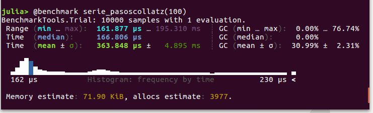

# Capítulo 9. Diagnosticar y medir el rendimiento

Una de las virtudes que más se suele publicitar de Julia es su velocidad de cálculo, incluso con enormes cantidades de datos. Pero la eficiencia de un programa depende de cómo esté construido. De hecho, un programa "mal escrito" (en el sentido de que no siga unas buenas prácticas de programación, aunque las operaciones sean correctas) puede resultar decepcionantemente lento. 

Este capítulo y los siguientes están dedicados a herramientas que Julia pone a disposición de los usuarios para mejorar la eficiencia de sus programas. A la hora de optimizar un programa, es muy importante buscar primero dónde están los "cuellos de botella" (las partes del código que más lento lo hacen) y medir tanto su influencia como el efecto de las supuestas mejoras que se introducen. Por esta razón, comenzaremos por ver herramientas que sirven para hacer estos diagnósticos.

## Ejemplo: pasos de las secuencias de Collatz

Para facilitar las explicaciones de este capítulo, vamos a usar como ejemplo el cálculo de [secuencias de Collatz](https://es.wikipedia.org/wiki/Conjetura_de_Collatz), series de números que comienzan con cualquier número natural, y que continúan según la siguiente regla, hasta llegar a 1:[^1]

```math
a_{i+1} = \begin{cases}
\begin{array}{ll}
a_i/2, & \textrm{si }a_i\textrm{ es par} \\
3a_i+1, & \textrm{si }a_i\textrm{ es impar}
\end{array}
\end{cases}
```

[^1]: No está matemáticamente probado que todas las secuencias de Collatz posibles acaben llegado a 1, pero es una conjetura verificada para los primeros trillones de números naturales. El siguiente [vídeo de Veritasium](https://www.youtube.com/watch?v=094y1Z2wpJg) proporciona una interesante introducción a este problema. 


Esta regla se puede expresar con una función como la que sigue:

```julia
siguiente_collatz(x) = iseven(x) ? x÷2 : 3x+1
```

Pero para evitar problemas de desbordamiento (ya que las secuencias de Collatz podrían llegar a números excesivamente altos), podemos forzar que siempre se usen números de tipo `BigInt`:

```@example c9
siguiente_collatz(x::BigInt) = iseven(x) ? x÷2 : 3x+1
siguiente_collatz(x) = siguiente_collatz(BigInt(x))
nothing #hide
```

A continuación se define la función `pasoscollatz`, que calcula el número de pasos que tiene que darse en una secuencia de Collatz que comience en `x` hasta llegar a la unidad:

```@example c9
function pasoscollatz(x::Integer)
    (x < 1) && throw(DomainError("solo se admiten números naturales"))
    n = 0
    s = BigInt(x)
    while s ≥ 1
        s == 1 && break
        s = siguiente_collatz(s)
        n += 1
    end
    return n
end
nothing #hide
```

Para calcular ese valor de todas las secuencias de Collatz con inicios desde 1 hasta `n`, bastaría con escribir:

```julia
pasoscollatz.(1:1000)
```

Pero es obvio que esto resulta un proceso poco ineficiente. Por la forma en la que se definen las secuencias de Collatz, se deduce que si conocemos el valor de `pasoscollatz(y)` para todos los valores de `y < x`, entonces para calcular `pasoscollatz(x)` solo haría falta contar los pasos de la secuencia desde `x` hasta que se alcanza el primer valor menor que `x`, y sumarles el resultado correspondiente a ese número menor. 

Para implementar este otro algoritmo se define el siguiente método de `pasoscollatz`, que hace la cuenta de los pasos desde `x` hasta el primer número menor que `x0`, y también devuelve el valor de ese número:

```@example c9
function pasoscollatz(x::Integer, x0)
    (x < 1) && throw(DomainError("solo se admiten números naturales"))
    n = 0
    s = BigInt(x)
    while s ≥ x0
        s == 1 && break
        s = siguiente_collatz(s)
        n += 1
    end
    return (n, s)
end
nothing #hide
```

Y la función `serie_pasoscollatz` emplea ese método para calcular el número total de pasos para secuencias de 1 a `n`:

```@example c9
function serie_pasoscollatz(n)
    pasos_total = zeros(Int, n)
    for i=2:n
        (pasos, inferior) = pasoscollatz(i, i)
        pasos_total[i] = pasos + pasos_total[inferior]
    end
    return pasos_total
end
nothing #hide
```

## Macros para medir consumos de tiempo y memoria

La herramienta más básica de Julia para medir la velocidad de una operación es un conjunto de macros que se pueden aplicar a cualquier expresión, para capturar el tiempo y la cantidad de memoria que se ha necesitado asignar para ejecutarla. La más básica es `@time`, que ejecuta la expresión e imprime una información básica en pantalla. Con esto podríamos, por ejemplo, comparar la velocidad de las dos alternativas definidas antes para calcular las longitudes de las series de Collatz de 1 a `n`:

```julia-repl
julia> @time pasoscollatz.(1:1000)
  0.014103 seconds (279.48 k allocations: 4.888 MiB)
1000-element Vector{Int64}:
   0
   1
   ⋮
  49
 111

julia> @time serie_pasoscollatz(1000)
  0.001451 seconds (27.12 k allocations: 495.336 KiB)
1000-element Vector{Int64}:
   0
   1
   ⋮
  49
 111
```

De esta manera podemos comprobar rápidamente que la segunda versión es diez veces más eficiente que la primera. El valor exacto del tiempo y la memoria consumida en asignaciones depende del ordenador y también puede variar entre pruebas. En particular, la primera vez que se ejecuta una función se suele observar un mayor consumo de tiempo y memoria, porque parte de lo que se está midiendo es la compilación.

La macro `@timev` hace lo mismo que `@time`, pero muestra más detalles sobre el tiempo y memoria consumidas. Por otro lado la macro `@timed`, en lugar de simplemente imprimir en pantalla las medidas de tiempo y memoria, las vuelca junto con el resultado de la operación en una tupla. Así, con `x = @serie_pasoscollatz(1000)` se obtendrían los siguientes valores:

* `x.value` con el resultado de la expresión ejecutada.
* `x.time` con el tiempo en segundos.
* `x.bytes` con el número de bytes de memoria asignados en la operación.
* `x.gctime` con el tiempo consumido en *garbage collection* (gestión de la memoria).
* `x.gcstats` con un objeto de tipo `GC_Diff` con más detalles sobre la gestión de memoria.


Una alternativa muy popular a la macro `@time` es `@btime` del paquete [BenchmarkTools](https://github.com/JuliaCI/BenchmarkTools.jl). A nivel de uso son muy semejantes, con unas importantes salvedades:

* `@btime` repite la operación múltiples veces, hasta llegar a un objetivo de repeticiones o tiempo. Las medidas de tiempo y memoria mostradas son un promedio, que excluye los tiempos de compilación.
* `@btime` permite interpolar los nombres de variables en la expresión para hacer más fiable el análisis. Por ejemplo, si el argumento de `serie_pasoscollatz(x)` estuviese guardado en la variables `n`, se podría escribir `@btime serie_pasoscollatz($n)`.
* La expresión pasada a `@btime` ha de ser sencilla, idealmente una simple llamada a una función. Para asignar el resultado a una variable ha de escribirse `y = @btime f(x)`, no `@btime y = f(x)`.

El paquete BenchmarkTools también proporciona la macro `@belapsed` equivalente a `@elapsed`, así como `@benchmark`, que da estadísticas más detalladas de todas las repeticiones realizadas, como en el siguiente ejemplo:[^2]



[^2]: El resultado mostrado se corresponde con la versión 1.1 de BenchmarkTools.

## *Profiling*

Las macros anteriores son útiles para comparar distintas versiones de una función, o para hacer pruebas unitarias de las funciones que componen un programa. Pero los cuellos de botella a menudo aparecen en funciones que no presentan un gran coste en pruebas de ese tipo, y dependen de cómo, cuánto y dónde se emplean. Por otro lado, aunque con esas macros se puedan detectar funciones excesivamente costosas, queda el reto de averiguar en qué parte de sus operaciones radica el problema.

Para diagnósticar esas situaciones Julia dispone de la macro `@profile` y otras funciones en el módulo estándar `Profile`. La macro `@profile` se usa igual que `@time`, pero no muestra nada en pantalla, sino que guarda numerosos detalles sobre todas las operaciones relevantes que se ejecutan como parte de la expresión que sigue, incluyendo los tiempos que consumen y la memoria que asignan. El concepto de *relevante* aquí está determinado por unos umbrales que se fijan con la función `Profile.init`; uno de estos umbrales es el intervalo de tiempo entre cada "captura" de información, que por defecto está fijado en 1 ms. Esto implica que `@profile` detectará todas las funciones que cuestan más de 1 ms.

Cada vez que se usa la macro `@profile`, la información recogida hasta el momento se amplía con la de la expresión ejecutada, a no ser que se ejecute `Profile.clear()` para "limpiar el *buffer*". Hay distintas formas de ver la información acumulada. La más básica es la función `Profile.print`, que la muestra en forma de texto. Pero esa información es tan copiosa que no resulta una forma práctica de examinarla.

Lo más habitual es usar los llamados [*flame graphs*](https://www.brendangregg.com/flamegraphs.html), que muestran de forma visual el tiempo consumido por cada operación y las "suboperaciones" que las componen, de forma recursiva, hasta llegar el límite de resolución temporal que se haya usado en el registro de información. Cada operación se representa con una barra horizontal, cuya longitud es proporcional al tiempo que consume; una secuencia de operaciones se representa como una sucesión horizontal de barras, y las operaciones anidadas en otras se representan apilando las barras verticalmente. Esa disposición aporta a los gráficos una forma característica, que se puede comparar con un relieve montañoso, o con el perfil de una llama cuando se colorea con tonos rojos y amarillos —de ahí el nombre que reciben—. 

Hay diversos paquetes y otras herramientas para crear y visualizar *flame graphs* a partir de esos registros. La siguiente figura muestra el gráfico interactivo que resulta de monitorizar la función `factoresprimos`, tal como se ve en VS Code con su [extensión para visualizar *flame graphs*](https://marketplace.visualstudio.com/items?itemName=ms-vscode.vscode-js-profile-flame).


Con esa extensión, VS Code no requiere cargar explícitamente el módulo `Profile` ni ningún otro paquete de Julia. Basta con escribir en el REPL:

```julia
@profview serie_pasoscollatz(100_000)
```

Esa instrucción crea una tabla con la información de tiempos recogida, cuya visualización se puede alternar con la de un *flame graph* como el mostrado si se dispone de la extensión adecuada. (Si no está disponible, al intentar cambiar de vista aparece una sugerencia para instalarla.)

En este gráfico el eje vertical está invertido respecto al sentido que usan otros visualizadores: las operaciones anidadas se muestran *debajo* de las que las contienen, en lugar de arriba. Las primeras barras (las que se muestran en la parte superior) tienen poco interés para nuestro propósito, pues tienen que ver con el entorno en el que se ejecuta y se monitoriza la expresión a evaluar. La parte interesante es la mitad inferior, comenzando por nuestra función principal: `serie_pasoscollatz`.

Naturalmente, esa función y `pasoscollatz` en el siguiente nivel ocupan casi todo el rango horizontal de tiempos. También se puede ver que la mayor parte del tiempo dentro de `pasoscollatz` lo ocupa la función `siguiente_collatz`, aunque también hay un consumo de tiempo significativo que se invierte en operaciones de comparación, y en el constructor `BigInt`.  Y dentro de `siguiente_collatz`, encontramos de forma más o menos equitativa la división entera (la función `div`) y otras operaciones aritméticas. A niveles inferiores hay muchos pequeños bloques de operaciones con el tipo `BigInt`. (En el pantallazo mostrado los nombres de funciones están cortados, pero en VS Code se puede hacer zoom y desplazarse para ver los detalles del gráfico.)

## Ejemplo: aplicación de mejoras

No siempre es fácil interpretar los detalles de resultados como los mostrados anteriormente. Una primera observación del *flame graph* es que `div` (usada cuando el número de la secuencia es par) parece ocupar tanto o más tiempo que las operaciones de multiplicación y suma empleadas con los impares. Quien conozca la aritmética binaria con números enteros, puede caer rápidamente en la cuenta de que dividir por 2 es equivalente a desplazar los bits del número una posición, lo cual es más eficiente en el caso de `BigInt`:

```@repl c9
using BenchmarkTools
mitad(x) = x ÷ 2    # operación con `div`
mitadb(x) = x >>> 1 # operación binaria
x = big"6782"
@btime mitad($x)
@btime mitadb($x)
```

Así pues, una posible mejora sería cambiar la operación de división en la función `siguiente_collatz`. Por otro lado, también se puede considerar que el hecho de hacer operaciones con `BigInt` añade una carga significativa, y que podría aumentarse la eficiencia utilizando otros tipos de números enteros. El precio a pagar sería el riesgo de cometer errores, si en alguna secuencia se supera el límite de desbordamiento para ese tipo.

En la práctica, con la mayoría de ordenadores personales se pueden calcular las secuencias de Collatz usando tipos de enteros menos costosos sin superar su límite de desbordamiento, antes de que el tamaño del vector generado con `serie_pasoscollatz` sea inmanejable. Por lo tanto sería razonable modificar las funciones anteriores para evitar el retardo sistemático provocado por usar `BigInt`.

Juntando esas dos ideas, el método genérico de `siguiente_collatz` podría modificarse como sigue, para que devuelva un número del mismo tipo de entero introducido:

```@example c9
function siguiente_collatz(x::T) where T<:Integer
    if iseven(x)
        return x >>> 1
    else
        if x > typemax(T) ÷ 3
            throw(DomainError("la secuencia excede del límite superior para $T"))
        end
        return T(3)*x + one(T)
    end
end
nothing #hide
```

Asimismo, las otras dos funciones (`pasoscollatz` y `serie_pasoscollatz`), se podrían modificar del siguiente modo para que las secuencias contengan el tipo de entero que se introduce como argumento:

```@example c9
function pasoscollatz(x::Integer, x0)
    (x < 1) && throw(DomainError("solo se admiten números naturales"))
    n = 0
    while x ≥ x0
        x == 1 && break
        x = siguiente_collatz(x)
        n += 1
    end
    return (n, x)
end

function serie_pasoscollatz(n::T) where T<:Integer
    pasos_total = zeros(Int, n)
    for i=range(T(2), stop=n)
        (pasos, inferior) = pasoscollatz(i, i)
        pasos_total[i] = pasos + pasos_total[inferior]
    end
    return pasos_total
end
nothing #hide
```

Cualquiera de las medidas de *benchmarking* expuestas anteriormente muestra que esta nueva versión de `serie_pasoscollatz` es cien veces más rápida que la basada en `BigInt`.