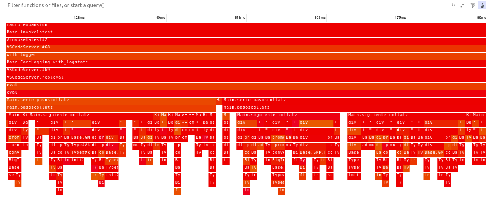

# Capítulo 9. Optimizando el código

```@setup c9
using Random
Random.seed!(123)
```

Una de las virtudes que más se suele publicitar de Julia es su velocidad de cálculo, incluso con enormes cantidades de datos. Pero para que un programa sea eficiente también tienen que aprovecharse bien los recursos del lenguaje. De hecho, un programa "mal escrito" (en el sentido de que no siga unas buenas prácticas de programación, aunque las operaciones sean correctas) puede resultar decepcionantemente lento. En este capítulo vamos a ver algunas de esas buenas prácticas para hacer programas eficientes. En la sección de [Performance tips](https://docs.julialang.org/en/v1/manual/performance-tips/) del manual oficial de Julia encontrarás estas y más recomendaciones para aumentar la eficiencia de tus programas.

Por supuesto, la optimización del código no es algo que se pueda reducir a una serie de recetas y consejos generales: cada programa presenta sus propios cuellos de botella y desafíos, que pueden requerir conocimientos profundos y especializados sobre la gestión de memoria y otros recursos informáticos. Julia también ofrece herramientas para trabajar a bajo nivel, incluso en código máquina; pero aquí nos conformaremos con presentar las buenas prácticas más sencillas, que pueden aplicarse a la mayoría de programas, a un nivel semejante al que se ha visto en los capítulos anteriores.

Antes de entrar en otras materias más específicas, la primera de las buenas prácticas a destacar es una muy sencilla, y que no requiere grandes explicaciones: lo que más te ayudará con el mínimo esfuerzo a que tu programa sea robusto y eficiente es encapsular el código en pequeñas funciones, desde el primer momento en que comiences a escribir código. Este consejo ya se dio en la [guía básica de Julia](https://hedero.webs.upv.es/julia-basico/10-debugging/#Encapsular-c%C3%B3digo-en-funciones-peque%C3%B1as) que antecede a esta, con la finalidad de hacer los programas más fáciles de depurar y mantener. Pero también es un buen consejo para procurar que el código sea eficiente. No es que el mero hecho de tener el código estructurado en forma de funciones mejore mágicamente su velocidad de ejecución; pero varias de las recomendaciones que se explicarán en las siguientes secciones son más fáciles de cumplir si se sigue este sencillo consejo.

## Evitar variables globales

En el [capítulo 7](7-contextos.md) hemos visto que las variables de un programa pueden ser locales o globales. El alcance de las variables locales se limita a la estructura en la que están definidas (función, bucle, u otros tipos de bloques), por lo que generalmente están sujetas a un conjunto de operaciones cerrado --las variables "capturadas" en funciones anidadas pueden ser una excepción a esto--. Por otro lado, las variables globales pueden ser accedidas por cualquier otro elemento del módulo en el que están definidas, e incluso por otros módulos --aunque la única manera de modificarlas desde otro módulo es mediante `eval`--.

Tanto si son locales como globales, las variables son sencillamente nombres que designan objetos representados de alguna forma en la memoria del ordenador. Pero debido a su distinto alcance, el espacio de memoria ocupado por esos objetos se gestiona de forma distinta según si se asocian a variables locales o globales, y resulta mucho menos eficiente en el caso de las globales. Por esa razón, una de las recomendaciones habituales para mejorar la velocidad de los programas es evitar el uso de *variables* globales lo máximo posible.

El énfasis en la palabra "variables" se debe a que el problema no está en todos los tipos de objetos globales, sino específicamente en las variables, que pueden cambiar su contenido. De hecho, una de las soluciones recomendadas para evitar este problema (después de la de utilizar funciones para utilizar menos globales) es sustituir las variables globales por *constantes*, siempre que sea pertinente, por ejemplo cuando se trata de parámetros cuyo valor no se espera que tenga que cambiar.

Las constantes se definen igual que las variables, pero añadiendo la palabra `const` antes del nombre. También es costumbre usar nombres en mayúsculas para distinguir las constantes de las variables. Por ejemplo, podríamos definir la [constante de Avogadro](https://es.wikipedia.org/wiki/Constante_de_Avogadro) de la siguiente manera:

```julia
const AVOGADRO = 602_214_076_000_000_000_000_000
```

Esto es una promesa de que `AVOGADRO` no se va a redefinir más adelante, por lo que el espacio que ocupa en memoria puede gestionarse de forma eficiente y segura a la vez. Si se intenta redefinir más adelante, dependiendo del caso la operación puede dar lugar a un error o por lo menos un *warning*, y no está bien definido lo que puede pasar después con ella.

Eso no impide, sin embargo, que las constantes sean objetos *mutables*. Por ejemplo podría ser un vector, que se puede modificar sin ningún tipo de problema; lo que no se debería hacer es sustituirlo por otro vector u otro tipo de objeto:

```@repl
const NUMEROS = [1,2,3]
push!(NUMEROS, 4) # esto es correcto
NUMEROS = [5,6,7,8] # pero esto no
```

Así pues, los tipos mutables son un recurso para crear constantes que se pueden utilizar hasta cierto punto como variables. Para representar un solo valor, en lugar de vectores se pueden utilizar objetos de tipo `Ref`, que son como vectores que solo admiten un elemento; por ejemplo:

```@repl c9
const K = Ref(1)
```

El contenido de un `Ref` se puede consultar o reemplazar como se hace con los vectores, aunque como solo pueden tener un elemento, no se tiene que usar ningún índice entre los corchetes:

```@repl c9
K[] # consultar
K[] = 2 # modificar
K[] # consultar nuevo valor
```

Lo que hay que tener en cuenta a la hora de modificar un `Ref` --igual que en el caso de los vectores-- es que solo se admiten valores del mismo tipo. Esto no funcionaría, ya que `K` se creó como un contenedor de enteros:

```@repl c9
K[] = 0.5
```

## Optimizar operaciones con bucles y *arrays*

Los cálculos con *arrays* de grandes dimensiones, y en general las rutinas iterativas que repiten operaciones sobre grandes cantidades de datos son partes de los programas que típicamente consumen una gran parte del tiempo de computación, así que también suelen ser partes en las que pequeñas mejoras pueden tener un gran impacto sobre la velocidad del programa.

### Bucles vs. código vectorizado

En primer lugar vale la pena desterrar el prejuicio hacia los bucles que a menudo se aprende al programar en otros lenguajes como Matlab/Octave, Python (con Numpy) o R. En esos lenguajes las operaciones con *arrays* están muy optimizadas, y resulta más rápido hacer una sola operación complicada con *arrays* de 1000 elementos que interpretar y ejecutar 1000 operaciones con unos pocos números escalares. Así que en ellos se recomienda, cuando es viable, sustituir los bucles por operaciones monolíticas con *arrays* que contengan todos los elementos sobre los que se quiere iterar.

Por ejemplo, supongamos que tenemos dos vectores de números `x` e `y`, de longitudes `n` y `m`, respectivamente, y tenemos que calcular la variable `z` que se define según la siguiente fórmula:

```math
z = \sum_{i,j=1}^{n,m}(x_i \cdot x_j + \left|x_i - y_j\right|)
```

Esta operación se podría escribir en una función como:

```julia
function operacion1(x, y)
    z = 0
    for xi in x, yj in y
        z += xi * yj + abs(xi - yj)
    end
    return z
end
```

Su versión "vectorizada" podría ser algo como lo que sigue:

```julia
function operacion2(x, y)
    multiplicacion = x .* y'
    resta = x .- y'
    sumandos = multiplicacion .+ abs.(resta)
    z = sum(sumandos)
    return z
end
```

Las dos formas de escribir estas operaciones son posibles, y el mecanismo de *broadcasting* (las operaciones "con punto") facilita mucho hacer la versión vectorizada. Pero en Julia la vectorización del código no es necesaria; ni siquiera es conveniente en general. El código de las operaciones vectorizadas a veces es más complicado de entender que si se desarrolla en forma de un bucle `for`, y normalmente requiere más memoria, porque hay que guardar todos los datos en *arrays* para hacer todas las operaciones con una sola instrucción. En otros lenguajes la mayor rapidez de las operaciones vectorizadas compensa esos inconvenientes, pero ese no es el caso en Julia. De hecho, en el ejemplo anterior la versión vectorizada es notablemente más lenta y consume muchísima más memoria que la basada en el bucle `for`.

### Iterar con *arrays* y preasignación

Cuando un bucle tiene como objetivo la generación de un *array*, hay dos formas de proceder: comenzar con un vector vacío e ir aumentándolo con operaciones como `push!` o `append!`, o bien crearlo por anticipado con valores arbitrarios e ir "rellenándolo" con los valores correctos. A continuación se muestra un ejemplo de la primera alternativa, aplicada al cálculo de un vector en el que se calcula el número de caracteres que tiene cada línea de un archivo de texto:

```julia
caracteres = Int[]
for linea in eachline(archivo)
    push!(caracteres, length(linea))
end
```

Este código tiene la desventaja de que en cada iteración se tiene que redefinir el vector `caracteres` para alterar su tamaño, lo cual consume más recursos que crear un vector del tamaño adecuado al inicio e ir rellenándolo a continuación:

```julia
n = countlines(archivo)
caracteres = Vector(Int, n)
for (i, linea) in enumerate(eachline(archivo))
    caracteres[i] = length(linea)
end
```

Esta segunda alternativa supone un ahorro de memoria, aunque obliga a procesar el archivo dos veces: una para contar el número de líneas con la función `countlines`, y otra para medir su longitud e ir escribiendo el resultado. Esto es porque el primer paso es suficientemente sencillo (consume aproximadamente un 5% del tiempo total, y prácticamente nada de memoria comparado con el resto de la operación), y compensa sobradamente el coste adicional de ir redefiniendo el vector `caracteres`. Este es un ejemplo muy básico, en el que según el tamaño del archivo no se observará gran diferencia, pero hay situaciones en las que el ahorro sí se puede notar.

Se podría señalar también que un bucle tan sencillo es un candidato ideal para escribirlo como un *array comprehension*:

```julia
caracteres = [length(linea) for linea in eachline(archivo)]
```

Sin embargo, a pesar de que es más conciso y fácil de leer, es la más lenta y pesada de las tres alternativas.

La preasignación de *arrays* puede ser un recurso especialmente útil para ganar eficiencia, si las operaciones que se hacen en el bucle implican crear nuevos *arrays* (por ejemplo, si se está trabajando con vectores, matrices, etc., y se definen nuevos valores de los mismos en cada iteración). La creación de *arrays* es más costosa que la de escalares, porque el espacio que ocupan en memoria se gestiona de otro modo. Así que, aprovechando que son objetos mutables, según el caso puede ser buena idea predefinirlos fuera del bucle, y hacer que las operaciones del mismo no creen nuevos *arrays*, sino que sencillamente los modifiquen asignándoles nuevos valores a sus elementos.

!!! tip "Usar `StaticArray`s para trabajar con *arrays* pequeños"
    
    Una alternativa que puede ser útil en situaciones como la anterior es usar el paquete [StaticArrays](https://juliaarrays.github.io/StaticArrays.jl/stable/) para crear los vectores, matrices, etc. que se tengan que usar en las iteraciones. Ese paquete define unos tipos especiales de *arrays* (`SArray`, `MArray`, etc.) que se comportan en casi todo como los tipos de *array* estándar, excepto en que no se puede cambiar sus dimensiones, y en el caso de los `SArray` son inmutables. Estas restricciones permiten gestionarlos de tal manera que son mucho maś eficientes de usar, sobre todo si no tienen muchos elementos.

!!! note "Peligros de los cálculos en paralelo"
    
    La recomendación de predefinir *arrays* fuera de los bucles y modificarlos en las iteraciones hay que tomarla con cautela cuando se hacen cálculos en paralelo. Véase el siguiente capítulo para más detalles al respecto.

### Acceso eficiente a los *arrays*

Cuando se itera sobre *arrays*, también hay algunas prácticas que ayudan a que el acceso a sus contenidos sea más rápido. Cuesta menos leer o escribir elementos contiguos de un *array*, que también suelen ocupar direcciones contiguas en la memoria del ordenador, que "saltar" entre elementos distantes. Esto significa que en el caso de matrices es más eficiente iterar por columnas (recorrer primero la primera columna, luego la segunda, etc.) que por filas, ya que esa es la forma en la que están ordenados internamente sus elementos. Por ejemplo, en la siguiente matriz:

```@repl c9
matriz = reshape(1:12, 3, 4)
```

La forma eficiente de iterar a lo largo de todos los elementos de esta matriz sería poniendo las columnas en en bucle más externo, lo que nos permitiría recorrer sus elementos en el orden natural.

```@repl c9
for columna=1:4, fila=1:3
    println(matriz[fila, columna])
end
```

Generalizando esta regla para *arrays* multidimensionales, en general lo más eficiente es iterar comenzando por la mayor dimensión, y luego por las siguientes hasta llegar a la primera. El ejemplo dado con matrices es un caso particular de esta regla para dos dimensiones (iterar en primer lugar a lo largo de la segunda dimensión, y luego por la primera.)

Cuando se tiene una serie de índices para filas y columnas (o más dimensiones), pero esta serie no está ordenada como conviene, se pueden reordenar fácilmente haciendo uso de "índices cartesianos" (objetos de tipo `CartesianIndex`). Supongamos por ejemplo que tenemos esta serie, en la que cada elemento es una tupla de índices para una matriz (primero la fila y luego la columna):

```@repl c9
celdas = [(1,1),(1,2),(1,3),(2,1),(2,3),(3,3)]
```

Se puede observar que los elementos de la matriz representada están ordenados por filas, y parcialmente salteados:

```@repl c9
for (i,j) in celdas
    println("Elemento ($i, $j): ", matriz[i,j])
end
```

Los objetos de tipo `CartesianIndex` sirven para indexar los elementos de un *array* (da igual el número de dimensiones) a partir de los índices de sus ejes (filas, columnas, etc.). Así, una operación equivalente a la anterior es:

```@repl c9
for ij in celdas
    ind = CartesianIndex(ij)
    println("Elemento $ind: ", matriz[ind])
end
```

Pero una ventaja interesante de indexar a través de `CartesianIndex` en lugar de simples tuplas de números, es que este tipo especial de índices guarda un orden consistente con el de los elementos de los *arrays*, y se pueden reordenar con `sort` (o `sort!` para reordenar "en el sitio", sin crear una copia):

```@repl c9
ci = CartesianIndex.(celdas)
sort!(ci)
for ind in ci
    println("Elemento $ind: ", matriz[ind])
end
```

Esto puede ayudar a crear recorridos más eficientes a lo largo de los índices de matrices y *arrays multidimensionales*, sin tener que hacer manualmente los cálculos para reordenarlos.

### "Vistas" de *arrays* (*views*)

Cuando se tiene que operar con bloques de *arrays* en lugar de elementos individuales de los mismos o con el *array* completo, a menudo se hace un consumo de memoria que resulta superfluo, porque se crean *arrays* nuevos con datos que ya están en el original. Por ejemplo, supongamos que tenemos que hacer operaciones con submatrices de tamaño 3×3 incluidas en la que se ha usado para los ejemplos anteriores:

```@repl c9
for i = 1:2
    println("")
    submatriz = matriz[:, i:i+2]
    println(submatriz)
end
```

En este código, `submatriz` es una copia de una parte de `matriz` (lo que en inglés llaman *slice*, es decir una "tajada"). Esa copia ocupa su propio espacio en memoria, y con volúmenes de datos suficientemente grandes (por ejemplo con miles de elementos) eso puede significar una carga que ralentice significativamente el programa. Una alternativa es utilizar "vistas" de la matriz, que se comportan como esas copias parciales pero utilizan directamente los datos de la matriz original. Esto se consigue con la función `view`, o más cómodamente con la macro `@view`:

```@repl c9
for i = 1:2
    println("")
    submatriz = @view matriz[:, i:i+2]
    println(submatriz)
end
```

Es importante tener en cuenta que si se hace una modificación a estas "vistas", al referirse a los datos originales, se modifica también el *array* original, lo cual no ocurre con las copias. Este y otros detalles se explican en el [capítulo sobre *arrays* de la guía básica](https://hedero.webs.upv.es/julia-basico/5-arrays/#Mutabilidad-de-los-*arrays*).

### Macro `@inbounds`

Para terminar con los bucles, se puede señalar que hay distintas herramientas en Julia que ayudan a optimizar el funcionamiento de los mismos, como la macro `@inbounds`. Esta macro "desactiva" las comprobaciones que se hacen normalmente cuando se indexan *arrays* para asegurarse de que no se excede su tamaño, lo que hace las iteraciones más rápidas, aunque menos seguras. Utilizarla es tan sencillo como añadir `@inbounds` antes de escribir el bucle:

```julia
@inbounds for i = 1:n
    # ...
end
```

Por supuesto, solo conviene usar este "truco" cuando estamos seguros de que los índices empleados en el bucle están dentro de los límites, y por lo tanto las comprobaciones desactivadas son innecesarias. Una práctica aconsejable a este respecto es utilizar la función `eachindex` en lugar de rangos para crear los iteradores cuando se necesiten los índices. Así, en lugar de:

```julia
n = length(x)
@inbounds for i = 1:n
    # operaciones con x[i]
end
```

... convendría escribir:


```julia
@inbounds eachindex(x)
    # operaciones con x[i]
end
```

O si es posible prescindir de los índices, es incluso mejor:

```julia
@inbounds for xi in x
    # operaciones con xi
end
```

Con los *arrays* habituales ambos códigos son prácticamente equivalentes, pero no todos los tipos de contenedores iterables se indexan con series de números naturales comenzando por 1, por lo que en general es más seguro evitar los rangos para esta finalidad.

Del mismo modo, para operar a lo largo de filas, columnas u otras dimensiones de *arrays* se puede usar la función `axes`, de tal manera que por ejemplo `axes(x, 1)` devuelve un iterador con los índices de las filas de `x`, `axes(x, 2)` hace lo propio con los índices de las columnas, etc.

## Facilitar la inferencia de tipos

La inferencia de tipos es una cuestión clave para conseguir un código eficiente, y en otros sitios se menciona antes que algunos de los temas tratados arriba. Aquí lo hemos postergado, pero no por tener menos importancia, sino por que es un aspecto más complicado de manejar que los anteriores.

Para que un programa sea eficiente es fundamental que las funciones se compilen de forma óptima. La compilación consiste, a grandes rasgos, en traducir el código escrito por el programador en código máquina. A ese bajo nivel es crucial conocer el tipo de cada variable, porque el tipo define cómo cada valor se codifica en memoria. Algunos lenguajes de programación como C o Java obligan a declarar de forma explícita el tipo al que pertenece cada variable. Julia, en cambio, infiere el tipo de las variables y otros objetos según el código usado para definirlas, sin declaraciones explícitas.

Por ejemplo, en el caso de los números, `1` es por definición un `Int`[^1], mientras que `1.0` es un `Float64`, `0x01` es un `UInt8`, etc., aunque todos esos números representen una unidad. Por otro lado, la mayoría de tipos se determinan a través del constructor usado al crear el objeto; por ejemplo para definir la unidad de un `Int128` (entero de 128 bits) hay que escribir `Int128(1)`.

[^1]: `Int` es equivalente a `Int64` en ordenadores con arquitectura de 64 bits, o `Int32` en los de 32 bits.

Hemos visto en el [capítulo 3](3-tipos-intro.md) que los constructores también pueden tener métodos para crear tipos distintos según los argumentos de entrada. De hecho en general, cuando se asigna a una variable el resultado de una operación, el tipo resultante puede depender tanto de la función empleada como de los argumentos. Por ejemplo, en el caso de la multiplicación `z = x*y`:

* Si `x` e `y` son dos números de cualquier tipo común, `z` será un número del mismo tipo.
* Si `x` e `y` son dos tipos distintos de números enteros, p.ej. `Int32` e `Int64`, `z` será del tipo de entero que pueda representar los valores de ambos (en este caso `Int64`).
* Si `x` es un `Float64` e `y` es un *array* de `Int`s, `z` será un *array* de `Float64`.
* Si `x` e `y` son dos cadenas de texto (`String`s), `z` será otro `String` que concatena `x` seguido de `y`.
* Etc.

Sin embargo, no siempre es todo tan sencillo. Es fácil introducir operaciones que generen una situación ambigua. Un caso habitual son las estructuras de código como bloques condicionales o bucles. Por ejemplo, en la siguiente función que realiza una "operación sorpresa" sobre dos argumentos:

```@example c9
function sorpresa(x, y)
    if rand() > 0.5
        z = x/y
    else
        z = x*y
    end
    return z
end
```

Si tanto `x` como `y` son números enteros, la operación `x*y` dará lugar a otro entero, pero `x/y` dará un número decimal. Por lo tanto no se puede predecir de qué tipo será el resultado `z` antes de conocer los valores de los argumentos. Otro ejemplo, esta vez a causa de un bucle que trata de reproducir lo que hace la función `sum`:

```julia
function suma(valores)
    y = 0
    for x in valores
        y += x
    end
    return y
end
```

En este caso, la variable `y` se define inicialmente como un número del tipo de `0` (un `Int`), pero una vez se entra en el bucle, se le asignan nuevos valores que pueden ser de otro tipo, dependiendo del tipo de los elementos contenidos en `valores`. Así pues, tampoco se podrá saber a priori de qué tipo va a ser en cada momento `y`.

En estas situaciones, cuando a través del código no se puede inferir unívocamente el tipo de alguna variable, se dice que la variable es de "tipo inestable". Cuando esto ocurre en el código de una función, es más difícil que se compile adecuadamente, lo que puede hacer que sea más lenta. Por esta razón, una de las recomendaciones más habituales para hacer funciones eficientes es cuidar la estabilidad de tipos en las funciones.

Una complicación de la inestabilidad de tipos es que muchas veces es difícil detectar su presencia solo observando el código, por lo que se necesitan herramientas para vigilar si ocurre o no. Una de las más básicas es la macro `@code_warntype`, que muestra en pantalla la inferencia de tipos que se haría al llamar a una función con unos argumentos dados. Por ejemplo, con la función `sorpresa` que hemos definido antes:

```julia-repl
julia> @code_warntype sorpresa(1,2)
Variables
  #self#::Core.Const(sorpresa)
  x::Int64
  y::Int64
  z::Union{Float64, Int64}
```

La información mostrada por `@code_warntype` en realidad contiene más detalles, pero para lo que queremos ver ahora basta con esas primeras líneas, que indican el tipo de las variales que intervienen en la función. En el REPL habitual, la línea que indica el tipo de la tercera variable (`z::Union{Float64, Int64}`) se muestra marcada en rojo,[^2] destacando que no es de un tipo bien determinado (puede ser tanto `Float64` como `Int64`). Se puede destacar que la inestabilidad de tipos no depende solo de la función, sino también del tipo de los argumentos usados; por ejemplo, si uno de los dos argumentos de `sorpresa` fuese un número decimal, no nos encontraríamos con el mismo problema.

[^2]: El ejemplo de `@code_warntype` mostrado aquí es de la versión 1.6 de Julia. Versiones anteriores muestran el resultado de forma distinta.

Hay buenas prácticas que ayudan a prevenir esas ambigüedades o a reducir su impacto. Una de ellas es la comentada anteriormente de evitar variables globales, ya que sus contenidos podrían cambiarse por otros en cualquier momento (eso no ocurre con las constantes).

En casos como el de la función `suma`, donde hay un valor que se inicializa y luego se sustituye a través de operaciones con los argumentos, suele recomendarse que el valor inicial también se ajuste según los argumentos de entrada. Por ejemplo, se podría conseguir una versión estable de `suma` para números distintos de los enteros, sustituyendo la línea `y = 0` por una equivalente, pero en la que el tipo de `y` sea consistente con los valores que luego recibirá:

```julia
function suma_estable(valores)
    y = zero(eltype(valores))
    for x in valores
        y += x
    end
    return y
end
```

También es bueno un estilo de programación basado en hacer muchas funciones pequeñas, más que unas pocas funciones con mucho código. Las funciones que se reducen a una serie lineal de operaciones, sin bifurcaciones que puedan introducir ambigüedades como las vistas anteriormente, serán de tipo estable siempre que las operaciones que utiliza lo sean a su vez. Todas las operaciones y funciones básicas de Julia son de tipo estable; y ese nivel de confianza se puede extender a los paquetes de terceros más populares, especialmente en los que la eficiencia es un objetivo principal, ya que en ellos este suele ser también un aspecto muy cuidado. Así pues, es más fácil preservar la estabilidad de tipos en funciones cortas y sencillas que en las largas y complicadas. Incluso si incorporan bloques condicionales, bucles u otras estructuras que pueden introducir ambigüedades, la simplicidad ayuda a reducir el riesgo, o al menos a detectarlo con más facilidad.

### Funciones barrera

En este punto uno se puede preguntar: pero si al final hay que hacer las mismas operaciones, ¿cuál es la diferencia entre escribirlas todas directamente en una sola función, o escribirlas en múltiples funciones pequeñas que luego tienen que ser llamadas por una función principal? El motivo es que las funciones pequeñas pueden hacer de barrera para prevenir que las inestabilidades "contaminen" todo el código. En este sentido, podríamos pensar en las funciones como recetas y en la compilación como el proceso de aprendérselas de memoria, para poder realizarlas sin pararse a consultar las instrucciones. Una inestabilidad de tipo en una línea de una función sería como introducir alguna traba que impide aprenderse la receta de memoria. Pero si algunos pasos de la receta (pongamos que se trata de un plato de pasta) son a su vez otras "subrecetas" que el cocinero ya se había aprendido (por ejemplo hacer la salsa de acompañamiento), no costará tanto como si los pasos para hacer la salsa fueran parte de la receta principal que no se puede aprender.

En Julia es habitual hablar de "funciones barrera" como recurso para reducir esta clase de problemas. Pero una advertencia que hay que hacer al respecto es que se trata de barreras para proteger código de tipo estable, no para contener el código de tipo inestable. Podemos verlo con un ejemplo. Supongamos que tenemos una función `principal` que tiene que hacer una serie de operaciones como se define a continuación:

```julia
function principal(a)
    b = inestable(a) # ¡`b` es de tipo inestable!
    c = estable1(a, b)
    d = estable2(c)
    return d
end
```

Consideremos que la primera operación es de tipo inestable, porque el tipo de su resultado, que se asigna a la variable `b`, es ambiguo (podría ser el caso de que `inestable` fuese como la función `sorpresa` que hemos visto antes). Puede que, por otro lado, el resultado de las funciones `estable1` y `estable2` fuera el mismo cualquiera que fuese el tipo de `b`, pero una vez ha fallado el mecanismo de inferencia con `b`, no hay ninguna garantía de que vaya a predecir claramente los tipos de `c` o `d`, que dependen directa o indirectamente de `b`. En cierto modo, es como si la inestabilidad de la primera línea se propagase a todas las demás líneas de la misma función. De hecho, esa inestabilidad haría que la función `principal` también sea de tipo inestable, porque no se podría saber a priori de qué tipo será el valor que devuelve (`d`).

Ahora bien, si las otras dos operaciones son de tipo estable, es una buena idea protegerlas con la función `barrera` como sigue:


```julia
function barrera(a, b)
    c = estable1(a, b)
    d = estable2(c)
    return d
end    

function principal(a)
    b = inestable(a)
    d = barrera(a, b)
    return d
end
```

La función `principal` seguiría ralentizándose parcialmente y continuaría siendo de tipo inestable, porque el tipo de `b` no puede conocerse hasta que se ejecuta, y lo mismo puede decirse del resultado `d` en la siguiente línea. Pero *dentro* de la función `barrera`, las dos operaciones que contiene se podrían compilar sin problemas. Así pues, aunque la función barrera no resuelve el problema, al menos hace que una parte de la función no sea tan lenta. (En la metáfora culinaria de antes, sería como si `barrera` fuese la receta de la salsa que el cocinero se sabe de memoria.)

En cambio, lo que sigue no ayudaría gran cosa:

```julia
function barrera_inutil(a)
    b = inestable(a)
    c = estable1(a, b)
    return c
end

function principal(a)
    c = barrera_inutil(a)
    d = estable2(c)
    return d
end
```

La función `barrera_inutil` contiene la inestabilidad de tipo que antes estaba en `principal`, y por lo tanto la propia función es también inestable. No sería posible inferir el tipo de ninguna de las variables `b` o `c` dentro de `barrera_inutil`, y como `c` es el resultado de esa función, tampoco se podría inferir su tipo ni el de `d` en `principal`. Es decir, que la situación sería muy parecida a la de la función original.

### No usar contenedores de tipos abstractos

Los tipos abstractos son un recurso muy práctico para varias cosas. Para empezar, en el [capítulo 1](1-multiple-dispatch.md) vimos cómo ayudan a definir métodos genéricos y extensibles. Otra de sus utilidades es permitir que los elementos de *arrays* y otros contenedores no estén restringidos a un tipo concreto específico. Por ejemplo, en el código que sigue se define una variable de tipo `Ref`, que como hemos visto antes puede cambiarse de valor, pero no de tipo. Sin embargo, gracias al uso de tipos abstractos podemos hacer que admita cualquier tipo de número (`Number`):

```@repl
x = Ref{Number}(1)
x[] # inicialmente contiene un entero
x[] = 0.5 # pero admite decimales...
x[] = 1+1im # y de hecho cualquier tipo de número
```

Ahora bien, que esta clase de cosas se pueda hacer no significa que sea una buena idea. Los contenedores de tipos abstractos son una fuente casi segura de inestabilidad, porque cuando se extrae un valor de ellos no se puede conocer a priori cuál será su tipo. Siguiendo con el ejemplo anterior, si en una función apareciese la expresión `x[]`, no habría manera de predecir a cuál de todos los subtipos de `Number` pertenecería su resultado.

!!! note "No existen objetos de tipo abstracto"
    
    Ante la cuestión anterior surge a veces una confusión: si `x` es del tipo `Ref{Number}`, ¿cómo es que `x[]` no es del tipo `Number`? El motivo es que los tipos abstractos son, como dice su nombre, abstracciones: la unión bajo un mismo nombre de múltiples tipos concretos; pero los objetos representados en memoria siempre son de un tipo concreto. Así, decir que `x` es un contenedor de `Number` no significa que los objetos contenidos en él sean `Number`, sino que son *subtipos concretos* de `Number` (si `eltype(x) == Number`, entonces `typeof(x[]) <: Number`).

En el ejemplo anterior, `x` se ha definido explícitamente como un contenedor de elementos abstractos, igual que si hubiéramos definido el vector `Number[1, 0.5, 1+1im]`. Pero también es fácil (y por lo tanto más problemático) crear contenedores abstractos inadvertidamente. Por ejemplo, si se inicializa un vector como `x = []`, este será del tipo `Vector{Any}`, aunque todo lo que se vaya a añadir sean elementos de un mismo tipo concreto. Del mismo modo, una forma habitual de cargar tablas de datos es leerlas con la función `readdlm` a partir de archivos de texto; y si esa tabla contiene datos de distintos tipos que no se pueden convertir entre sí (por ejemplo números y textos), el resultado será del tipo `Matrix{Any}`.

El problema de los contenedores abstractos también se extiende a los tipos compuestos. Por esa razón se recomienda que sus elementos estén anotados como tipos concretos, o bien utilizar definiciones paramétricas. Así pues, [ya veíamos en el capítulo 3](3-tipos-intro.md#Tipos-de-los-campos-y-tipos-paramétricos) que un tipo como `Fraccion` podría definirse del siguiente modo, asignando el tipo concreto `Int` a sus dos elementos:

```julia
struct Fraccion <: Real
    num::Int
    den::Int
end
```

O si queremos permitir que el numerador y el denominador sean algún otro tipo de entero, se puede utilizar una definición paramétrica:

```julia
struct Fraccion{T<:Integer} <: Real
    num::T
    den::T
end
```

Pero aunque se pueda hacer, no sería recomendable anotar los elementos con tipos abstractos como `Integer`:

```julia
struct Fraccion <: Real
    num::Integer
    den::Integer
end
```

Ni tampoco lo es dejar los elementos sin anotar, pues eso equivale a anotarlos como del supertipo abstracto `Any`:

```julia
struct Fraccion <: Real
    num
    den
end
```

## Diagnosticar y medir cuellos de botella

Cosas que hemos visto en este capítulo como evitar las variables globales y la inestabilidad de tipos, usar de forma eficiente los bucles y los *arrays*... son unos principios básicos generales para optimizar el código, junto con el procesamiento en paralelo que se tratará en el siguiente capítulo. Pero unos consejos generales pueden no ser suficientes para resolver problemas particulares.

A la hora de optimizar un programa, es muy importante buscar primero dónde están los "cuellos de botella" (las partes del código que más lento lo hacen) y medir tanto su influencia como el efecto de las supuestas mejoras que se introducen. Todo lo comentado en las secciones anteriores tiene muy poca utilidad si se aplica a las partes del programa que consumen menos tiempo y recursos, o puede que realmente no cambie gran cosa.

Como conclusión de este capítulo veremos un par de herramientas que Julia pone a disposición de los usuarios con esa finalidad. Para facilitar las explicaciones, usaremos como ejemplo la siguiente función, expresamente *naíf* y poco eficiente, que calcula los factores primos de un número entero dado:

```@example c9
function factoresprimos(num::T) where {T<:Integer}
    # Lista de números enteros  inicialmente vacía
    factores = T[]
    # Se comienza probando el factor f = 2
    f = T(2)
    while num ≥ f^2
        # Si se encuentra un divisor...
        if mod(num, f) == 0
            push!(factores, f) # se añade a la lista de factores
            num = div(num, f)  # y se divide n por el factor
        else
            # Si f no es un divisor, probar con el siguiente
            f = f + T(1)
        end
    end
    # Añadir el número que queda sin factorizar y devolver la lista
    push!(factores, num)
    return factores
end
```

Esta función proporciona un *array* de factores primos, en la que cada número se repite tantas veces como se puede dividir en el argumento de entrada, de tal manera que `prod(factoresprimos(x)) == x`. O con un ejemplo:

```@repl c9
factoresprimos(63800) # 2^3 * 5^2 * 11 * 29
```

La función `contar_frecuencias` que se da a continuación sirve para transformar ese *array* en una colección de parejas de valores, en la que cada factor se acompaña de su número de repeticiones:

```@example c9
function contarfrecuencias(x)
    unicos = unique(x)
    return [u => count(isequal(u), x) for u in unicos]
end
```
```@repl c9
contarfrecuencias( factoresprimos(63800) )
```

Finalmente, para que el impacto de estas ineficientes funciones se pueda apreciar en los siguientes ejemplos, usaremos la función `contar_factoresprimos` para aplicar la operación anterior a `n` números aleatorios de tipo `T`, entre `0` y el máximo número representable por ese tipo:

```@example c9
function contar_factoresprimos(T, n)
    # Vector del tipo y tamaño adecuados para el resultado
    lista_factores = Vector{Vector{Pair{T,Int}}}(undef, n)
    for i in eachindex(lista_factores)
        num = rand(zero(T):typemax(T))
        factores = factoresprimos(num)
        lista_factores[i] = contarfrecuencias(factores)
    end
    return lista_factores
end
```

### Macros para medir consumos de tiempo y memoria

La herramienta más básica de Julia para medir la velocidad de una operación es un conjunto de macros que se pueden aplicar a cualquier expresión, para capturar el tiempo y la cantidad de memoria que se ha necesitado asignar para ejecutarla. La más básica es `@time`, que ejecuta la expresión e imprime una información básica en pantalla, por ejemplo:

```@repl c9
using Random
Random.seed!(123);
@time contar_factoresprimos(Int, 10)
```

Las dos primeras líneas del código anterior tienen el propósito de que se ejecuten siempre las mismas operaciones, ya que los números grandes cuestan más de analizar que los pequeños, y el conjunto de números analizados en `contar_factoresprimos` es aleatorio. Aun así nos podemos encontrar con tiempos de ejecución distintos cada vez que ejecutemos la instrucción con `@time`. En particular, la primera vez que se ejecuta una función siempre se observa un mayor consumo de tiempo y memoria, porque parte de lo que se está midiendo es la compilación. En las siguientes repeticiones el coste es sensiblmente menor:

```@repl c9
Random.seed!(123)
@time contar_factoresprimos(Int, 10)
```

La macro `@timev` hace lo mismo que `@time`, pero muestra más detalles sobre el tiempo y memoria consumidas. Por otro lado la macro `@timed`, en lugar de simplemente imprimir en pantalla las medidas de tiempo y memoria, las vuelca junto con el resultado de la operación en una tupla. Así, con `x = @timed contar_factoresprimos(Int, 10)` se obtienen los siguientes valores:

* `x.value` con el resultado de la expresión ejecutada.
* `x.time` con el tiempo en segundos.
* `x.bytes` con el número de bytes de memoria asignados en la operación.
* `x.gctime` con el tiempo consumido en *garbage collection* (gestión de la memoria).
* `x.gcstats` con un objeto de tipo `GC_Diff` con más detalles sobre la gestión de memoria.


Una alternativa muy popular a la macro `@time` es `@btime` del paquete [BenchmarkTools](https://github.com/JuliaCI/BenchmarkTools.jl). A nivel de uso son muy semejantes, con unas importantes salvedades:

* `@btime` repite la operación múltiples veces, hasta llegar a un objetivo de repeticiones o tiempo. Las medidas de tiempo y memoria mostradas son un promedio, que excluye los tiempos de compilación.
* `@btime` permite interpolar los nombres de variables en la expresión para hacer más fiable el análisis. Por ejemplo, si los argumentos de `contar_factoresprimos` estuviesen guardados en las variables `tipo` y `numero`, se podría escribir `@btime contar_factoresprimos($tipo, $numero)`.
* La expresión pasada a `@btime` ha de ser sencilla, idealmente una simple llamada a una función. Para asignar el resultado a una variable ha de escribirse `y = @btime f(x)`, no `@btime y = f(x)`.

El paquete BenchmarkTools también proporciona la macro `@benchmark`, que da estadísticas más detalladas de todas las repeticiones realizadas, como en el siguiente ejemplo (basado en la función `factoresprimos`, menos costosa que `contar_factoresprimos`, para poder ver resultados basados en un número mayor de repeticiones)[^3]:

```julia-repl
julia> using BenchmarkTools

julia> @benchmark factoresprimos(987656789)
BenchmarkTools.Trial: 10000 samples with 9 evaluations.
 Range (min … max):  2.348 μs …  3.862 μs  ┊ GC (min … max): 0.00% … 0.00%
 Time  (median):     2.353 μs              ┊ GC (median):    0.00%
 Time  (mean ± σ):   2.368 μs ± 75.103 ns  ┊ GC (mean ± σ):  0.00% ± 0.00%

  █▆▅▄▄▃▂▂▁▁                                                 ▁
  ████████████▇▆▇▆▆▆▅▆▅▅▄▃▃▃▅▆▇▇▆▅▄▅▄▄▄▄▅▅▄▁▅▃▄▄▄▄▃▄▄▄▁▃▁▅▄▅ █
  2.35 μs      Histogram: log(frequency) by time      2.7 μs <

 Memory estimate: 208 bytes, allocs estimate: 3.
```


[^3]: El resultado mostrado se corresponde con la versión 1.1 de BenchmarkTools.

### *Profiling*

Las macros anteriores son útiles para comparar distintas versiones de una función, o para hacer pruebas unitarias de las funciones que componen un programa. Pero los cuellos de botella a menudo aparecen en funciones que no presentan un gran coste en pruebas de ese tipo, y dependen de cómo, cuánto y dónde se emplean. Por otro lado, aunque con esas macros se puedan detectar funciones excesivamente costosas, queda el reto de averiguar en qué parte de sus operaciones radica el problema.

Para diagnósticar esas situaciones Julia dispone de la macro `@profile` y otras funciones en el módulo estándar `Profile`. `@profile` se usa igual que `@time`, pero no muestra nada en pantalla, sino que guarda numerosos detalles sobre todas las operaciones relevantes que se ejecutan como parte de la expresión que sigue, incluyendo los tiempos que consumen y la memoria que asignan. El concepto de *relevante* aquí está determinado por unos umbrales que se fijan con la función `Profile.init`; uno de estos umbrales es el intervalo de tiempo entre cada "captura" de información, que por defecto está fijado en 1 ms. Esto implica que `@profile` detectará todas las funciones que cuestan más de 1 ms.

Cada vez que se usa la macro `@profile`, la información recogida hasta el momento se amplía con la de la expresión ejecutada, a no ser que se ejecute `Profile.clear()` para "limpiar el *buffer*". Hay distintas formas de ver la información acumulada. La más básica es la función `Profile.print`, que la muestra en forma de texto. Pero esa información es tan copiosa que no resulta una forma práctica de examinarla.

Lo más habitual es usar los llamados [*flame graphs*](https://www.brendangregg.com/flamegraphs.html), que muestran de forma visual el tiempo consumido por cada operación y las "suboperaciones" que las componen, de forma recursiva, hasta llegar el límite de resolución temporal que se haya usado en el registro de información. Cada operación se representa con una barra horizontal, cuya longitud es proporcional al tiempo que consume; una secuencia de operaciones se representa como una sucesión horizontal de barras, y las operaciones anidadas en otras se representan apilando las barras verticalmente. Esa disposición aporta a los gráficos una forma característica, que se puede comparar con un relieve montañoso, o con el perfil de una llama cuando se colorea con tonos rojos y amarillos —de ahí el nombre que reciben—. 

Hay diversos paquetes y otras herramientas para crear y visualizar *flame graphs* a partir de esos registros. La siguiente figura muestra el gráfico interactivo que resulta de monitorizar la función `factoresprimos`, tal como se ve en VS Code con su [extensión para visualizar *flame graphs*](https://marketplace.visualstudio.com/items?itemName=ms-vscode.vscode-js-profile-flame).



Con esa extensión, VS Code no requiere cargar explícitamente el módulo `Profile` ni ningún otro paquete de Julia. Basta con escribir en el REPL:

```julia
@profview contar_factoresprimos(Int, 10)
```

Esa instrucción crea una tabla con la información de tiempos recogida, cuya visualización se puede alternar con la de un *flame graph* como el mostrado si se dispone de la extensión adecuada. (Si no está disponible, al intentar cambiar de vista aparece una sugerencia para instalarla.)

En este gráfico el eje vertical está invertido respecto al sentido que usan otros visualizadores: las operaciones anidadas se muestran *debajo* de las que las contienen, en lugar de arriba. Las primeras barras (las que se muestran en la parte superior) tienen poco interés para nuestro propósito, pues tienen que ver con el entorno en el que se ejecuta y se monitoriza la expresión a evaluar. La parte interesante es la mitad inferior, comenzando por nuestra función principal: `contar_factoresprimos`.

Naturalmente, esa función ocupa todo el rango horizontal de tiempos (en la figura solo se muestra un fragmento). Pero se puede ver que la mayor parte del tiempo también está ocupado por `factoresprimos`. La otra función que se ejecuta a su mismo nivel, `contarfrecuencias`, ni siquiera se llega a visualizar. Y al examinar a un nivel de detalle mayor, resulta muy evidente que el mayor peso de `factoresprimos` lo lleva la función `mod`.

Esa operación (el cálculo del resto en una división entera) es por sí misma muy poco costosa, pero en el diseño tan básico que se ha hecho de la función para factorizar números, se usa en bucle un número de veces proporcional al tamaño del número analizado, y en términos globales eso es lo que más tiempo consume. Así pues, de ese análisis se manifiesta claramente que para optimizar la cuenta de factores primos lo que hay que hacer es buscar un algoritmo de factorización más eficiente.[^4]

[^4]: Para una visión general de cómo mejorar la factorización de un número, puede consultarse https://es.wikipedia.org/wiki/Factorizaci%C3%B3n_de_enteros


