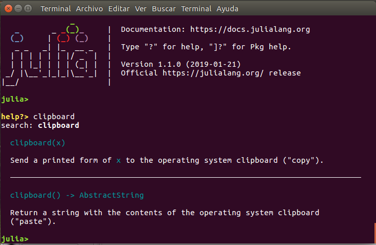

# Capítulo 1. Primeros pasos

## Instalación de Julia

Lo primero que se necesita para trabajar con cualquier lenguaje de programación son las herramientas para crear y ejecutar los programas. El software básico para usar Julia está disponible en su página oficial [https://julialang.org/downloads](https://julialang.org/downloads), en forma de código fuente así como en binarios preparados para instalar en Windows, Mac OS X, y algunas distribuciones de Linux. Desde esa página podrás encontrar también enlaces con explicaciones detalladas sobre cómo instalar y ejecutar Julia, que son específicas para cada sistema, y por lo tanto no desarrollaremos aquí.

Existen varias versiones disponibles de Julia. En general la mejor opción es usar la más reciente (señalada como la "versión estable actual"), aunque los usuarios más conservadores pueden preferir la versión "LTS" (de *long term support*, con "soporte a largo plazo"). Esta guía sirve para la versión 1 de Julia, que incluye las etiquetadas como 1.0, 1.1, etc.

El paquete básico de Julia presenta una sencilla consola de comandos (figura 1) conocida como "REPL" por las siglas de *Read-Eval-Print-Loop*  ("bucle leer-evaluar-imprimir"). El REPL es una interfaz ligera y rápida, útil para realizar pruebas o rutinas sencillas. Sin embargo, para muchos usuarios este tipo de interfaz resulta poco "amigable", y por otro lado, para ejecutar rutinas más complejas, y siempre que se quiera obtener resultados reproducibles, es recomendable escribir las instrucciones en un archivo de código (*script*), y luego ejecutarlo en Julia. Con la interfaz básica se puede ejecutar un *script* (véase un ejemplo en la siguiente sección), pero para escribirlo se necesitaría un programa auxiliar.


*Figura 1. REPL de Julia*

Para combinar ambas tareas de forma eficiente en una sola interfaz lo habitual es usar los llamados "entornos de desarrollo integrados" (conocidos por sus siglas IDE en inglés), que juntan en una misma interfaz una consola de comandos, un editor de código y otras utilidades como visores de variables y gráficas, herramientas de depuración, etc. Julia cuenta, más que con un IDE particular, con "plug-ins" para múltiples editores de código avanzados, como [Atom](https://atom.io), [Visual Studio Code](https://code.visualstudio.com/), [Sublime Text](https://www.sublimetext.com/), [Emacs](https://www.gnu.org/software/emacs/), etc., que integran estas mismas herramientas.

Uno de los entornos más completos es el proporcionado por [Juno](http://junolab.org/), el IDE para Julia basado en Atom (figura 2). En particular, los que prefieran soluciones empaquetadas pueden optar por descargar y usar [Julia Pro](https://juliacomputing.com/products/juliapro.html), una distribución de Julia + Juno preparada por la compañía [Julia Computing](https://juliacomputing.com). Julia Pro existe tanto en una versión gratuita para uso personal, como de pago con soporte profesional. En ambos casos, la principal diferencia entre usar Julia Pro y una instalación manual de Julia con Juno es que en el caso de Julia Pro, el conjunto de paquetes disponibles para ampliar la funcionalidad del lenguaje está controlado por Julia Computing, lo cual hace que en principio sea una solución más estable, aunque también más limitada.


*Figura 2. Julia en Atom (Juno)*


## Un ejemplo básico

```@raw html
<div id="gauss_diasemana" />
```

Veamos ahora un primer ejemplo práctico de Julia, con un programa sencillo para calcular el día de la semana en el que cae cualquier fecha del calendario Gregoriano, usando el algoritmo de Gauss tal como está publicado por Bernt Schwerdtfeger.[^1] Se trata de un algoritmo simple, consistente en los siguientes pasos:

1. Si el número del mes (`m`) es igual o mayor que 3 (de marzo en adelante), el número del año (`y`) se descompone en el número del siglo (`c`, correspondiente a las centenas) y el resto (`g`). En el caso de enero o febrero (`m < 3`) se hace la misma descomposición para `y-1`.

2. Se escoge un número `e` en función del número del mes (de 1 a 12), según la siguiente tabla:
    
    |mes        |`e`|
    |-----------|---|
    |enero      | 0 |
    |febrero    | 3 |
    |marzo      | 2 |
    |abril      | 5 |
    |mayo       | 0 |
    |junio      | 3 |
    |julio      | 5 |
    |agosto     | 1 |
    |septiembre | 4 |
    |octubre    | 6 |
    |noviembre  | 2 |
    |diciembre  | 4 |

3. Se escoge un número `f` según el número del siglo, en un ciclo de 4 siglos (el ciclo de años bisiestos se repite cada 400 años).
    
    |año (`100*c`)  | f |
    |---------------|---|
    |1600, 2000, ...| 0 |
    |1700, 2100, ...| 5 |
    |1800, 2200, ...| 3 |
    |1900, 2300, ...| 1 |

4. El día de la semana viene determinado por el resto de la división entera entre `w` y 7, siendo `w = d + e + f + g + ⌊g/4⌋`. (el último sumando es el cociente de la división entera entre `g` y 4).

Este algoritmo se puede implementar en Julia con la siguiente función:

```@example c1
"""
Cálculo del día de la semana.
La función devuelve una cadena de texto con el día de la semana que corresponde
a los números de día, mes y año introducidos como los argumentos numéricos
`d`, `m`, `y`, respectivamente.
"""
function gauss_diasemana(d, m, y)
    #=
    Enero y febrero (m=1, m=2) se tratan como el año anterior
    en torno a los años bisiestos
    =#
    if m < 3
        y = y - 1
    end
    # Dividir el año entre centenas (c) y el resto (g)
    c = div(y, 100)
    g = mod(y, 100)
    # Definir e y f en función del mes (de 1 a 12) y el siglo
    # (en ciclos de 400 años --- 4 siglos)
    earray = [0,3,2,5,0,3,5,1,4,6,2,4]
    farray = [0,5,3,1]
    e = earray[m]
    f = farray[mod(c,4) + 1]
    # Seleccionar el día de la semana en función del cálculo de Gauss
    warray = ["domingo","lunes","martes","miércoles",
        "jueves","viernes","sábado"]
    w = mod(d + e + f + g + div(g, 4), 7)
    return(warray[w+1])
end
nothing #hide
```

[^1]: [http://berndt-schwerdtfeger.de/wp-content/uploads/pdf/cal.pdf](http://berndt-schwerdtfeger.de/wp-content/uploads/pdf/cal.pdf)

!!! tip "Trabajando con ejemplos"

    Para asimilar mejor las explicaciones que siguen puedes copiar este ejemplo de código en un archivo, y probarlo en una sesión interactiva de Julia tal como se comenta a continuación, o con variantes de las instrucciones que se propongan. Además, al tener el código en un archivo aparte podrás consultarlo en paralelo mientras lees las explicaciones de la guía, sin tener que desplazarte hacia atrás y hacia delante a lo largo de las páginas. (Esta recomendación también sirve para todos los demás ejemplos que se usen en los siguientes capítulos.)

Supongamos que el código mostrado arriba está guardado en un archivo llamado `calc_diasemana.jl` (el nombre del archivo es arbitrario, y puede ser cualquier nombre aceptado por el sistema operativo). El programa consiste en una sola función con tres argumentos (los números del día, el mes y el año), basada en unas pocas divisiones enteras (definidas en la función `div`) y el cálculo de "restos" de dichas divisiones (`mod`),[^2] más la selección de unos valores a partir de los resultados intermedios y unas listas predefinidas.

[^2]: Existen dos funciones para el resto de una división: `mod` y `rem`, que funcionan de forma distinta cuando alguno de los dos operandos es negativo. Para el caso que nos ocupa esa diferencia no es relevante.

Este programa se puede cargar usando la función `include` en la consola de Julia, como sigue:

```julia-repl
julia> include("calc_diasemana.jl")
```

!!! note

    A lo largo de esta guía se mostrarán varios ejemplos como el de arriba, con líneas que comienzan con `julia>`. Esto representa líneas del REPL en las que el usuario introduce código a ejecutar (pero la etiqueta "`julia>`" no forma parte de lo que hay que escribir). 

El resultado posiblemente sea algo decepcionante, porque lo único que se ha hecho es definir una función, que por sí misma no da ningún resultado. Por otro lado, lo más probable es que al introducir esa línea sin más, ni siquiera se obtenga ningún resultado, sino un error debido a que no se encuentra el archivo de código. Para asegurarse de que Julia encuentra el archivo hay varias alternativas:

  * Copiar el archivo de código `calc_diasemana.jl` al directorio de trabajo de Julia. La ruta de ese directorio se puede obtener con la función `pwd()` --sin ningún argumento--.
  * Cambiar el directorio de trabajo al lugar que contiene el archivo. El cambio de directorio se hace con el comando `cd(directorio)`, donde `directorio` ha de ser la ruta de destino. La mayoría de IDEs también incluyen alguna opción en los menús gráficos para escoger el directorio de trabajo.
  * Introducir la ruta completa del archivo de código en la llamada a `include`. Esta se puede escribir literalmente, o si el directorio que contiene el archivo está definido en una variable (supongamos que esta variable se llama `directorio`, la ruta se puede componer con la función `joinpath`. Es decir, la expresión anterior sería `include(joinpath(directorio, "calc_diasemana.jl"))`.

!!! tip "Nombres de rutas en Windows"

    A veces los nombres de los directorios son largos y resulta tedioso escribirlos. Un atajo habitual es abrir el directorio en un explorador de archivos y copiar la ruta desde la barra de direcciones. Pero en Windows hay un problema añadido, y es que por defecto los directorios se delimitan con barras invertidas (`\`), que hay que "duplicar" para escribirlas de forma literal en Julia (`\\`). Hay dos soluciones rápidas para este problema:
    
    1. Si se está trabajando de forma interactiva, guardar directamente el contenido del portapapeles en una variable, mediante la función `clipboard`. Por ejemplo, con el comando `directorio = clipboard()`.
    2. Si se va a pegar el nombre de la ruta en un *script*, etiquetar la cadena de texto con el prefijo `raw`. Por ejemplo: `directorio = raw"C:\Users\ABC\Documents\Julia\"`. (Esto equivale a `directorio = "C:\\Users\\ABC\\Documents\\Julia\\"`, pero se evita duplicar las barras; véanse más detalles en la sección sobre [Secuencias de escape](@ref) del capítulo 7.) 
    

Una vez se ha conseguido cargar el archivo que define la función, esta ya se puede usar para obtener un resultado de verdad. Por ejemplo, para conocer en qué día de la semana cayó 11 de agosto de 2018, la fecha en la que se publicó la version 1 de Julia:

```@repl c1
gauss_diasemana(11, 8, 2018)
```

!!! note

    Normalmente, cuando se ejecuta una línea o un bloque de código en el REPL, inmediatamente debajo del código introducido aparece el resultado, como la palabra `"sábado"` en este ejemplo. En algunos casos puede quererse ocultar el resultado (por ejemplo si ocupa demasiadas líneas). En ese caso basta con añadir un punto y coma al final del código a ejecutar.

Lo que se hace "en un día cualquiera" usando Julia es esencialmente este modelo de rutina, con funciones más complicadas y muchas más operaciones interactivas, explorando resultados, corrigiendo argumentos y repitiendo operaciones, claro está.


## Sintaxis básica

Para escribir un programa en Julia o cualquier otro lenguaje de programación hay que seguir una serie de reglas sintácticas, la mayoría de las cuales en realidad no es necesario explicar, ya que son reglas de escritura lógicas e intuitivas, o se desprenden directamente de la lectura de ejemplos. A continuación se mencionan algunos detalles básicos que se pueden observar en el anterior ejemplo del algoritmo de Gauss:

  * Cada operación se escribe normalmente en una línea distinta, aunque es posible "partir" las expresiones en varias líneas. Si una línea acaba con una expresión incompleta se asume que continúa en la siguiente, como ocurre en la definición de la variable `warray` con los nombres de los días de la semana:
  
    ```julia
    warray = ["domingo","lunes","martes","miércoles",
        "jueves","viernes","sábado"]
    ```
  
  * Todo el texto que sigue al símolo `#` hasta el final de la línea se considera un comentario, y no se ejecuta. También se pueden hacer bloques de comentarios que ocupen varias líneas, delimitados por `#=` al principio y `=#` al final, como se ha hecho al comienzo de la función.

  * Las expresiones más habituales son las del tipo `a = f(b)`, como `c = div(y, 100)`, donde `a` es un nombre de variable, `f` el nombre de una función, y `b` el número, cadena de texto u otro tipo de argumento sobre el que opera esa función, o bien el nombre de la variable a la que se le ha asignado el valor de ese argumento. (La función también puede aceptar varios argumentos de entrada, como ocurre con `div`, o tener varias salidas, que se presentan como variables separadas por comas.)
  
  * También es habitual encontrarse expresiones del tipo `a = f[b]`, p.ej. en `e = earray[m]`, con corchetes en lugar de paréntesis. En esos casos `f` no es una función sino un vector, matriz u otra colección de datos, y `b` es el índice o clave que identifica la parte de su contenido que se asignará a la variable `a`.
  
  * Los nombres de variables, funciones, etc. pueden estar formados por cualquier combinación de letras y números, más guiones bajos, exceptuando nombres que comiencen por números y las palabras clave del lenguaje (como `for`, `if`, `function`, `end`, etc.). Además, también se admiten nombres con caracteres Unicode más allá del ASCII básico (letras acentuadas, griegas, etc.), así como el signo de exclamación (`!`) en posición no inicial, aunque conviene usarlos con mesura: emplear caracteres extendidos aumenta el riesgo de problemas de portabilidad de los programas, y la exclamación se suele resevar para el nombre de cierto tipo de funciones (las que modifican sus argumentos de entrada).
  
  * Se puede trabajar con muchos tipos de variables. En este ejemplo se manejan números enteros (`0`, `1`, etc.) y también cadenas de texto, que se escriben entrecomilladas (`"lunes"`, `"martes"`, etc.). En capítulos posteriores se verán otros tipos. Las distintas variables empleadas en un programa pueden hacer referencia a cualquier tipo de variable, e incluso pueden cambiar de tipo a lo largo del programa (aunque es mejor ser consistente en la nomenclatura).
  
  * Los programas suelen tener diversos bloques de código anidados. La función `gauss_diasemana` es en sí un bloque, dentro del cual hay un bloque condicional (el que comienza por `if m < 3`). Los bloques de código se delimitan cerrándolos con la palabra clave `end`, y se recomienda indentar las líneas interiores al código para hacerlo más legible, aunque el programa funcionaría igualmente si no se hace. Otros bloques de código habituales son los bucles `for` y `while`. Para más detalles sobre los distintos tipos de bloques, véase el [capítulo 3](3-funciones-control.md) sobre funciones y estructuras de control.
  
  * En general los espacios son irrelevantes: con contadas excepciones, cuando haya algun símbolo delimitador (operadores matemáticos, signos de puntuación, paréntesis...) puede usarse un espacio, varios o ninguno entre nombres de variables, funciones, etc., o al principio de la línea.

## Módulos y paquetes

```@raw html
<div id="pkg" />
```
Cuando se inicia una sesión de Julia, por defecto solo están disponibles una serie de utilidades elementales, y para la mayoría de proyectos hace falta usar "módulos" que contienen funciones y otras utilidades complementarias. Por ejemplo, en un proyecto en el que se quieran hacer cálculos estadísticos (incluso al nivel básico de medias, varianzas, etc.), hace falta usar el módulo `Statistics`. Para ello hay que ejecutar antes el siguiente comando:

```julia
using Statistics
```

La distribución básica de Julia viene con una biblioteca estándar que incluye diversos módulos. Algunos de estos módulos no están activados por defecto para que la sesión de trabajo no se cargue innecesariamente con tipos de variables y funciones que no se vayan a usar --o cuyo nombre el usuario quiera emplear para otros propósitos--. La lista de módulos de la bilbioteca estándar se puede consultar en la [documentación oficial](https://docs.julialang.org/en/stable/). Algunos que suelen usarse en proyectos de muchos ámbitos son:

* [`Dates`](https://docs.julialang.org/en/v1/stdlib/Dates/) para trabajar con fechas y unidades de tiempo.
* [`DelimitedFiles`](https://docs.julialang.org/en/v1/stdlib/DelimitedFiles/) para leer y escribir tablas de datos en ficheros de texto.
* [`LinearAlgebra`](https://docs.julialang.org/en/v1/stdlib/LinearAlgebra/) para cálculos de álgebra lineal (vectores, matrices, etc.).
* [`Statistics`](https://docs.julialang.org/en/v1/stdlib/Statistics/) para cálculos estadísticos (a menudo junto con [`Random`](https://docs.julialang.org/en/v1/stdlib/Random/) para trabajar con números aleatorios y distribuciones de probabilidad).
* [`Sockets`](https://docs.julialang.org/en/v1/stdlib/Sockets/) para trabajar con conexiones a redes informáticas.

Hay muchas otras utilidades que pueden considerse importantes, incluso fundamentales por la mayoría de los potenciales usuarios, como representaciones gráficas de datos, editor de código, ayudas para la depuración de rutinas (*debugging*), etc., pero no están incluidas en la biblioteca estándar, sino en un "ecosistema" de paquetes que se han desarrollo de forma coordinada (aunque independiente) por la comunidad de usuarios y desarrolladores de Julia. Puede consultarse la sección *Ecosystem* en la web oficial ([https://julialang.org](https://julialang.org)) para ver algunos de los dominios principales, o la web [Julia Packages](https://juliapackages.com/) para explorar muchos más paquetes disponibles.

Las soluciones más completas como Julia Pro ya incorporan muchos de los paquetes más importantes, pero incluso en esos casos puede ser necesario gestionarlos, actualizarlos o añadir nuevos paquetes. En el caso de paquetes "registrados" (que es el caso de los más populares, y todos los que se comentan en esta guía), la forma más sencilla de instalarlos es desde el modo de gestión de paquetes de la línea de comandos, mediante los siguientes pasos:

1. Cambiar del modo "normal" al de gestión de paquetes ("pkg"), pulsando la tecla `]` (se verá un cambio en la etiqueta al comienzo de cada línea, como en la figura 3).
2. Escribir el comando `add` seguido del nombre del paquete. Por ejemplo, para añadir el paquete "CSV", que utilizaremos en el siguiente capítulo: `add CSV`
3. Cambiar de nuevo al modo normal, pulsando la tecla de borrar al comienzo de la línea.


*Figura 3. Cambio a "modo pkg"*

## Buscando ayuda

Con toda seguridad, al programar en Julia pronto te encontrarás con dificultades que no puedes resolver con la información que se recoge en esta guía, y necesitarás ayuda adicional. Lo primero con lo que se ha de contar es el [manual de referencia oficial](https://docs.julialang.org/en/stable/), que contiene numerosos detalles de todos los aspectos esenciales del lenguaje, y también explica el uso de todas las funciones que forman parte del paquete "básico" de Julia.

El documento de referencia para las funciones es clave incluso para los programadores experimentados, ya que uno de los problemas habituales es la dificultad de recordar cómo se usa cierta función (qué argumentos acepta, qué resultados proporciona, etc.). Un atajo práctico cuando se trabaja en modo de línea de comandos consiste en escribir el signo de interrogación (`?`) al principio de una instrucción. Al hacerlo la interfaz cambia al "modo de ayuda" (la etiqueta que marca el comienzo de la línea cambia a `help?>`), y al introducir el nombre de la función (sin paréntesis ni argumentos, solo el nombre) aparece en pantalla el texto de referencia, como se muestra en la figura 4.



*Figura 4. Ejemplo de ayuda*

Puedes probar con cualquier función básica (por ejemplo `?div` para leer la ayuda sobre la división entre enteros), con un operador (p.ej. `?+` para la suma), o incluso para una variable que se haya definido (en ese caso dará una información básica sobre su contenido).

La interfaz de Juno también proporciona un panel de documentación en el que se puede buscar por texto el nombre de funciones, variables, etc., y presenta la misma información de ayuda.

!!! note "Documentación a través de "docstrings""

    Si has realizado el ejercicio de crear la función [`gauss_diasemana`](#gauss_diasemana) con el código completo presentado en este capítulo, al escribir `?gauss_diasemana` podrás leer el texto de las líneas que preceden a la definición de la función. Esta forma de documentar las funciones u otro tipo de objetos es muy útil y recomendable para hacer programas trazables y comprensibles. Puedes encontrar más detalles en el [capítulo 3 sobre funciones](3-funciones-control.md#Docstring-1).

Para las dudas no resueltas en el  manual, entre otras cuestions, los creadores de Julia han organizado un foro de debate y preguntas, disponible en [https://discourse.julialang.org](https://discourse.julialang.org) (en inglés). Y además existen múltiples foros y redes sociales (también en español y otros idiomas), tanto promovidas por los desarrolladores como por los propios usuarios, donde se pueden encontrar infinidad de consultas pasadas y hacer nuevas. Una buena recopilación de estas redes se puede encontrar en [https://julialang.org/community/](https://julialang.org/community/).

## Sumario del capítulo

En este primer y breve capítulo hemos aprendido los siguientes puntos fundamentales para trabajar en Julia:

* Las distintas distribuciones y entornos de trabajo disponibles: Julia, JuliaPro, el REPL básico e IDEs diversos.
* Algunas reglas básicas de sintaxis del lenguaje.
* Cómo instalar y cargar paquetes.
* Cómo buscar ayuda.

A lo largo de las explicaciones también hemos empleado las siguientes funciones particulares (además de las propias de la gestión de paquetes):

* `cd` y `pwd` para definir y consultar el directorio de trabajo, respectivamente.
* `include` para ejecutar *scripts*.
* `joinpath` para componer nombres de directorios y archivos.
* `div` para divisiones enteras y `mod` para el resto de una división.

