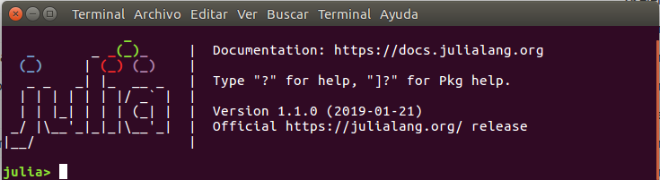
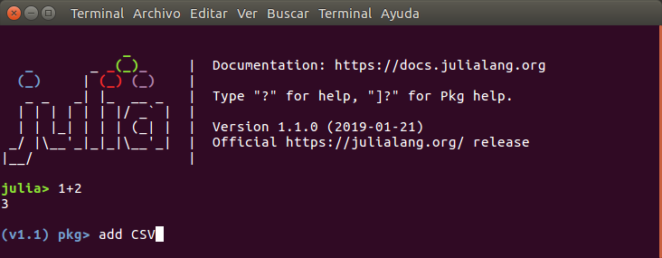

# Capítulo 1. Primeros pasos

## Instalación de Julia

Obviamente, lo primero que se necesita para trabajar con cualquier lenguaje de programación son las herramientas para crear y ejecutar los programas. El software básico para usar Julia está disponible en su página oficial [https://julialang.org/downloads](https://julialang.org/downloads), en forma de código fuente así como en binarios preparados para instalar en Windows, Mac OS X, y algunas distribuciones de Linux. Desde esa página se pueden encontrar también enlaces con explicaciones detalladas sobre cómo instalar y ejecutar Julia, que son específicas para cada sistema, y por lo tanto no desarrollaremos aquí.

El paquete básico de Julia presenta una sencilla consola de comandos conocida como "REPL" por las siglas de *Read-Eval-Print-Loop* (figura 1), que es la forma de interacción que utiliza. El REPL es una interfaz ligera y rápida, útil para realizar pruebas o rutinas sencillas. Sin embargo, para muchos usuarios este tipo de interfaz resulta poco "amigable", y por otro lado, para ejecutar rutinas más complejas, y siempre que se quiera obtener resultados reproducibles, es recomendable escribir las instrucciones en un archivo de código (*script*), y luego ejecutarlo en Julia. Con la interfaz básica se puede ejecutar un *script* (véase un ejemplo en la siguiente sección), pero para escribirlo se necesitaría un programa auxiliar.



*Figura 1. REPL de Julia*

Para combinar ambas tareas de forma eficiente en una sola interfaz lo habitual es usar los llamados "entornos de desarrollo integrados" (conocidos por sus siglas IDE en inglés), que juntan en una misma interfaz una consola de comandos, editor de código, y dependiendo del IDE en particular, otras utilidades como exploradores de archivos, visores de variables y gráficas, etc. Los IDEs pueden ser programas específicos para el lenguaje en cuestión, o aplicaciones de terceras partes con módulos particulares para distintos lenguajes. En el caso de Julia sus desarrolladores han optado por esta solución, de tal modo que no existe uno, sino múltiples IDEs basados en programas populares como [Atom](https://atom.io), [Visual Studio](https://code.visualstudio.com/), [Sublime](https://www.sublimetext.com/), [Emacs](https://www.gnu.org/software/emacs/), etc.

Uno de los IDEs más completos es [Juno](http://junolab.org/), el IDE basado en Atom (figura 2). En particular, los que prefieran soluciones empaquetadas pueden optar por descargar y usar [Julia Pro](https://juliacomputing.com/products/juliapro.html), una distribución de Julia + Juno preparada por la compañía [Julia Computing](https://juliacomputing.com). Julia Pro existe tanto en una versión gratuita para uso personal, como de pago con soporte profesional. En ambos casos, la principal diferencia entre usar Julia Pro y una instalación manual de Julia con Juno es que en el caso de Julia Pro, el conjunto de paquetes disponibles para ampliar la funcionalidad de Julia está controlado por Julia Computing, lo cual hace que en principio sea una solución más estable, aunque también más limitada.


*Figura 2. Julia en Atom (Juno)*


## Un ejemplo básico

```@raw html
<div id="gauss_diasemana" />
```

Veamos ahora un primer ejemplo práctico de Julia, con un programa sencillo para calcular el día de la semana en el que cae cualquier fecha del calendario Gregoriano, usando el algoritmo de Gauss tal como está publicado por Bernt Schwerdtfeger.[^1] Se trata de un algoritmo simple, que podría traducirse a Julia mediante el siguiente código: 

```@example c1
"""
Cálculo del día de la semana.
La función devuelve una cadena de texto con el día de la semana que corresponde
a los números de día, mes y año introducidos como los argumentos numéricos
`d`, `m`, `y`, respectivamente.
"""
function gauss_diasemana(d, m, y)
    #=
    Enero y febrero (m=1, m=2) se tratan como el año anterior
    en torno a los años bisiestos
    =#
    if m < 3
        y = y - 1
    end
    # Dividir el año entre centenas (c) y el resto (g)
    c = div(y, 100)
    g = mod(y, 100)
    # Definir e y f en función del mes (de 1 a 12) y el siglo
    # (en ciclos de 400 años --- 4 siglos)
    earray = [0,3,2,5,0,3,5,1,4,6,2,4]
    farray = [0,5,3,1]
    e = earray[m]
    f = farray[mod(c,4) + 1]
    # Seleccionar el día de la semana en función del cálculo de Gauss
    warray = ["domingo","lunes","martes","miércoles",
        "jueves","viernes","sábado"]
    w = mod(d + e + f + g + div(g, 4), 7)
    return(warray[w+1])
end
nothing #hide
```

[^1]: [http://berndt-schwerdtfeger.de/cal/cal.pdf](http://berndt-schwerdtfeger.de/cal/cal.pdf)

Supongamos que el código mostrado arriba está guardado en un archivo llamado `calc_diasemana.jl` (el nombre del archivo es arbitrario, y puede ser cualquier nombre aceptado por el sistema operativo. El programa consiste en una sola función con 3 argumentos (los números del día, el mes y el año), basada en unas pocas divisiones enteras (definidas en la función `div`) y el cálculo de "restos" de dichas divisiones (`mod`),[^2] más la selección de unos valores a partir de los resultados intermedios y unas listas predefinidas.

[^2]: Existen dos funciones para el resto de una división: `mod` y `rem`, que funcionan de forma distinta cuando alguno de los dos operandos es negativo. Para el caso que nos ocupa esa diferencia no es relevante.

Este programa se puede cargar usando la función `include` en la consola de Julia, como sigue:

```julia-repl
julia> include("calc_diasemana.jl")
```

!!! note

    A lo largo de este manual se mostrarán varios ejemplos como este, con líneas que comienzan con `julia>`. Esto representa líneas de la consola en las que el usuario introduce código a ejecutar (pero la parte de "`julia>`" no forma parte de lo que hay que escribir). 

El resultado posiblemente sea algo decepcionante, porque lo único que se ha hecho es definir una función, que por sí misma no da ningún resultado. Por otro lado, lo más probable es que al introducir esa línea sin más ni siquiera se obtenga ningún resultado, sino un error debido a que no se encuentra el archivo de código. Para asegurarse de que Julia encuentra el archivo hay varias alternativas:

  * Copiar el archivo de código `calc_diasemana.jl` al directorio de trabajo de Julia. La ruta de ese directorio se puede obtener con la función `pwd()` --sin ningún argumento--.
  * Cambiar el directorio de trabajo al lugar que contiene el archivo. El cambio de directorio se hace con la función `cd`, que recibe un solo argumento: el nombre del directorio destino. Este se puede definir literalmente como un texto entre comillas dobles, o ser una variable que contiene dicho texto. La mayoría de IDEs incluyen algún elemento en el menú para escoger el directorio de trabajo.
  * Introducir la ruta completa del archivo de código en la llamada a `include`. Esta se puede escribir literalmente, o si el directorio que contiene el archivo está definido en una variable (supongamos que esta variable se llama `dir_include`, la ruta se puede componer con la función `joinpath`. Es decir, la expresión anterior sería `include(joinpath(dir_include, "calc_diasemana.jl"))`.

Una dificultad añadida es que a veces los nombres de los directorios son largos y resulta tedioso escribirlos. De hecho, lo más natural para la mayoría de la gente es utilizar entornos gráficos para seleccionar y definir rutas y nombres de archivos. La interfaz de Juno permite definir el directorio de trabajo a través de los menús. Como alternativa si se está trabajando con la consola de comandos, se puede copiar el nombre del directorio desde el gestor de archivos al "portapapeles", y convertirlo en una variable de texto mediante la función `clipboard`. Por ejemplo, con la expresión `directorio = clipboard()`.

Una vez se ha conseguido cargar el archivo que define la función, esta ya se puede usar para obtener un resultado de verdad. Por ejemplo, para conocer en qué día de la semana cayó 11 de agosto de 2018, la fecha en la que se publicó la version 1 de Julia:

```@repl c1
gauss_diasemana(11, 8, 2018)
```

!!! note

    Normalmente, cuando se ejecuta una línea o un bloque de código en el REPL, inmediatamente debajo del código introducido aparece el resultado, como la palabra `"sábado"` en este ejemplo. En algunos casos puede quererse ocultar el resultado (por ejemplo si ocupa demasiadas líneas). En ese caso basta con añadir un punto y coma al final del código a ejecutar.

Lo que se hace "en un día cualquiera" usando Julia es esencialmente este modelo de rutina, con funciones más complicadas y muchas más operaciones interactivas, explorando resultados, corrigiendo argumentos y repitiendo operaciones, claro está.


## Sintaxis básica

Para escribir un programa en Julia o cualquier otro lenguaje de programación hay que seguir una serie de reglas sintácticas, la mayoría de las cuales en realidad no es necesario explicar, ya que son reglas de escritura lógicas e intuitivas, o se desprenden directamente de la lectura de ejemplos. A continuación se mencionan algunos detalles básicos que se pueden observar en el anterior ejemplo del algoritmo de Gauss:

  * Cada operación se escribe normalmente en una línea distinta, aunque es posible "partir" las expresiones en varias líneas. Si una línea acaba con una expresión incompleta se asume que continúa en la siguiente, como ocurre en la definición de la variable `warray` con los nombres de los días de la semana.
  
  * Todo el texto que sigue al símolo `#` hasta el final de la línea se considera un comentario, y no se ejecuta. También se pueden hacer bloques de comentarios delimitados por `#=` al principio y `=#` al final, como al comienzo de la función.

  * Las expresiones más habituales son las del tipo `a = f(b)`, como `c = div(y, 100)`, donde `a` es un nombre de variable, `f` el nombre de una función, y `b` el número, cadena de texto u otro tipo de argumento sobre el que opera esa función, o bien el nombre de la variable a la que se le ha asignado el valor de ese argumento. (La función también puede aceptar varios argumentos de entrada, como ocurre con `div`, o tener varias salidas, que se presentan como variables separadas por comas.)
  
  * También es habitual encontrarse expresiones del tipo `a = f[b]`, p.ej. en `e = earray[m]`, con corchetes en lugar de paréntesis. En esos casos `f` no es una función sino un vector, matriz u otra estructura de datos, y `b` es el índice o clave que identifica la parte de su contenido que se asignará a la variable `a`.
  
  * Los nombres de variables, funciones, etc. pueden estar formados por cualquier combinación de letras y números, más guiones bajos, exceptuando nombres que comiencen por números y las palabras clave del lenguaje (como `for`, `if`, `end`, etc.). Además, también se admiten nombres con caracteres Unicode más allá del ASCII básico (letras acentuadas, griegas, etc.), así como el signo de exclamación (`!`) en posición no inicial, aunque conviene usarlos con mesura: emplear caracteres extendidos aumenta el riesgo de problemas de portabilidad de los programas, y la exclamación se suele resevar para el nombre de cierto tipo de funciones (las que modifican sus argumentos de entrada).
  
  * Se puede trabajar con muchos tipos de variables. En este ejemplo se manejan números enteros (`0`, `1`, etc.) y también cadenas de texto, que se escriben entrecomilladas (`"lunes"`, `"martes"`, etc.). Más adelante se verán muchos otros tipos. Las distintas variables empleadas en un programa pueden hacer referencia a cualquier tipo de variable, e incluso pueden cambiar de tipo a lo largo del programa (aunque es mejor ser consistente en la nomenclatura).
  
  * Los programas suelen tener diversos bloques de código anidados. La función `gauss_diasemana` en en sí un bloque, dentro del cual hay un bloque condicional (el que comienza por `if m < 3`). Los bloques de código se delimitan cerrándolos con la palabra clave `end`, y se recomienda indentar las líneas interiores al código para hacerlo más legible, aunque el programa funcionaría igualmente si no se hace. Otros bloques de código habituales son los bucles `for` y `while`. Para más detalles sobre los distintos tipos de bloques, véase el [Capítulo 3. Funciones y estructuras de control](@ref).
  
  * En general los espacios son irrelevantes: siempre que haya algun símbolo delimitador (operadores matemáticos, signos de puntuación, paréntesis...) pueden usarse uno, varios o ningún espacio entre nombres de variables, funciones, etc., o al principio de la línea, excepto al inicio de las llamadas a "macros" (ver capítulo de macros).
.

## Módulos y paquetes

Cuando se inicia una sesión de Julia, por defecto solo están disponibles una serie de utilidades elementales, y para la mayoría de proyectos hace falta usar "módulos" que contienen funciones y otras utilidades complementarias. Por ejemplo, en un proyecto en el que se quieran hacer cálculos estadísticos (incluso al nivel básico de medias, varianzas, etc.), hace falta usar el módulo `Statistics`. Para ello hay que ejecutar el siguiente comando:

```julia
using Statistics
```

La distribución básica de Julia viene con una biblioteca estándar que incluye diversos módulos. Algunos de estos módulos no están activados por defecto para que la sesión de trabajo no se cargue innecesariamente con tipos de variables y funciones que no se vayan a usar -- o cuyo nombre el usuario quiera emplear para otros propósitos. (Normalmente habrá una serie de módulos que se usen de forma habitual, pero el conjunto de estos módulos "esenciales" varía según el campo en el que se trabaje.) La lista de módulos de la bilbioteca estándar se puede consultar en la [documentación oficial](https://docs.julialang.org/en/stable/). Algunos de los que es más probable que se usen en proyectos de muchos ámbitos son:

* `Dates` para trabajar con fechas y unidades de tiempo.
* `DelimitedFiles` para leer y escribir tablas de datos en ficheros de texto.
* `LinearAlgebra` para cálculos de álgebra lineal (vectores, matrices, etc.).
* `Statistics` para cálculos estadísticos (a menudo junto con `Random` para trabajar con números aleatorios y distribuciones de probabilidad).
* `Sockets` para trabajar con conexiones a redes informáticas.

Hay muchas otras utilidades que pueden considerse importantes, incluso fundamentales por la mayoría de los potenciales usuarios, como representaciones gráficas de datos, editor de código, ayudas para la depuración de rutinas (*debugging*), etc., pero no están incluidas en la biblioteca estándar, sino en un "ecosistema" de paquetes que se han desarrollo de forma coordinada (aunque independiente) por la comunidad de usuarios y desarrolladores de Julia. Puede consultarse la sección *Ecosystem* en la web oficial (https://julialang.org) para ver algunos de los dominios principales, o la web [Julia Observer](https://juliaobserver.com/) para explorar todos los paquetes publicados.

Las soluciones más completas como Julia Pro ya incorporan muchos de los paquetes más importantes, pero incluso en esos casos puede ser necesario gestionarlos, actualizarlos o añadir nuevos paquetes. En el caso de paquetes "registrados" oficialmente (que es el caso de los más populares, y todos los que se comentan en esta guía), la forma más sencilla de instalarlos es desde el modo de gestión de paquetes de la línea de comandos, mediante los siguientes pasos:

1. Cambiar del modo "normal" al de gestión de paquetes ("pkg"), pulsando la tecla `]` (se verá un cambio en la etiqueta al comienzo de cada línea, como en la figura 3).
2. Escribir el comando `add` seguido del nombre del paquete. Por ejemplo, para añadir el paquete "CSV", que utilizaremos en el siguiente capítulo: `add CSV`
3. Cambiar de nuevo al modo normal, pulsando la tecla de borrar al comienzo de la línea.



*Figura 3. Cambio a "modo pkg"*

## Buscando ayuda

Con toda seguridad, al programar en Julia pronto te encontrarás con dificultades que no puedes resolver con la información que se recoge en este manual, y necesitarás ayuda adicional. Lo primero con lo que se ha de contar es el [manual de referencia oficial](https://docs.julialang.org/en/stable/), que contiene numerosos detalles de múltiples aspectos del lenguaje, y también explica el uso de todas las funciones que forman parte del paquete "básico" de Julia.

El documento de referencia para las funciones es clave incluso para los programadores experimentados, ya que uno de los problemas más recurrentes es la dificultad de recordar cómo se usa cierta función (qué argumentos acepta, qué resultados proporciona, etc.). Un atajo práctico cuando se trabaja en modo de línea de comandos consiste en escribir el signo de interrogación (`?`) al principio de una instrucción. Al hacerlo la interfaz cambia al "modo de ayuda" (la etiqueta que marca el comienzo de la línea cambia de `julia>` a `help?>`), y al introducir el nombre de la función (sin paréntesis ni argumentos, solo el nombre) aparece en pantalla el texto de referencia.

Se puede probar con cualquier función básica (por ejemplo `?div` para leer la ayuda sobre la división entre enteros), con un operador (p.ej. `?+` para la suma), o incluso para una variable que se haya definido (en ese caso dará una información básica sobre su contenido).

La interfaz de Juno también proporciona un panel de documentación en el que se puede buscar por texto el nombre de funciones, variables, etc., y presenta la misma información de ayuda.

!!! note "Documentación a través de "docstrings""

    Si has realizado el ejercicio de crear la función [`gauss_diasemana`](#gauss_diasemana) con el código completo presentado en este capítulo, al escribir `?gauss_diasemana` podrás leer el texto de las líneas que preceden a la definición de la función. Esta forma de documentar las funciones u otro tipo de objetos es muy útil y recomendable para hacer programas trazables y comprensibles.

Para las dudas no resueltas en el  manual, entre otras cuestions, los creadores de Julia han organizado un foro de debate y preguntas, disponible en [https://discourse.julialang.org](https://discourse.julialang.org) (en inglés). Y además existen múltiples foros y redes sociales (también en español y otros idiomas), tanto promovidas por los desarrolladores como por los propios usuarios, donde se pueden encontrar infinidad de consultas pasadas y hacer nuevas. Una buena recopilación de estas redes se puede encontrar en [https://julialang.org/community/](https://julialang.org/community/).

## Sumario del capítulo

En este primer y breve capítulo hemos aprendido los siguientes puntos fundamentales para trabajar en Julia:

* Los distintos entornos disponibles: la interfaz de comandos, *notebooks* de Jupyter y el IDE de Juno.
* Algunas reglas básicas de sintaxis del lenguaje.
* Cómo instalar y cargar paquetes.
* Cómo buscar ayuda.

Además, a lo largo de las explicaciones hemos empleado las siguientes funciones particulares (además de las propias de la gestión de paquetes):

* `cd` y `pwd` para definir y consultar el directorio de trabajo, respectivamente.
* `div` para divisiones enteras y `mod` para el resto de una división.
* `include` para ejecutar *scripts*.
* `joinpath` para componer nombres de directorios y archivos.

