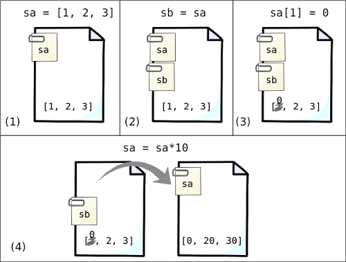

# Capítulo 5. Arrays

```@setup c5
cp("../../datos/", "./datos")
```

En los capítulos anteriores se han explorado con algunos ejemplos prácticos las nociones básicas sobre los elementos necesarios para hacer programas en Julia. Llegados a este punto, podemos revisitar y explorar en más profundidad cada uno de los conceptos estudiados, para sacarles el máximo provecho.

Empezaremos por el de las variables conocidas como *arrays*, entre las que se cuentan los vectores y las matrices que se introdujeron en el capítulo sobre [series y tablas de datos](2-series-tablas.md). Los *arrays* son series organizadas de datos que pueden tener una, dos o más dimensiones. En el presente capítulo veremos más detalles sobre este tipo de variables, que son un elemento fundamental en la mayoría de cálculos numéricos, y por lo tanto conviene dominar desde un principio. Además, estos detalles servirán como introducción práctica a otros asuntos importantes para la programación en Julia.


## Sintaxis para la creación de *arrays*

### Vectores

Hay distintas formas de crear y componer *arrays*, algunas de las cuales ya se han visto en el capítulo 2. El caso más sencillo es el de los vectores (*arrays* unidimensionales), que se pueden definir escribiendo sus valores entre corchetes, separados por comas:

```@repl
numeros = [1,2,3,4]
```

Por otro lado, la forma más general de crear *arrays* de cualquier dimensión es mediante la función `cat` (De "con*cat*enar"), que utiliza el argumento con nombre `dims` para indicar en qué dimensión se añaden los valores introducidos. Por ejemplo, una forma alternativa (aunque menos práctica) de crear el vector `numeros` anterior es:

```@repl
cat(1,2,3,4, dims=1)
```

### Matrices

A la hora de trabajar con matrices, como ya se ha visto antes, se considera que la primera dimensión representa las filas, y la segunda representa las columnas. Por este motivo, una matriz se puede crear concatenando vectores a lo largo de una segunda dimensión (por columnas). Por ejemplo:

```@repl c5
sudoku = cat(
    [1,2,3,4],
    [4,3,1,2],
    [3,4,2,1],
    [2,1,4,3],
    dims=2)
```

Como las matrices son un objeto de cálculo tan habitual, al igual que pasa con los vectores existen formas más prácticas de componerlas. La operación `cat(a, b..., dims=2)` se puede escribir como `hcat(a, b...)` --con "h" de "horizontal"--. Por lo tanto el sudoku anterior podría haberse escrito como:

```julia-repl
julia> sudoku = hcat(
       [1,2,3,4],
       [4,3,1,2],
       [3,4,2,1],
       [2,1,4,3]
       )
```

Cuando los elementos a concatenar horizontalmente son más cortos, resulta aún más conciso escribirlos entre corchetes (como los vectores), pero separados por espacios en lugar de comas para indicar que se concatenan como una fila:

```@repl
fila = [1 2 3 4]
```

Así, tenemos otra forma de componer matrices, que es concatenando filas verticalmente. Esto se hace con la función `vcat`:

```@repl c5
sudoku2 = vcat(
    [1 2 3 4],
    [3 4 2 1],
    [4 3 1 2],
    [2 1 4 3]
    )
```

Existen dos alternativas abreviadas de `vcat` usando corchetes: una es separando los elementos a concatenar con punto y coma, y la otra separándolos por cambios de línea, sin ningún otro separador. Así pues, este segundo sudoku podría haberse escrito de las dos siguientes maneras:

```julia-repl
julia> [
         [1 2 3 4];
         [3 4 2 1];
         [4 3 1 2];
         [2 1 4 3]
       ]

julia> [
         [1 2 3 4]
         [3 4 2 1]
         [4 3 1 2]
         [2 1 4 3]
       ]
```

Y una forma más de componer matrices, especialmente práctica en estos casos en los que todos los valores son escalares breves de escribir, es mediante la operación combinada de concatenación horizontal y vertical. La función correspondiente es `hvcat`, y su forma abreviada utiliza una sola pareja de corchetes para todo el conjunto de datos, y los mismos separadores entre elementos que se emplean para la concatenación horizontal y vertical:

```julia-repl
julia> [1 2 3 4;
        3 4 2 1;
        4 3 1 2;
        2 1 4 3]
```

La función `hvcat` puede ser útil cuando la serie de valores no se puede escribir a mano, por ejemplo porque está contenida (quizás con una estructura distinta) en otras variables. La sintaxis de esta función es:

```julia
hvcat(ncols, valores...)
```

donde `ncols` es el número de columnas esperado en cada fila, y `valores...` representa un número indefinido de argumentos (múltiplo de `ncols`) con los valores a organizar, ordenados "fila a fila" (como se leen en la forma abreviada). Por ejemplo (cambiando a una matriz de cadenas de texto, para que se vea con más claridad la diferencia de los argumentos):

```@repl
hvcat(3, "a", "b", "c", "x", "y", "z")
```

En un ejemplo más realista los valores estarían agrupados en otra variable, como podría ser un vector. Los valores individuales de dicho vector podrían pasarse a la función `hvcat` mediante la técnica de *splatting* (añadiendo puntos suspensivos al nombre de la variable), como se indicaba en la sección sobre [Agrupaciones de argumentos](@ref) del capítulo anterior:

```@repl c5
letras = ["a", "b", "c", "x", "y", "z"];
hvcat(3, letras...)
```

Otro caso de uso práctico de `hvcat` es para crear una matriz con una sola columna (pero con dos dimensiones, no como los vectores). Véase la sutil diferencia entre los dos siguientes resultados:

```@repl
vector = ["a", "b", "c"]
matriz_columna = hvcat(1, "a", "b", "c")
```

Aunque la disposición de los valores es idéntica, el tipo de *array* es distinto: El primero es un `Array{String, 1}` (es decir, un *array* cuyos elementos son de tipo `String` con una sola dimensión), que contiente "3 elementos". Por contra, el segundo es un `Array{String, 2}` (con dos dimensiones), de tamaño 3×1.

Para finalizar con las matrices y las distintas formas de concatenar valores en dos dimensiones, resulta pertinente destacar la diferencia entre el uso de la coma y el punto y coma (o el cambio de línea) como separador de elementos: la coma es el separador de elementos *en vectores*, mientras que el punto y coma indica que el siguiente elemento se concatene con los anteriores añadiendo filas al *array* --sea un vector o una matriz--. Esto explica los distintos resultados de estas dos operaciones:

```@repl
unodos = [1, 2];
[unodos; 3] # concatena el tres como otra fila
[unodos, 3] # crea un vector añadiendo el tres
```

La diferencia entre los separadores solo se diluye al crear un vector a partir de elementos sueltos, aunque ni siquiera en ese caso son intercambiables, pues no se pueden mezclar:


```jldoctest
julia> [1, 2, 3] == [1; 2; 3] # Ambas expresiones son equivalentes
true

julia> [1, 2; 3]   # Pero esto no funciona
ERROR: syntax: unexpected semicolon in array expression
```

!!! warning "¡No te confundas con las reglas de Matlab!"

    Las funciones `cat` y derivadas, así como la composición de matrices escribiendo valores entre corchetes, es muy semejante a la de Matlab y Octave, pero los que estén acostumbrados a este otro lenguaje de programación han de tener precaución para no confundirse al usar Julia. En Matlab la coma tiene un uso distinto a la hora de crear matrices, y los vectores se interpretan como matrices de una fila, al contrario que en Julia.

### *Arrays* n-dimensionales

Los *arrays* con más de dos dimensiones se crean con la función `cat` descrita para vectores y matrices, sin ninguna forma alternativa o abreviada. Por ejemplo, la operación que habría que realizar para componer los dos sudokus como dos "capas" de una hipermatriz tridimensional es:

```@repl c5
cat(sudoku, sudoku2, dims=3)
```

Por otro lado, a partir de un conjunto de datos estructurados en un array con ciertas dimensiones se puede crear otro con dimensiones distintas pero compatibles (es decir que en conjunto pueda recoger el mismo número de elementos), a través de la función `reshape`. El primer argumento de esta matriz es el conjunto de datos a redimensionar, y luego siguen las dimensiones deseadas, en orden. En una (y solo una) de las dimensiones el número objetivo puede sustituirse por dos puntos, para indicar que se calcule automáticamente a partir del número de elementos y las demás dimensiones. Por ejemplo:


```@repl
matriz = [
    0.1 0.01 1 10;
    0.2 0.02 2 20;
    0.3 0.03 3 30
    ]
reshape(matriz, 3,2,:) # Varias capas de 3×2
```

Un caso típico en el que se utiliza esta operación es cuando el conjunto de datos proviene de un archivo de texto, que se ha leído en forma de matriz a través de `readdlm` o de forma equivalente, que se quiere pasar a una hipermatriz con más dimensiones.

Además, `reshape` también puede servir de contrapartida a `hvcat` para crear matrices a partir de un vector de datos, cuando estos se quieren disponer "columna a columna".

## Generación automatizada de *arrays*

### Valores predefinidos

Hay algunos *arrays* prototípicos que se emplean a menudo, y se pueden crear de forma rápida con funciones específicas para ellos, sin tener que definir sus valores uno a uno. Por ejemplo, las funciones `zeros` y `ones` sirven para crear *arrays* compuestos enteramente de ceros o unos, con unas dimensiones dadas. También existen las funciones análogas `trues` and `falses`, para crear *arrays* con los correspondientes valores lógicos (verdadero o falso). Por ejemplo, podemos crear las siguientes matrices de tamaño 2×3 (aunque estas funciones sirven para crear *arrays* con cualquier número de dimensiones):

```@repl
zeros(2,3)
ones(2,3)
trues(2,3)
falses(2,3)
```

Por otro lado, la función `fill` permite crear un *array* compuesto por otro valor (no necesariamente números), que ha de pasarse como primer argumento:

```@repl
fill("abc", 2, 3)
```

Si ya se tiene una matriz preparada para recibir los valores, se puede utilizar la función `fill!` (con una exclamación al final del nombre) para rellenarla con un valor dado, en lugar de tener que crear una matriz nueva.

```@repl
matriz = zeros(2,3)
fill!(matriz, 0.5)
matriz
```

### Valores aleatorios

Hay situaciones en las que se desea crear *arrays* con valores aleatorios, por ejemplo para probar programas que se están desarrollando, poner ejemplos de uso, etc. En el capítulo de [gráficos](4-graficos.md) ya vimos el uso de la función `randn` para generar números aleatorios distribuidos según una normal. Por otro lado, la función `rand` permite generar números distribuidos uniformemente entre 0 y 1, con la misma sintaxis que `randn`, `zeros` y `ones`:

```@setup c5
using Random;
Random.seed!(123)
```

```@repl c5
rand(2,3)
```

Además, tanto `randn` como `rand` generan números aleatorios aislados (escalares, no contenidos en ningún *array*), si no se les pasa ningún argumento:

```@repl c5
rand()
randn()
```

Y además de generar números de una distribución uniforme, `rand` también sirve para seleccionar aleatoriamente elementos de una serie predefinida de valores (no solo números), que se le ha de pasar como primer argumento:

```@repl c5
letras = ["a","b","c","d"];
rand(letras, 3)
```

!!! tip "Otros generadores de números aleatorios"

    En el módulo estándar `Random` también hay otras funciones no importadas por defecto, para generar números aleatorios a partir de otras distribuciones, como `randexp` (distribución exponencial de media igual a 1) o `bitrand` (selección aleatoria de números binarios), así como variantes para "rellenar" arrays ya existentes con números aleatorios: `rand!`, `randn!`, etc., que se manejan con la misma sintaxis que `fill!`. Para acceder a ellas se puede importar el módulo con la orden `using Random`.

Si se quiere generar estos números aleatorios (en realidad *pseudoaleatorios*) de forma reproducible, es decir que sean los mismos cuando se vuelva a ejecutar el programa, se puede fijar la "semilla" del algoritmo de aleatorización, con la función `Random.seed!` (antes hay que importar el módulo `Random`). Esta función toma solo un argumento, que es un número entero arbitrario (sirve cualquiera, pero ha de ser el mismo para conseguir resultados repetibles):

```@repl c5
rand() # un número aleatorio
rand() # otro número aleatorio distinto
Random.seed!(111); # fijamos semilla
rand() # número repetible
rand() # siguiente número repetible
Random.seed!(111); # misma semilla
rand() # mismos resultados que antes...
rand()
```

### Valores indefinidos

También se pueden crear *arrays* con valores indefinidos, con la finalidad de darles valores concretos más adelante. Esto es más eficiente que crearlos con un valor predefinido, y además permite que el *array* contenga cualquier tipo de datos. Veamos dos ejemplos: uno para crear una hipermatriz de números enteros, y otro para crear un vector con 3 cadenas de texto:

```@repl
Array{Int}(undef, 1, 3, 2)
Array{String}(undef, 3)
```

En todos los casos, la función que crea el *array* toma como nombre `Array{T}`, donde `T` es el tipo de elemento que se quiere definir (en los ejemplos `Int` y `String`; véanse más detalles sobre los tipos en el siguiente apartado). El primer argumento de la función es siempre la palabra clave `undef`, y los siguientes son las dimensiones del *array* creado.

!!! tip

    Para mayor control se pueden utilizar constructores más específicos, como `Array{T, N}`, donde `N` es un número entero que define la cantidad de dimensiones del *array*, o `Vector{T}` (equivalente a `Array{T, 1}`), o `Matrix{T}` (equivalente a `Array{T, 2}`). En estos casos el número de dimensiones proprocionado como argumentos ha de coincidir con `N`.

Otra forma de crear *arrays* con valores indefinidos es tomando otros *arrays* existentes como patrón, con la posibilidad de modificar su tipo o número de dimensiones, mediante la función `similar`:

```@repl
patron = zeros(2,3)
similar(patron) # Otra matriz como la anterior
similar(patron, String) # Mismas dimensiones pero otro tipo de elemento
similar(patron, 1,2) # Otras dimensiones
similar(patron, Int, 1, 2) # Otro tipo y dimensiones
```

## Indexación y manipulación

Aunque en los capítulos anteriores ya se ha visto como extraer "partes" de un *array* (p.ej. elementos aislados, columnas...), vamos a describir más detalles y trucos para tener una visión más completa.

Es posible leer o modificar uno o varios valores de un *array*, indexando la posición seleccionar entre corchetes (`[]`), siguiendo el orden fila-columna-etc. (la primera posición se indica con el número 1). Si solo se utiliza un índice de posición, hay que tener en cuenta que los valores están internamente ordenados por columnas:

```@repl c5
mat = [1 10 0.1; 2 20 0.2; 3 30 0.3]
mat[1, 2] # Primera fila, segunda columna de la matriz:
mat[3 + 1] # Lo mismo: primer valor tras la primera columna:

```

Se pueden utilizar vectores de índices, para seleccionar varios valores o combinaciones de filas y columnas en la misma operación. Por ejemplo, para intercambiar la segunda y tercera filas de la matriz (completas, es decir los valores de las tres columnas para esas dos filas):

```@repl c5
# Véase que los índices de las filas se invierten al reasignarlos:
mat[[2,3],[1,2,3]] = mat[[3,2],[1,2,3]];
mat
```

### Indexación mediante "rangos"

Estos conjuntos de índices se pueden escribir de forma más cómoda a través de "rangos", un tipo especial de variable que representa una serie aritmética acotada. Los rangos se definen a través de tres valores: el primero y último de la serie (`a` y `b`, respectivamente), más el "paso" o diferencia entre dos números consecutivos (`s`), con la sintaxis `a:s:b`. Por ejemplo, la serie de números impares entre 1 y 10:

```@repl c5
impares = 1:2:10
```

En este ejemplo el valor final asignado (10) no es compatible con la definición del valor inicial y el paso, por lo tanto se sustituye automáticamente por 9, el valor compatible más cercano (*dentro* del rango entre los valores inicial y final asignados). El conjunto de valores representados se entiende más fácilmente si el resultado se convierte a un vector, usando la función `collect`:

```@repl c5
collect(impares)
```

Los números de un rango no han de ser necesariamente enteros ni positivos, aunque es lo lógico cuando se quiere definir un conjunto de índices. Por otro lado, el paso `s` es un valor opcional, que por defecto se asume igual a 1. Para construir una serie ordenada de mayor a menor, además de definir los valores inicial y final en el orden adecuado, se ha de definir un paso negativo. Olvidar este detalle hace que la serie creada sea vacía. Por ejemplo, para una "cuenta atrás" de 5 a 1 (convertida a vector para más claridad):

```@repl
collect(5:-1:1) # Correcto
collect(5:1) # Serie vacía
```

Algunos trucos útiles con rangos cuando se usan como índices son: las palabras clave `begin` y `end` hacen referencia respectivamente a la primera y la última posición/fila/columna indexable en el *array* manipulado; y los dos puntos aislados (`:`) hacen referencia a "todas" las posiciones, filas o columnas.

```@repl c5
numeros = [1, 2, 5, 10];
numeros[end:-1:1] # Serie de números invertida: # cambiar a begin
# Intercambiar las filas primera y segunda (antes tercera) de `mat`
mat[1:2,:] = mat[[2,1],:];
mat
```

!!! note

    El uso de `begin` como índice para referirse al primer elemento no funciona en versiones anteriores a Julia 1.4.

## Tipos de elementos

En Julia todos los objetos se caracterizan por el tipo de variable al que pertenecen. El tipo de una variable se puede extraer con la función `typeof`:

```@repl c5
typeof(1) # número entero
typeof(1.0) # número decimal
typeof("abc") # cadena de texto
```

Como ya se ha visto, los elementos contenidos en un *array* son siempre de un tipo de variable específico. El tipo de elementos de un *array* se muestra en la descripción del mismo, y se puede extraer con la función `eltype`. En el siguiente ejemplo tenemos un vector de elementos de tipo `String`:

```@repl
letras = ["a", "b", "c"]
eltype(letras)
```

Este detalle de los *arrays* es importante, porque restringe los valores que se pueden introducir. Por ejemplo, en un vector de números enteros no se pueden introducir cadenas de texto, ni tampoco números decimales arbitrarios, aunque sí se pueden introducir números que se puedan convertir al tipo correspondiente:

```jldoctest
julia> numeros = [1, 2, 3];

julia> numeros[1] = "cero";
ERROR: MethodError: Cannot `convert` an object of type String to an object of type Int64
[...]

julia> numeros[1] = 0.5;
ERROR: InexactError: Int64(0.5)
[...]

julia> numeros[1] = 5.0;

julia> numeros
3-element Array{Int64,1}:
 5
 2
 3
```

Los tipos fundamentales de números reconocidos por Julia son los enteros y decimales. Cada uno de estos tipos tiene distintas representaciones internas:

* Los números enteros son los que tienen más variedad de representaciones internas. Pueden ser binarios (valores lógicos, representados por el tipo `Bool`), o de 8, 16, 32, 64 y 128 bits, así como de precsión arbitraria (`BigInt`). Los enteros entre 8 y 128 bits pueden ser con signo (`Int8`, `Int16`, ..., `Int128`) o sin signo (`UInt8`, `UInt16`, etc., números enteros positivos que suelen representarse con códigos hexadecimales). El tipo de entero por defecto se puede representar como el tipo `Int`, que es un *alias* de `Int32` o `Int64` según la arquitectura del sistema.
* Los números decimales (de coma flotante) pueden ser de 16, 32 ó 64 bits (`Float16`, `Float32`, `Float64`, respectivamente), o de precisión arbitraria (`BigFloat`). Por defecto son `Float64` en todos los sistemas.

Además, existen otros tipos de números derivados de los anteriores:

* Números racionales (`Rational`), compuestos por un numerador y un denominador de números enteros, p.ej. `5//3`.
* Números complejos (`Complex`), compuestos por una parte real y una imaginaria de números que pueden ser enteros (p.ej. `1 + 2im`) o decimales (`1.0 + 0.5im`).

Finalmente, existe un tipo dedicado específicamente a representar el valor exacto de números irracionales (`Irrational`), como π o el número de Euler (ℯ), que funcionan de manera distinta.

### Reglas de conversión entre tipos

Es útil tener en cuenta cuándo los números de un tipo se pueden convertir a otro. Comenzamos por señalar los casos más claros, según reglas matemáticas:

* Los valores lógicos (`Bool`) se pueden convertir a cualquier otro tipo de número entero, siendo `true` equivalente a `1`, y `false` equivalente a `0`.
* Los números enteros se pueden convertir a números decimales con parte decimal nula.
* Los números enteros se pueden convertir a números racionales con denominador igual a `1`.
* Tanto los números enteros como los decimales se pueden convertir a complejos con parte imaginaria nula.

Además, dentro de la misma categoría existen casos en los que unas representaciones internas engloban a otras:

* Todos los números (enteros o decimales) de *N* bits pueden convertirse a números de la misma categoría con más bits (p.ej. `Float32` a `Float64`, `Int64` a `Int128`, o `UInt8` a cualquier otro tipo de `UInt`.
* Los enteros con signo (`Int8`, `Int16`, ... `Int128`), si contienen valores de signo positivo, pueden convertirse a enteros sin signo (`UInt8`, etc.) con el mismo número de bits.

Estas reglas de conversión son transitivas; por ejemplo, si un valor lógico se puede convertir a cualquier tipo de entero, y los enteros se pueden convertir a decimales, los valores lógicos también se pueden convertir a decimales, etc.

Por otro lado, las conversiones inversas a las que se han indicado son posibles si se cumplen las condiciones adecuadas:

* Cualquier número de valor equivalente a uno o cero se puede convertir al tipo `Bool` (dando lugar a `true` si equivale a uno, y a `false` si es cero).
* Los números decimales con parte decimal nula se pueden convertir a enteros.
* Los números racionales cuyo numerador es múltiplo del denominador se pueden convertir a enteros.
* Los números complejos con parte imaginaria nula se pueden convertir a números decimales, de valor igual a la parte real.

Las conversiones inversas a las indicadas dentro de la misma categoría de tipos (enteros, decimales) dependen de los valores particulares.

Todas estas conversiones se realizan (o se intenta realizarlas) de forma automática cuando se asigna un valor de un tipo a un *array* con elementos de otro tipo distinto, y en otras situaciones donde conviene. Pero también se puede hacer explícitamente utilizando el nombre del tipo objetivo como función. Veamos algunos ejemplos:

```@repl
Float64(true)
Rational(2)
Complex(0.5)
UInt16(0x11)
Bool(1+0im)
Int(8//4)
```

Sin embargo, como los ordenadores no tienen precisión infinita, puede que el resultado de una operación que teóricamente debería cumplir alguna de las condiciones necesarias para la conversión no lo haga. Por ejemplo, teóricamente `sqrt(5.0)^2` debería dar como resultado el número `5.0`, que se debería poder convertir a un entero. Sin embargo lo que tenemos es:

```jldoctest
julia> Int(sqrt(5.0)^2)
ERROR: InexactError: Int64(5.000000000000001)
```

El error ya nos indica que el problema es que la operación no nos ha dado un número exactamente entero. Para arreglarlo lo tenemos que forzar a un entero, lo que se puede lograr con la función `round` (redondeo al número más cercano), así como con `floor` (redondeo al número inferior) `ceil` (redondeo al número superior) o `trunc` (redondeo quitando la parte decimal):

```@repl
cinco = round(sqrt(5.0)^2)
Int(cinco)
```

Como el propósito de redondear suele ser convertir a un entero, estas funciones también permiten indicar directamente el tipo de número al que se quiere redondear (normalmente algún tipo de entero):

```@repl
round(Int, sqrt(5.0^2))
```

!!! tip "Opciones de redondeo"

    La funciones `round`, etc. admiten argumentos con nombre `digits` o `sigdigits`, si se quieren usar para redondear a un número particular de cifras decimales distinto de cero, o a un número de cifras signficativas (independientemente de dónde caiga el punto decimal).

### Tipos abstractos

Además de estos tipos de números que tienen una representación concreta en memoria, Julia tiene definida una jerarquía de tipos "abstractos", que permite interpretar variables de distintos tipos como elementos de un mismo "supertipo". La jerarquía de tipos numéricos en Julia es la siguiente:

```
Number ----------------------------------- Complex
        |
        ·- Real -------------------------- Rational
                 |
                 ·- AbstractIrrational --- Irrational
                 |
                 |
                 ·- AbstractFloat -------| BigFloat
                 |                       | Float64
                 |                       | Float32
                 |                       | Float16
                 |
                 ·- Integer -------------- Bool
                            |
                            ·- Signed  --| BigInt
                            |            | Int128
                            |            | Int64
                            |            | Int32
                            |            | Int16
                            |            | Int8
                            |
                            ·- Unsigned -| UInt128
                                         | UInt64
                                         | UInt32
                                         | UInt16
                                         | UInt8
```

Cuando se crea un *array* combinando elementos de distintos tipos, Julia escoge como tipo el "menos abstracto" (el más bajo en la jerarquía) que puede recoger todos los casos, incluyendo posibles conversiones. En la práctica, esto significa que si se combinan distintos tipos de enteros `Unsigned` se creará un *array* de `UIntX` con el número de bits más alto; si se introduce algún entero con signo pasará a ser un *array* de `IntX`; si hay algún cualquier otro tipo de número real será de `FloatX`, y si se añade algún número complejo será un *array* de `Complex`.

Por otro lado, si se juntan números y otro tipo de objetos (por ejemplo cadenas de texto), el tipo de elementos del *array* creado será `Any`, el "supertipo" abstracto que sirve para recoger cualquier tipo de objeto en Julia:

```@repl c5
unos = [1, 1.0, 1+0im, "uno"]
```

También es posible declarar explícitamente un array para que sea de un tipo (concreto o abstracto) a elección del usuario, siempre que los elementos introducidos sean compatibles con ese tipo. Si el *array* se crea introduciendo sus valores entre corchetes, esto se hace anteponiendo el nombre del tipo que se desea:

```@repl c5
Real[1, 2, 3]
```

Si se crea mediante una función como `cat` o sus variantes, `zeros`, `rand`, etc., el tipo de variable deseado se puede introducir como primer argumento de la función:

```@repl
zeros(Real, 3)
```

Si el tipo escogido es abstracto, como en los ejemplos anteriores, esto permite asignar al *array* resultante elementos de cualquiera de sus "subtipos".

Que un *array* esté definido como de un tipo abstracto no significa, sin embargo, que sus elementos individuales lo sean. Estos son siempre de tipos concretos, como se puede observar si se consultan sus valores:

```@repl c5
unos
typeof(unos[1])
typeof(unos[2])
typeof(unos[3])
typeof(unos[4])
```

## Mutabilidad de los *arrays*

Una característica importante de los *arrays* es que son un tipo de objeto *mutable*, es decir que sus contenidos se pueden modificar. Esto es lo que permite un manejo eficiente de los mismos, como reemplazar los valores de algunas celdas por otros sin tener que crear un *array* nuevo, y operaciones de "rellenado" como `fill!`, etc. Sin embargo, también puede dar lugar a que un *array* se modifique sin haberlo esperado, si no se tiene cuidado al operar con ellos. Para evitar este tipo de sorpresas conviene conocer cómo funciona la asignación de variables. La situación habitual en la que se da este problema es cuando un *array* se reasigna a otra variable. Por ejemplo:

```@repl c5
sa = [1, 2, 3];
sb = sa; # Creamos otro array `sb` "igual a `sa`"
sa[1] = 0; # Ahora modificamos `sa`...
sa = sa * 10; # Volvemos a cambiar `sa`
sa # Vemos cómo ha quedado `sa`:
```

El resultado de `sa` coincide con el esperado, pero si ahora volvemos a `sb`, quizás uno no esperaría esto:

```@repl c5
sb
```

Una forma de entender lo que pasa en este ejemplo es considerar que las variables `sa`, `sb` no son lo mismo que los objetos contenidos en ellas (en este caso los *arrays*), sino meras referencias, una especie de "etiquetas" que pueden asignarse de forma independiente, e incluso redundante a los diversos objetos que hay en el espacio de trabajo. La siguiente figura muestra gráficamente lo que ocurre en cada una de las operaciones.



Como los *arrays* son elementos mutables, al hacer que `sb` se identifique con  `sa`, los cambios realizados a una de las variables afecta también a la otra --a no ser que una de las variables se reasigne, como ocurre en el cuarto paso--.

Esta situación no ocurre solo al asignar *arrays* explícitamente, como en el ejemplo mostrado. Un caso común se da al pasar *arrays* como argumentos de funciones, ya que aunque en el código de la función se use otro nombre, lo que se le pasa es el *array* original, y las modificaciones que se hagan sobre él se reflejarán también fuera de la función.

### Evitar mutaciones inesperadas

Estas situaciones se pueden evitar usando copias de los *arrays* cuando se asignan a distintas variables. Cuando el *array* es un vector, la forma más concisa de hacer una copia del mismo es "subindexando" todos sus elementos, como sigue:

```@repl c5
sa = sb[:] # Redefinimos `sa` como un array con los valores de `sb`
sa[1] = 1; # Los cambios en `sa`, ya no se aplican a `sb`
sa
sb
```

Para cualquier tipo de *array* también se puede utilizar la función `copy` o `deepcopy`. La diferencia entre ambas se oberva cuando los elementos contenidos en el *array* copiado son también mutables, como un *array* de *arrays*. Por ejemplo:

```@repl
vectores = [[1,2],[3,4]]
copia_vectores = copy(vectores);
copia_vectores[1] = zeros(3); # Reemplazamos el primer vector
copia_vectores
vectores # El array original sigue intacto:
copia_vectores[2][1] = 0; # Pero si hacemos cambios a otro nivel...
copia_vectores
vectores # ... `copy` no ha evitado la mutación
```

Por otro lado, si usamos `deepcopy` en lugar de `copy` sí que se evitan las modificaciones en todos los niveles:

```@repl
vectores = [[1,2],[3,4]]
copia_vectores = deepcopy(vectores);
copia_vectores[2][1] = 0;
copia_vectores
vectores
```

!!! tip "Paquete StaticArrays"

    El paquete [StaticArrays](https://juliaarrays.github.io/StaticArrays.jl/stable/) proporciona unos tipos especiales de *arrays* con dimensiones fijas, y que pueden ser inmutables (`SVector`, `SMatrix`, `SArray`...) o también mutables (`MVector`, etc.), según convenga. Además de que es más fácil controlar mutaciones accidentales, la principal ventaja de este tipo de *arrays* es que su manejo puede ser mucho más eficiente en términos de consumo de memoria y de tiempo (sobre todo para *arrays* pequeños). 

### Forzar la mutación

También se puede dar la situación inversa, cuando se quiere hacer una referencia a parte de un *array* y operar con ella de forma que los cambios se apliquen al original. Por ejemplo, supongamos que queremos modificar la última columna de una matriz rellenándola de otros valores:

```@repl
matriz = zeros(2,3)
fill!(matriz[:, 3], 0.5)
matriz
```

Esto no ha funcionado, porque `matriz[:, 3]` es vector en el que se ha *copiado* de la tercera columna de `matriz`, lo mismo que `sb[:]` contenía una copia de `sb` en el ejemplo de la sección anterior.

La forma de trabajar con una parte del array sin hacer una copia es mediante la función `view` --o para mayor comodidad, con la macro[^1] `@view`, que permite utilizar un código más semejante al usado cuando se trabaja con copias--:

```@repl
matriz = zeros(2,3)
ultima_columna = @view matriz[:, 3]
fill!(ultima_columna, 0.5)
matriz
```

[^1]: Las [*macros*](https://es.wikipedia.org/wiki/Macro) son un tipo especial de instrucciones que se utilizan como "truco" para generar expresiones más complejas a partir de otras más sencillas. En Julia, las macros se identifican por nombres que comienzan con `@`, como `@view`. Su definición es un tema complejo que no se aborda en esta guía, pero por simplificar se pueden considerar como una especie de funciones, aunque sus argumentos no suelen ser variables sino otras instrucciones. Para más detalles, se puede consultar (en inglés) la [sección sobre macros del manual oficial](https://docs.julialang.org/en/v1/manual/metaprogramming/#man-macros-1)
.
## Manipulación de las dimensiones

Además del tipo de variables contenidas, los *arrays* tienen unas dimensiones determinadas, por lo que en general no se puede acceder a posiciones fuera de esas dimensiones, ni para leerlas ni para asignarles valores en ellas. En el caso particular de los vectores, sin embargo, hay múltiples funciones para redimensionarlos (sin tener que crear nuevas variables):

* `resize(v, n)` para cambiar la longitud del vector `v` a `n` elementos (añadiendo valores indefinidos si `n` es mayor que la longitud original de `v`).
* `push!(v, x, y...)` para añadir uno o más elementos (`x`, `y`, etc.),  al final del vector `v`.
* `pushfirst!(v, x, y...)` para añadir uno o más elementos (`x`, `y`, etc.) al principio del vector `v`.
* `insert!(v, i, x)` para insertar el elemento `x` en la posición `i` del vector `v` (moviendo la posición de los siguientes elementos).
* `append!(v, w)` para extender el vector `v` añadiéndole el conjunto de datos `w` (otro vector u otro tipo de colección) al final.
* `prepend!(v, w)` para extender el vector `v` añadiéndolo los datos de `w` al principio.
* `pop!(v)` para extraer y eliminar el último elemento del vector `v`.
* `popfirst!(v)` para extraer y eliminar el primer elemento del vector `v`.
* `deleteat!(v, indices)` para eliminar los elementos señalados en `indices` del vector `v`.
* `splice!(v, indices, w)` para eliminar los elementos señalados en `indices` del vector `v`, y opcionalmente poner los elementos de `w` en su lugar (semejante a una combinación de `deleteat!` e `insert!`).
* `empty!(v)` para eliminar todos los elementos del vector `v`.

!!! note "Coste de redimensionar los *arrays*"

    Aunque estas operaciones facilitan la creación dinámica de vectores, si se conoce de antemano el número de elementos que se ha de gestionar en un vector es recomendable predefinirlo con el tamaño necesario para contener todos los elementos que requiera, sobredimensionándolo si hace falta. El redimensionamiento de los vectores tiene un coste computacional, que puede ralentizar significativamente la velocidad de los cálculos.

En lo que respecta a matrices y *arrays* multidimensionales en general, la única manera de añadir elementos, filas, columnas, etc. a un *array* es crear uno nuevo mediante `cat` o las operaciones relacionadas que se han explicado en la primera sección de este capítulo.

Otro tipo de manipulación que se puede hacer con los *arrays* es redimensionarlos o reordenar sus dimensiones. Un ejemplo que ya hemos visto al principio de este capítulo es la función `reshape`, con la que se crea un *array* con nuevas dimensiones (manteniendo el número total de elementos).

Por otro lado, la función `permutedims` sirve para cambiar el orden de las dimensiones, sin cambiar el número de elementos en cada una. El primer argumento de estas funciones es el *array* a reorganizar, al que siguen los índices de las dimensiones originales, en el orden en el que se quieren dejar (organizados en una "tupla", es decir entre paréntesis). Por ejemplo, el siguiente código intercambia la primera y la tercera dimensión de un *array* tridimensional, dejando la segunda en el mismo lugar:

```@repl
numeros = cat([1 10; 2 20; 3 30],
[0.1 0.01; 0.2 0.02; 0.3 0.03],
dims=3)
permutedims(numeros, (3, 2, 1))
```

Los elementos de los *arrays* resultantes de estas operaciones son referencias directas a los elementos de los originales. Esto significa que los cambios que se hagan en los *arrays* transformados también modificarán los primeros. 

## Broadcasting

Cuando se quiere aplicar una misma operación a todos los elementos de un *array*, o de varios *arrays* del mismo tamaño, una forma compacta y eficiente de hacerlo es escribiendo la operación como si se hiciese con variables escalares, pero añadiendo un punto tras el nombre de las funciones que se aplican a los *arrays*, o antes de los símbolos de las operaciones.

Vamos a ver un ejemplo con la operación para calcular el módulo de un vector de dos elementos, que se usó para introducir esta forma de operar en el capítulo 2. Primero vemos los resultados de la operación con escalares:

```@repl
x = 0.5; y = 1.2;
sqrt(x^2 + y^2)
x = 3; y = 4;
sqrt(x^2 + y^2)
```

Y ahora hacemos la misma operación con las coordenadas en vectores. El resultado lo asignamos a otro vector `m` definido de antemano, para mostrar como las "operaciones con punto" también incluyen la asignación de valores a *arrays* existentes:

```@repl
x = [0.5, 3]; y = [1.2, 4]; m = zeros(2);
m .= sqrt.(x.^2 .+ y.^2)
```

Esta forma de operar se conoce como *broadcasting*, ya que los valores escalares (p.ej. el `2` que se utiliza como exponente en el código anterior) se aplican a todos los elementos de los *arrays*, como si ellos mismos estuviesen en *arrays* de la misma dimensión, con el mismo valor en todas las celdas. Además, los *arrays* también se pueden comportar como si sus dimensiones "unitarias" se ampliasen en la medida necesaria. Esto se ve mejor con otro ejemplo:

Imaginemos que queremos multiplicar cada elemento del vector columna `[1, 2, 3]` por cada uno del vector fila `[4 5]`, a la manera de un [producto tensorial](https://es.wikipedia.org/wiki/Producto_tensorial). Una forma de hacerlo sería multiplicar dos matrices de tamaños congruentes, cuyas filas y columnas fuesen réplicas de esos vectores. Por ejemplo, usando la función `repeat`:

```@repl c5
a = [1, 2, 3]
b = [4 5]
ma = repeat(a, 1, 2) # filas repetidas una vez, columnas dos veces
mb = repeat(b, 3, 1) # filas repetidas tres veces, columnas una vez
ma .* mb # Multiplicación con broadcasting
```

Sin embargo, esto no es necesario, ya que el mecanismo de *broadcasting* realiza los cálculos equivalentes a partir de los vectores originales, de forma más eficiente:

```@repl c5
a .* b
```

Normalmente, para hacer una operación "elemento a elemento" con los *arrays* es necesario hacerlo mediante *broadcasting*, ya que de lo contrario se intentará hacer la operación considerando el *array* completo como un objeto individual. A veces puede querer hacerse eso mismo; por ejemplo se pueden comparar dos *arrays* en su conjunto, que no es lo mismo que comparar los elementos individuales y guardar las comparaciones en un *array* de resultados:

```@repl
[1, 2, 3] == [1, 2, 4] # comparación de los arrays
[1, 2, 3] .== [1, 2, 4] # comparación de sus elementos
```

Cuando se combinan varias operaciones en la misma línea, puede resultar engorroso y poco estético añadir puntos a todas las funciones y operadores. Un truco para escribir código más "limpio" es utilizar la macro `@.`, que convierte en operaciones con *boradcasting* todo lo que sigue en esa línea, por ejemplo, la operación del primer ejemplo de esta sección se puede escribir de las siguientes dos maneras:

```julia
m .= sqrt.(x.^2 .+ y.^2)
@. m = sqrt(x^2 + y^2)
```


## Operaciones matriciales

Las matrices numéricas son solo un tipo particular de *arrays*, pero especialmente relevante, ya que son un elemento fundamental del álgebra lineal. Debido a su importancia, hay una gran cantidad de operaciones matemáticas específicas para este tipo de variables, que no son aplicables a *arrays* no numéricos o de más dimensiones. Sí se pueden usar, sin embargo, con vectores, con los que a estos efectos se opera como si fueran matrices de una sola columna.

Las cálculos matriciales incluyen las operaciones algebraicas elementales (suma, resta, multiplicación, división, potenciación por un escalar...), cálculos en el espacio de los números complejos, y cálculos numéricos como exponenciales, logaritmos, funciones trigonométricas, etc. En el caso particular de la suma y la resta de matrices, el resultado es el mismo que si se hace "elemento a elemento":

```@repl c5
m = [4 1 -1; 1 2 1; -1 1 2]
m2 = ones(3, 3)
m + m2 # suma matricial
m .+ m2 # suma de elementos
```

!!! tip "Sumas matriciales vs. broadcasting"

    Aunque los resultados sean iguales, el proceso de cálculo de la suma matricial es distinto. Una diferencia práctica es que la suma matricial no realiza *broadcasting*; pero por otro lado las funciones de cálculo de álgebra lineal están extraordinariamente optimizadas, lo que significa que para matrices grandes la suma matricial es mucho  más rápida.

Para cualquier otra operación, no tiene nada que ver hacer el cálculo con la matriz completa o con sus elementos individuales:

```@repl c5
m * m2 # producto de matrices
m .* m2 # producto de los elementos
exp(m) # exponencial de la matriz
exp.(m) # exponencial de los elementos
```

!!! note

    En el caso de las operaciones elementales (multiplicación, potencia, etc.) se utilizan las reglas de cálculo matricial comúnmente conocidas. Para otras operaciones más complejas se utilizan aproximaciones numéricas a la definición matemática de la función, de forma análoga a las operaciones con escalares.

### Matrices transpuestas

La transposición de matrices es una operación habitual en el álgebra lineal. En una sección anterior ya hemos visto cómo intercambiar filas por columnas en matrices de cualquier tipo con la función `permutedims`. En el caso de las matrices numéricas, esta operación se realiza de manera mucho más eficiente a través de la función `transpose`.

Una diferencia fundamental entre usar `transpose` y `permutedims` con matrices, es que aunque `transpose` guarde el resultado en una nueva variable, en realidad no crea una matriz nueva, sino que la variable que representa la matriz transpuesta mantiene una referencia a la original. Esto significa que los cambios que se hagan en cualquiera de las dos afectan a la otra. Por ejemplo:

```@repl
m = [1 2 3; 4 5 6]
mt = transpose(m)
m[1, 2] = 20; # cambiamos un elemento de `m`
m
mt # y el cambio también afecta a `mt`
```

Las matrices transpuestas se suelen usar en para resolver problemas algebraicos (factorización, inversión...) que implican matrices con números reales. Cuando las matrices pueden contener números complejos, lo que se suele usar son sus transpuestas *conjugadas*, en las que la parte imaginaria aparece con el signo opuesto. La transpuesta conjugada (también llamada matriz *adjunta*) se obtiene con la función `adjoint`, o más concisamente escribiendo un apóstrofe tras la matriz:

```@repl
mc = [1 -2im; 1+0.5im 0]
mc'
adjoint(mc)
```

Cuando se trabaja con matrices de números reales, la transpuesta conjugada es lo mismo que la transpuesta "a secas", por lo que se suele usar la sintaxis con el apóstrofe para que el código sea más conciso.


### Matrices diagonales

En muchos cálculos se hace uso de matrices diagonales, es decir matrices que son nulas en todos los elementos menos en la diagonal principal. En el módulo `LinearAlgebra` hay un tipo especial de matrices para este propósito, llamado `Diagonal`. Una matriz de este tipo se puede construir fácilmente a partir de un vector con los valores a incluir en la diagonal:

```@repl c5
using LinearAlgebra
Diagonal([1,2,3])
```

Las posiciones fuera de la diagonal se interpretan como ceros, pero en realidad no "existen" (es decir, no tienen representación en memoria), por lo que no se pueden modificar.

!!! note

    A la hora de presentar matrices de tipo `Diagonal` en pantalla, esos valores inexistentes se muestran como puntos centrados. En algunos entornos (en particular el REPL por defecto para Windows), este carácter no se muestra correctamente.

Una matriz diagonal particularmente importante es la "matriz identidad", equivalente a la unidad en el álgebra de matrices, cuya diagonal está compuesta enteramente de unos. Una matriz diagonal de tamaño `n×n` podría construirse como `Diagonal(ones(n))`. Pero también existe un tipo especial para esta matriz particular, que se construye con la letra `I` mayúscula (la forma habitual de representar la matriz identidad).

`I` representa una matriz identidad de cualquier tipo numérico y tamaño, de tal manera que se puede utilizar en distintas operaciones algebraicas sin añadirle más detalles. Por ejemplo, supongamos que queremos definir una matriz que, al multiplicarla por un vector unitario cualquiera, dé como resultado la proyección de dicho vector sobre el plano perpendicular a otro vector `n`. Esa matriz está definida como la matriz identidad menos el producto tensorial de `n` por sí mismo. Esto se puede escribir como `I - n*n'`, sin tener que especificar el tamaño de `I`. Veamos un caso particular:

```@repl c5
n = [1/3, 2/3, 2/3];
I - n * n'
```

Para crear una matriz identidad con un tipo de número y tamaño concreto (no necesariamente cuadrada), se puede utilizar la siguiente sintaxis:

```@repl c5
Matrix(1.0 * I, 3, 5) # Numeros decimales (como 1.0), de tamaño 3×5
```

(Si se cambia el `1.0` de este ejemplo por cualquier otro número, las entradas de la diagonal aparecerán multiplicadas por ese número.)

A veces puede interesar también crear matrices "pseudo-diagonales", en las que las diagonales con valores no nulos no sean la central. Para esto se puede usar la función `diagm`, que toma como argumentos parejas de índices y vectores, del tipo `d => v`, donde `d` es el índice de una diagonal, y `v` el vector con los valores de la misma. La diagonal central tiene como índice `0`, las diagonales superiores tienen índices positivos, y las inferiores índices negativos. El resultado es una matriz cuadrada, con el tamaño necesario para contener los valores introducidos. Por ejemplo:

```@repl c5
pseudodiagonal = diagm(2 => [1, 2, 3], -1 => [4,5])
```

Complementariamente, la función `diag(m, i)` sirve para extraer la diagonal con índice `i` de la matriz `m` (por defecto la diagonal principal, si no se especifica ningún índice):

```@repl c5
diag(pseudodiagonal, -1)
```

### Otras operaciones

El álgebra de matrices es un campo muy amplio, del que solo hemos visto aspectos relacionados con la creación de las matrices y operaciones elementales. Una presentación completa de las operaciones y funciones disponibles excede en mucho el enfoque de esta guía, pero se puede encontrar la referencia completa en la [página sobre álgebra lineal del manual oficial de Julia](https://docs.julialang.org/en/v1/stdlib/LinearAlgebra/).


## Sumario del capítulo

En este capítulo hemos visto cómo trabajar con *arrays* (vectores, matrices y conjuntos de datos multidimensionales en general). En particular, se ha explicado:

* Cómo crear *arrays* de distintas dimensiones con las funciones `cat`, `hcat`, `vcat`, `hvcat`, o mediante la sintaxis abreviada con corchetes (a partir de valores concretos), así como algunas formas de hacer *arrays* con valores predefinidos (a través de `zeros`, `ones`, `trues`, `falses`, `fill` o `fill!`), o con valores indefinidos (usando constructores con `undef`).
* La definición de algunas matrices especiales: matrices diagonales con `diagm` y de tipo `Diagonal`, y matriz identidad con `I`; uso de la función `diag` para extraer diagonales de una matriz.
* Cómo añadir y eleminar elementos de vectores (sin crear nuevas variables) mediante las funciones `push!`, `pushfirst!`, `insert!`, `append!`, `prepend!`, `pop!`, `popfirst!`, `deleteat!`, `splice!` y `empty!`.
* Cómo reorganizar las dimensiones de *arrays* mediante las funciones `reshape` y `permutedims` -- y en el caso de matrices numéricas, con `transpose` y `adjoint` (o con el operador `'` como forma abreviada de `adjoint`).
* La sintaxis para "subindexar" *arrays* a través de índices numéricos y rangos, y el uso de la macro `@view` para que los subarrays creados hagan referencia a los valores originales.
* La sintaxis para aplicar *broadcasting* a las operaciones con *arrays* (funciones y operadores "con punto").

Además, se han explorado otros aspectos de Julia no estrictamente asociados a los *arrays*, aunque tienen especial relevancia en los mismos:

* Los distintos tipos de variables, y en particular la familia de tipos numéricos: las relaciones jerárquicas entre ellos, las posibilidades de conversión entre tipos, y cómo definir los *arrays* para manejar distintos tipos de variables.
* Cómo funciona la asignación de objetos a variables en Julia, las implicaciones que esto tiene sobre los objetos mutables (como los *arrays*), y el uso de las funciones `copy` y `deepcopy` para evitar mutaciones no deseadas al reasignar objetos a distintas variables.

Finalmente, también se han explicado algunas funciones del módulo `Random` para la generación de números aleatorios (p.ej. `rand`, `rand!`, `randn` y `randn!`), y la configuración de la "semilla" (`Random.seed!`) para asegurar la reproducibilidad de los resultados cuando se usan esas funciones.

```@setup c5
rm("datos", recursive=true) # hide
```
