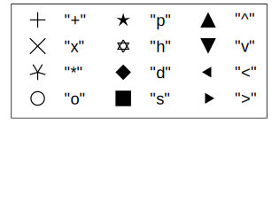
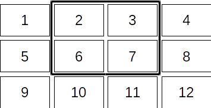

# Capítulo 4. Gráficos

```@setup c4
cp("../../datos/", "./datos")
```

En los capítulos anteriores de esta guía hemos hecho un tratamiento superficial, incluso podría decirse que apresurado, de unos pocos aspectos básicos en los que muchos otros manuales, sean de Julia o cualquier otro lenguaje de programación, suelen ser más detallados en sus capítulos introductorios. En este capítulo dedicado a los gráficos, sin embargo, vamos a detenernos más a pesar de que es una funcionalidad bastante avanzada, y requiere instalar algunos paquetes auxiliares y librerías externas para empezar.

Hay una buena razón para hacerlo así. El usuario de una herramienta informática normalmente no juzga si una tarea es "básica" o "avanzada" según las complejidades que supone para esa herramienta, sino por cuestiones más prácticas. Y explorar visualmente los datos es una de las primeras cosas que se suele hace después de recogerlos, como mínimo para valorar si parecen correctos o hay algún tipo de anomalía. En este sentido los gráficos podrían considerarse como una de las tareas más básicas. De hecho no es raro que el ansia por ver qué pinta tienen los datos conduzca a atajos "sucios y rápidos", como abrir los ficheros con una hoja de cálculo e improvisar gráficas con un par de *clicks* de ratón, antes de empezar los preparativos para un análisis más formal.

Parece lógico, por tanto, que las instrucciones para crear gráficos también se introduzcan lo más pronto posible a la hora de presentar una herramienta para el análisis de datos. Además, parafraseando el refrán popular, se puede decir que un gráfico vale más que mil números. Julia tiene una potencia extaordinaria para hacer cálculos complejos y costosos de forma rápida y eficaz; pero la representación en un bonito gráfico interactivo de un análisis de datos sencillo a veces da una mayor sensación de productividad, y aprender a crear esos gráficos es una buena manera de aumentar la motivación para introducirse en un lenguaje de programación.

## Paquetes de gráficos para Julia

Julia nos ofrece la versatilidad y potencia de múltiples herramientas externas para generar gráficos, a través de paquetes complementarios que instalan automáticamente las librerías necesarias y proporcionan funciones para manejarlas desde Julia. El que usaremos para los ejemplos que siguen es [GRUtils](https://github.com/heliosdrm/GRUtils.jl), que proporciona una buena experiencia como primera contacto con los gráficos en Julia, por la forma en que combina rapidez y facilidad de uso con potencia y versatilidad de los gráficos generados.

Hay muchos otros paquetes recomendables para hacer gráficos en Julia. El más conocido es [Plots](https://github.com/JuliaPlots/Plots.jl), que proporciona una interfaz común para manejar muchas librerías gráficas, lo que le confiere una mayor versatilidad y potencia. Para gráficos más sofisiticados o que requieran mayor nivel de personalización que el que proporciona GRUtils, Plots es una magnífica opción, aunque más pesada en términos de instalación y velocidad.

Otros paquetes muy populares son [PyPlot](https://github.com/JuliaPy/PyPlot.jl), basado en la librería gráfica que se suele usar con Python, [VegaLite](https://github.com/queryverse/VegaLite.jl) para hacer sofisticados gráficos interactivos, o [UnicodePlots](https://github.com/Evizero/UnicodePlots.jl) en el otro extremo, para crear gráficos basados en caracteres de texto sobre la consola de comandos. Una vez se ha "roto mano" con el lenguaje, y si se dispone de tiempo para ello, lo mejor es explorar distintos paquetes para escoger el que mejor se adapta a las necesidades y limitaciones de cada uno.


## Instalación de GRUtils

Como cualquier otro paquete de Julia, GRUtils necesita instalarse antes de poder usarlo. La principal diferencia con los paquetes vistos hasta ahora es que, indirectamente, la instalación de GRUtils en Julia intenta instalar en el sistema la librería gráfica [GR](http://gr-framework.org). GR se suele instalar sin problemas en los sistemas operativos habituales (Linux, Windows y OSX), pero puede haber casos en los que este paso falle, bien por alguna limitación del sistema o por algún error de conexión durante el proceso. Si esto ocurre se pueden probar las siguientes soluciones:

1. Reconstruir el paquete GR, que es el que lleva a cabo la compilación e instalación de la librería gráfica. Esto se hace en con dos instrucciones en la consola de comandos de Julia. La segunda instrucción se ha de ejecutar en el modo de gestión de paquetes (como viene indicado por la etiqueta `pkg>` al comienzo de la línea), en la que se entra pulsando la tecla `]`, como se indicó en el capítulo de [primeros pasos](primerospasos.md):

```julia-repl
julia> ENV["GRDIR"] = ""
pkg> build GR
```

2. Si la anterior solución no da resultados, puede ser que no tengas permiso para instalar la librería gráfica. En Windows puede intentarse saltarse esta limitación ejecutando Julia en modo administrador (al menos en la sesión en la que se quieran instalar los paquetes).


## Un ejemplo básico

Una vez instalado el paquete GRUtils, hacer gráficos es rápido y sencillo. Por ejemplo, el gráfico del capítulo 2 con una muestra de las señales analizadas se realizó con las siguientes instrucciones:

```@example c4
# Primero leemos el archivo con la serie de datos datos a representar
# (la primera columna tiene los tiempos, y la otra los valores de la serie)
using DelimitedFiles
datos = readdlm("datos/series/sA01.txt")
# Cargamos el paquete GRUtils y utilizamos la función `plot`
using GRUtils
Figure(); # hide
x = datos[:,1]
y = datos[:,2]
plot(x, y)
```

Según el entorno en el que se esté trabajando, este código hará que el gráfico se muestre de una manera u otra. Por ejemplo, en el REPL normalmente se abre en una nueva ventana; en Juno se muestra en el panel de gráficos dedicado; y en une notebook de IJulia los gráficos aparecen en celdas como imágenes integradas en las celdas de resultados.

Si nos interesase mostrar varias señales en la misma gráfica, tenemos a nuestra disposición muchas formas de hacerlo. Por ejemplo, vamos a añadir la última señal.

Como en este caso todas las señales tienen la misma longitud (100 muestras), podemos juntar la primera y la última como dos columnas de una misma matriz, y pasar esta matriz como segundo argumento a la función `plot`:

```@example c4
datos_b = readdlm("datos/series/sB30.txt")
y2 = datos_b[:,2]
matriz = [y y2]
plot(x, matriz)
```

Otra forma de hacerlo es dibujando la segunda gráfica sobre la primera, poniendo la figura en modo `hold`:

```julia
plot(x, y)
hold(true)   # Usar `hold(false)` para desactivar este modo
plot(x, y2)
```

Además, la función `plot` también admite que se pasen varias parejas de series X-Y a la vez. Esto hace que se representen todas en la misma gráfica como si se hubiera activado el modo `hold`:

```julia
plot(x, y, x, y2)
```

En todos los casos, el resultado sería la misma gráfica mostrada antes.

## Códigos de formato para `plot`

Cada nueva línea aparece dibujada con un color diferente, para ayudar a diferenciarlas. Además, tanto el color como el estilo de la línea se puede modificar, y también se pueden añadir símbolos como marcadores de los puntos representados. Todo esto se puede configurar pasando un "código de formato" en forma de cadena de texto a la función `plot`, después de las coordenadas X, Y. Por ejemplo, para añadir a la línea de datos asteriscos de color rojo:

```@example c4
plot(x, y, "-*r")
```

Los tres símbolos del código de formato representan lo siguiente:

* El guión (`-`) indica que se muestre la línea que conecta los puntos.
* El asterisco (`*`) indica que se añadan asteriscos en los puntos.
* La letra `r` indica que la serie (línea y marcadores) se muestre de color rojo.

Estos tres símbolos podrían haberse puesto en cualquier otro orden, por ejemplo `"r-*"`, `"*r-"`, etc.

Hay seis códigos de colores posibles, identificados por letras características del nombre del color en inglés:

* `"r"` para el rojo (red)
* `"g"` para el verde (green)
* `"b"` para el azul (blue)
* `"c"` para el cian (cyan)
* `"m"` para el magenta (magenta)
* `"y"` para el amarillo (yellow)
* `"k"` para el negro (black)
* `"w"` para el blanco (white)

Si el código de formato no incluye ninguna de estas seis letras, se utilizará el siguiente color de la secuencia automática. Por otro lado, un espacio en blanco dentro de la cadena sirve como un código de color especial, que reinicia la secuencia de colores automáticos.

Hay cuatro códigos para tipos de línea:

* `-` para líneas continuas
* `--` para líneas discontinuas
* `:` para líneas punteadas
* `-.` para líneas discontinuas alternadas con puntos

Si no se da ningún código de formato, por defecto se usa una línea continua. Pero si se proporciona dicho código sin ninguna de estas secuencias, no se dibuja ninguna línea.

Finalmente, los códigos habituales para marcadores son los doce que se muestran a continuación:



Además se puede indicar que los datos de las series se marquen como puntos (`"."`) --siempre que el punto en el código de formato no vaya después de un guión, en cuyo caso se está indicando un tipo de línea, como se ha señalado antes--. Sin embargo este tipo de marcador solo es visible para nubes de puntos con muchos datos concentrados en áreas semejantes, por ejemplo la siguiente distribución aleatoria:

```@example c4
# x: diez mil puntos aleatorios
# que siguen una distribución normal
x = randn(10_000)
# y: otros tantos puntos aleatorios
# correlacionados con x
y = x .+ randn(10_000)
# Nube de puntos en color negro
plot(x, y, ".k")
```

!!! tip
    El guión bajo usado en este ejemplo para indicar el número "diez mil" (`10_000`) es puramente estético, para ayudar a interpretar el número visualmente. No tiene ningún efecto sobre el número, que podría haberse escrito igualmente como `10000`.

## Ajustar y etiquetar gráficos

Normalmente interesa complementar los gráficos con etiquetas en los ejes, títulos, leyendas y otros elementos que ayuden a interpetarlos. Por ejemplo, veamos un gráfico con los resultados del análisis de las señales realizado en el [capítulo 2](series-tablas.md#ejemplo_series). La tabla de resultados era:

```@example c4
using CSV # hide
tabla_resultados = CSV.read("datos/tabla.txt") # hide
```

El siguiente gráfico muestra la relación entre tiempos y valores de los picos de las señales, separando los quince primeros casos (los que comienzan como "sA", de los quince segundos ("sB"). El gráfico incluye una leyenda para distinguir estos dos conjuntos, etiquetas para los ejes X e Y, y un título. Además, se han ajustado los límites de los ejes a unos rangos mayores que los que se muestran por defecto:

```@example c4
Figure() #hide
using DelimitedFiles
resultados = readdlm("datos/tabla.txt", ';')
plot(resultados[1:15,2], resultados[1:15,3], "o")
hold(true)
plot(resultados[16:30,2], resultados[16:30,3], "o")
legend("sA", "sB")
xlim(0, 1)
ylim(0, 30)
xlabel("tiempo")
ylabel("valor extremo")
title("Resultados del análisis")
```

En este ejemplo vemos una muestra de cómo utilizar las siguientes funciones:

* `legend` para añadir una leyenda de los distintos grupos de datos representados.
* `xlim` e `ylim` para ajustar los rangos de valores mostrados en los ejes X e Y. (También existe `zlim` para el eje Z en gráficos tridimensionales.)
* `xlabel` e `ylabel` para añadir etiquetas a los ejes X e Y. (Usar `zlabel` para el eje Z en gráficos tridimensionales.)
* `title` para añadir un título en la parte superior del gráfico.

Hay muchas más opciones para configurar estos elementos, así como otras funciones que sirven para añadir o modificar atributos como la escala de los ejes, líneas guía, mapas de color, etc. La referencia completa de las funciones que se pueden emplear para ello se puede consultar en la sección de ["Plot attributes"](https://heliosdrm.github.io/GRUtils.jl/stable/api/attributes/) en la documentación de GRUtils (en inglés).

## Otros tipos de gráficos

Los gráficos con líneas y puntos están entre los usados con más frecuencia, pero también hay muchos otros tipos de gráficos muy útiles, disponibles con otras funciones. El catálogo completo puede verse en la sección ["Plotting functions"](https://heliosdrm.github.io/GRUtils.jl/stable/api/plotting/) de la documentación, con ejemplos de todos ellos y explicaciones detalladas de cómo usar las funciones). Como resumen, estas son algunas funciones que se usan a menudo:

* Gráficos de líneas y marcadores: `plot`, `plot3` (gráficos tridimensionales) y `polar` (gráficos en coordenadas polares).
* Gráficos de dispersión --con la posibilidad de variar el tamaño o el color de los puntos en función de otras series de datos--: `scatter` y `scatter3`.
* Gráficos de flechas (campos vectoriales): `quiver` y `quiver3` (en tres dimensiones).
* Gráficos de barras: `barplot`.
* Histogramas: `histogram`, `polarhistogram` (en coordenadas polares) y `hexbin` (histogramas bidimensionales, presentados con celdas hexagonales).
* Gráficos con barras de error: `errorbar`.
* Gráficos de superficies tridimensionales: `surface` (superficie coloreada) y `wireframe` (superficie dibujada como una malla).
* Gráficos de contorno (como superficies vistas en 2D, con líneas que conectan puntos de la misma altura): `contour` y `contourf` (con áreas coloreadas).

En general, la interfaz de todas estas funciones es semejante: los primeros argumentos han de ser vectores (o matrices, según el tipo de gráfico) con los datos a representar. Normalmente el primer argumento son los valores asociados al eje X y el segundo los del eje Y --y en los gráficos tridimensionales, el tercero es el eje Z--. Además, hay tipos de gráficos que requieren más información como la dirección de las flecha en los campos vectoriales, el tamaño de las barras de error, etc., cuyos valores se pasan en otros argumentos a continuación.

Por otro lado, en varios casos (cuando no hay ambigüedad posible) se admite la omisión de algunos de los datos anteriores, que se calculan de forma implícita como series de números enteros comenzando por el uno. Por ejemplo, si a `plot` se le pasa solo un vector de datos, se asume que estos son los valores del eje Y, calculándose los del eje X como 1, 2... hasta *N*, siendo *N* la longitud del vector. Asímismo, `surface` y otras funciones para representar superficies admiten que se les pase solo una matriz de datos que representa los valores en el eje Z, considerando que los valores X, Y son los de las coordenadas de cada celda de la matriz.

En las funciones para gráficos basados en líneas y marcadores, su color y estilo se puede configurar mediante el código de formato que se ha explicado arriba, que se puede pasar como una cadena de texto después de los vectores de datos. Pero hay muchas otras características de las geometrías en estos y otros tipos de gráficos (colores, transparencia, tamaño de los objetos, orientación, etc.) que se pueden ajustar mediante argumentos "con nombre". Este tipo de argumentos también se puede usar para definir en la misma llamada a la función algunos atributos del gráfico, para los que antes hemos utilizado funciones aparte (`hold`, `xlim`, `title`, y muchos más).

Todas estas opciones y más detalles están comentados en la página de documentación de GRUtils referida antes.


## Alternar entre figuras

En las secciones anteriores hemos visto cómo dibujar gráficos y editarlos. Pero cuando creamos un gráfico nuevo, el anterior queda borrado. La forma de evitar que pase esto es trabajar con varias figuras.

Podemos imaginarnos que estamos en un estudio con un caballete en el que se puede colocar un lienzo para dibujar los gráficos. Estos lienzos son lo que en GRUtils se llaman objetos de tipo `Figure`. Normalmente trabajamos sobre el lienzo que está sobre el caballete, que es la "figura actual". En este lienzo podemos dibujar formas, escribir textos, y reemplazarlos o borrarlos en parte o por completo. Pero también podemos descabalgar el lienzo actual y poner uno nuevo en su lugar. Para crear una nueva figura basta con escribir `Figure()`. A esta función también se le pueden añadir argumentos para definir el tamaño de la figura; por ejemplo, para crear una figura de 4 centímetros de ancho y 3 de alto:

```julia
Figure((4, 3), "cm")
```

También se puede indicar el tamaño en pulgadas (`"in"`), metros (`"m"`) o píxeles (`"px"`). El tamaño por defecto es de 600×450 px.

Por otro lado, para poder recuperar una figura "descabalgada" es necesario identificarla antes de poner otra en su lugar. Esto se puede conseguir de varias formas:

* En el momento en el que se crea o modifica un gráfico, con funciones como `plot`, `title`, `xlim`, etc., asignando su resultado a una variable, por ejemplo `figura = plot(x, y)`.
* En cualquier momento, con la función `gcf` --de las siglas en inglés *get current figure*, por ejemplo `figura = gcf()`.
* Una figura creada con la función `Figure` también se puede asignar a una variable en el momento de su construcción: `figura = Figure()`

La función `gcf` también sirve para hacer que una figura existente se convierta en la actual (recolocarla en nuestro caballete metafórico). Por ejemplo:


```julia
fig1 = plot(x, y) # Asignamos la figura del gráfico creado a `fig1`
fig2 = gcf()      # Esto es lo mismo (fig2 == fig1)
fig3 = Figure()   # A partir de ahora `gcf()` se refiere a `fig3`.
plot(x, z)        # Hacemos un gráfico en la nueva figura (`fig3`)
gcf(fig1)         # Recuperamos la primera figura
```

## Gráficos múltiples

En lo comentado hasta este punto, cada figura se correspondía con un gráfico en un momento dado, pero una figura puede contener varios gráficos --o "sub-gráficos", como suelen denominarse en ese caso--. Para añadir un gráfico a la figura actual se usa la función `subplot`, que crea el gráfico dentro de una cuadrícula. Veamos un ejemplo:

```julia
subplot(3, 4, [2,7])
```

Este código crea un gráfico en una cuadrícula de 3 filas y 4 columnas cuyas celdas vienen identificadas secuencialmente como se muestra en la siguiente figura. Si el tercer argumento hubiera sido cualquier número del 1 al 12, el subgráfico se encuadraría en la celda correspondiente. Al ser un vector con varios números, el subgráfico se encuadra en el mínimo rectángulo que los contiene. (En este caso, el resultado hubiera sido el mismo si el vector también contuviese los números 3 ó 6.)



*Distribución de "subplots" con `subplot(3, 4, [2,7])`*

El subgráfico recién creado se convierte en el objetivo de las siguientes operaciones para crear y modificar gráficos, pero los subgráficos que se hayan creado antes siguen disponibles para su edición. Para poner un subgráfico anterior de nuevo en el objetivo, basta con llamar a la función `subplot` con unos índices que den lugar a un recuadro equivalente.

Por ejemplo, el siguiente código crea un conjunto de gráficos con una nube de puntos como la mostrada en uno de los ejemplos anteriores, con dos histogramas a los márgenes:

```@example c4
# Gráfico principal con la nube de puntos
subplot(3, 3, (4, 8))
x = randn(10_000)
y = x .+ randn(10_000)
plot(x, y, ".")
# Histogramas marginales
subplot(3, 3, (1, 2))
histogram(x)
subplot(3, 3, (6, 9))
histogram(y, horizontal = true, xflip = true)
```

## Guardar gráficos como archivos de imagen

Para poder utilizar un gráfico fuera de Julia, lo más práctico es guardarlo como una imagen que luego se podrá añadir a un documento, presentación, etc. Esto se hace con la función `savefig`, por ejemplo:

```julia
savefig("ejemplo.png")
savefig(f, "ejemplo.png")
```

Ambas líneas de este ejemplo crean un archivo de imagen llamado `"ejemplo.png"`. En el primer caso la imagen tendrá el contenido de la figura actual; en el segundo el de la figura guardada en la variable `f`.

El tipo de archivo dependerá de la extensión indicada en su nombre. En este ejemplo se crea un mapa de bits en formato PNG. En el caso de querer una imagen vectorial, se podría haber salvado con la extensión SVG (ideal para web) o PDF, según el uso que se le vaya a dar. Según las librerías instaladas en el sistema puede haber más o menos formatos disponibles.

## Sumario del capítulo

En este capítulo hemos visto algunos aspectos elementales sobre cómo hacer y editar gráficos con través del paquete GRUtils. En particular, nos hemos centrado en:

* El uso de la función `plot` para representar una o varias series de datos.
* Los códigos de formato usados para especificar el color y tipo de líneas y marcadores en los gráficos.
* Cómo crear leyendas, etiquetas y títulos para anotar los gráficos.
* El uso de la función `hold` para añadir nuevos datos a un gráfico anterior.
* Cómo crear nuevas figuras y cambiar la figura actual.
* La creación de gráficos múltiples mediante la función `subplot`.
* Salvar gráficos como archivos de imagen con `savefig`.

Además, también se han introducido otros dos detalles generales de Julia, no relacionados con los gráficos:

* La función `randn` para crear series de números aleatorios que siguen una distribución normal estándar.
* El uso del guión bajo como separador visual en números de muchas cifras (p.ej. `10_000`).

```@example c4
Figure(); # hide
rm("datos", recursive=true) # hide
```
